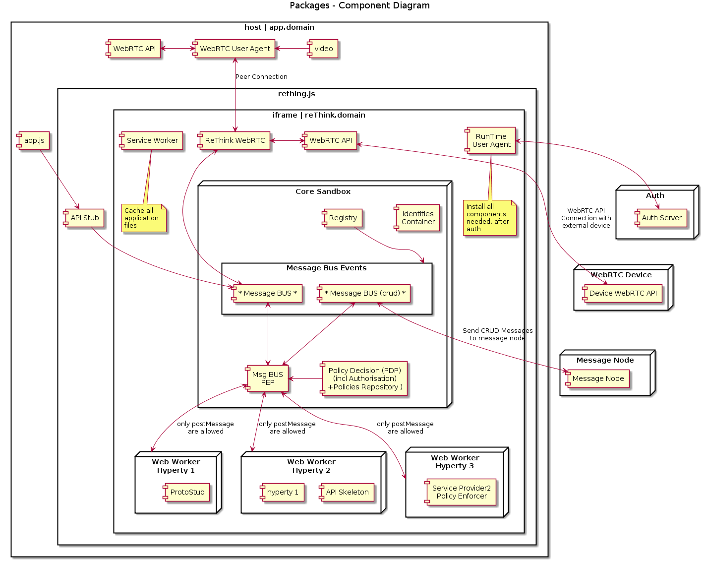

## Runtime Architecture with IFrame

After some investigation we find away to send stream from app client to iframe with our domain.
We use peer connection to send media stream.

#### how it works
The peer getUserMedia from app client and make a call to peer inside the rethink iframe, and this answer with null stream (we send stream one way), after this, peer can send the stream through peer connection to another client.

The next diagram explain how we can do it:

<!--
@startuml "Runtime_Architecture_IFrame.png"

title Packages - Component Diagram

node "WebRTC Device" {
  [Device WebRTC API] as WebRTCDevice
}

node "Auth" {
  [Auth Server] as Auth
}

node "Message Node" {
  [Message Node] as MNode
}

rectangle "host | app.domain" {

    component [video] as GUIVideo
    component [app.js] as App
    
    component [WebRTC User Agent] as PeerLocal
    component [WebRTC API] as WebRTCApiLocal

    rectangle rething.js {
  
        component [API Stub] as APIStub

        rectangle "iframe | reThink.domain" {
        
            component [ReThink WebRTC] as PeerRemote
            component [WebRTC API] as WebRTCApiRemote
            
            component [Service Worker] as ServiceWorker
            note bottom
                Cache all
                application
                files
            endnote
            
            component [RunTime\nUser Agent] as Agent
            note bottom
                Install all
                components
                needed, after
                auth
            endnote

            node "Web Worker\nHyperty 1" as W1 {
              [ProtoStub] as PS
            }
        
            node "Web Worker\nHyperty 2" as W2 {
              component [API Skeleton] as APIS2
              [hyperty 1] as H1
            }
        
            node "Web Worker\nHyperty 3" as W3 {
              component [Service Provider2\nPolicy Enforcer]
            }

            node "Core Sandbox" as Core {
            
                component [Registry] as Registry
                component [Identities\nContainer] as IContainer
                component [Msg BUS\nPEP] as Policy
                component [Policy Decision (PDP)\n(incl Authorisation)\n+Policies Repository )] as PDP
                
            
                rectangle "Message Bus Events" as MsgBusEvent {
                    component [* Message BUS *] as MsgBus
                    component [* Message BUS (crud) *] as MsgBusCrud
                }
            }

        }
    }
}

Auth <-[hidden]down-> WebRTCDevice
WebRTCApiRemote <-[hidden]down-> Core

App -down-> APIStub
APIStub -down-> MsgBus

GUIVideo -left-> PeerLocal
PeerLocal <-left-> WebRTCApiLocal
PeerLocal <-down-> PeerRemote : Peer Connection
PeerRemote <-right-> WebRTCApiRemote
PeerRemote <-down-> MsgBus
WebRTCApiRemote <-right-> WebRTCDevice : WebRTC API\nConnection with\nexternal device

Registry -down-> MsgBusEvent
IContainer -left- Registry

MsgBus <-> Policy
MsgBusCrud <-> Policy
PDP -left-> Policy

Policy <-right-> W1 : only postMessage\nare allowed
Policy <-right-> W2 : only postMessage\nare allowed
Policy <-down-> W3 : only postMessage\nare allowed

MsgBusCrud <-right-> MNode : Send CRUD Messages\nto message node
Agent <-right-> Auth

@enduml
-->

We need to do an experimentation code to make an complete validation for  this architecture. 
