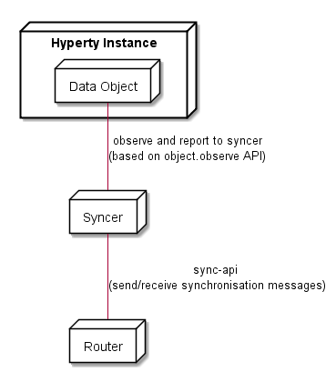

### Data Synchronisation Communication implementation

<!--
@startuml "hyperty-data-synchronisation.png"

	node "Hyperty Instance" as H {

		node "Data Object" as Obj {

		}
	}

	node "Syncer" as Syncer {

	}

	node "Router" as Router {

	}

	Obj -down- Syncer : observe and report to syncer\n(based on object.observe API)

	Syncer -down- Router : sync-api \n(send/receive synchronisation messages)

@enduml
-->

Usage of the emerging [object.observe](https://developer.mozilla.org/pt-PT/docs/Web/JavaScript/Reference/Global_Objects/Object/observe) javascript API to support Hyperty communication based on object synchronisation. If not supported by the native runtime we can use a few [existing libraries](https://github.com/MaxArt2501/object-observe).

The synchronisation API is implemented by the Router component and [meteor DDP protocol API](https://github.com/meteor/meteor/blob/devel/packages/ddp/DDP.md) is a good reference.
