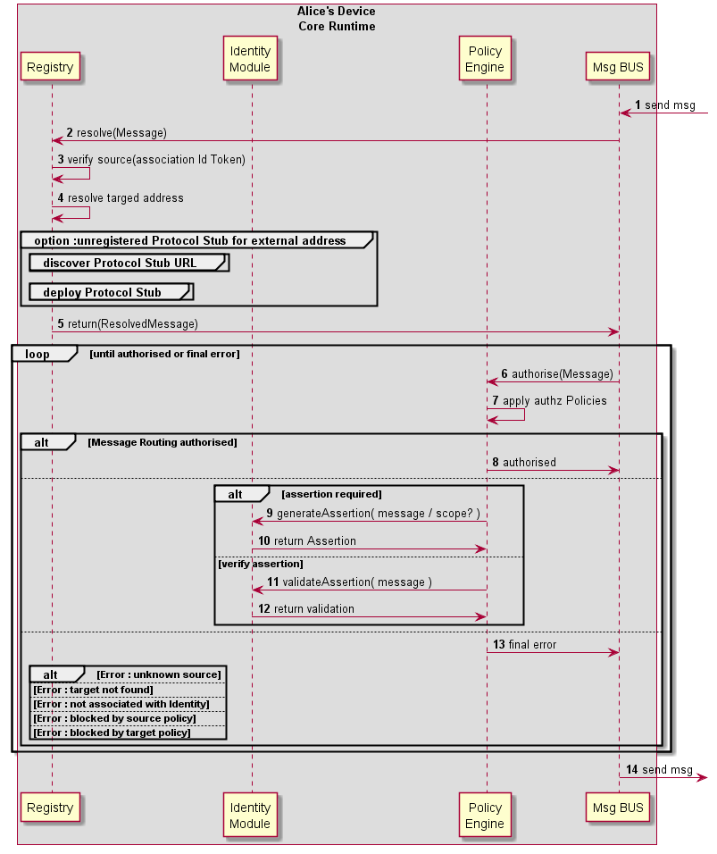

#### Message Routing in Message BUS

<!--
@startuml "bus-msg-routing.png"

autonumber

!define SHOW_RuntimeA

!define SHOW_CoreRuntimeA
!define SHOW_MsgBUSAtRuntimeA
!define SHOW_RegistryAtRuntimeA
!define SHOW_IdentitiesAtRuntimeA
!define SHOW_AuthAtRuntimeA

!include ../runtime_objects.plantuml

BUS@A <-  : send msg

RunAuth@A <- BUS@A : Authz request(Message)

RunReg@A <- RunAuth@A : Resolve(Message)

RunReg@A -> RunID@A : get Identity token

RunReg@A -> RunReg@A  : add ID Token to Msg

RunReg@A -> RunReg@A  : resolve addresses

group option :unregistered protocol stub for external address

	group discover protocol stub URL
	end

	group deploy protocol stub
	end

end

RunReg@A -> RunAuth@A : return(ResolvedMessage)

group enforce policies
	RunAuth@A -> RunAuth@A : enforce source policies

	RunAuth@A -> RunAuth@A : enforce target policies
end

alt
	RunAuth@A -> BUS@A : authorised(ResolvedMessage)

	BUS@A ->  : send msg
else Error : unknown source

else Error : target not found

else Error : not associated with Identity

else Error : blocked by source policy

else Error : blocked by target policy

end

@enduml
-->

