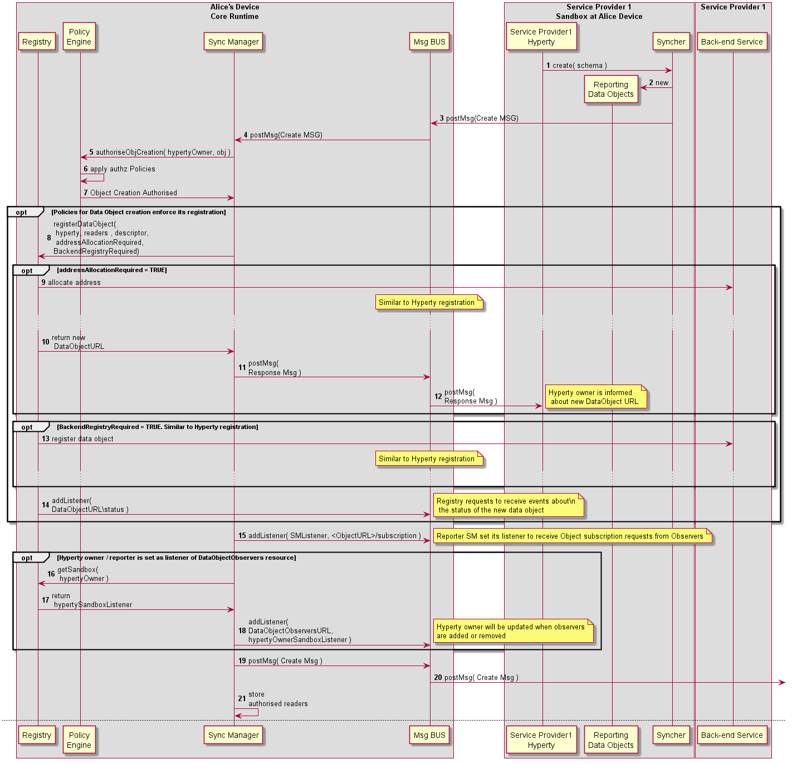

#### Setup of Data Object Synchronisation with Reporter-Observer communication pattern

This MSC diagrams shows the most relevant steps to support the setup of data object synchronisation.



Steps 1-2: The Data Object reporter post a Create Message to initiate the setup of the Data Object synchronisation.

**[Create Message sent by Reporter](https://github.com/reTHINK-project/architecture/tree/master/docs/datamodel/message#createmessagebody)**

```
"id" : "1"
"type" : "CREATE",
"from" : "hyperty-instance://sp1/alicehy123",
"to" : "hyperty-instance://sp2/bobhy123",
"contextId" : "qwertyuiopasdfghjkl",
"body" : { "resource" : "comm://sp1/alice/123456", "value" : "<json object > , "schema" : "hyperty-catalogue://sp1/dataObjectSchema/schema123" }
```

Steps 3-4: The Core Police Engine applies policies to check whether Alice has permissions to create the data object.

Step 5: optionally, and according to applicable policies, the new data object is registered in the Registry. In Step 11, the Registry adds a listener in the MessageBUS to be notified about status change events of the new Data Object.

Steps 6-9: optionally, and again, according to applicable policies, a new address might have to be allocated to the Data Object by the Messaging Node address allocation functionalities, to ensure the new data object is globally reachable. The new address allocated to the Data Object is informed back to the Reporter with a 3XX response message.

**[Response Message by Core PEP to inform Hyperty Owner about new allocated Data Object URL](https://github.com/reTHINK-project/architecture/tree/master/docs/datamodel/message#createmessagebody)**

***note:*** usually 3XX requires to send a new request message. In this case a new request message is not required.

```
"id" : "1"
"type" : "RESPONSE",
"from" : "hyperty-runtime://sp1/core/pep",
"to" : "hyperty-instance://sp1/alicehy123",
"contextId" : "qwertyuiopasdfghjkl",
"body" : { "code" : "308", "value" : "{ "resource" : "comm://sp1-msg-node/alice/123456" } }
```

Steps 10: optionally, and again, according to applicable policies, the new Data Object is also registered in the Back-end (Domain) Registry.

Steps 12 - 14: optionally, and again, according to applicable policies, the Reported Hyperty is added as a listener to be notified when new Observers to its Data Object are added or removed. The DataObjectObserversURL is handled by the Policy Engine.


Steps 15-17: In case the data object creation is authorised, the Message BUS forwards the data object creation message to invited Observers and the Core Policy Engine takes the Hyperty Instance URLs set in the `to` header field, to set as the list of addresses that are previously authorised to be Observer for the new data object.

Steps 19-21: optionally, invited Observers may respond with provisional responses e.g. to aknowledge the reception of the invitation and to accept or not the invitation to be an Observer.

**[Provisional Response Message sent by inviter Observer](https://github.com/reTHINK-project/architecture/tree/master/docs/datamodel/message#responsemessagebody)**

```
"id" : "1"
"type" : "RESPONSE",
"from" : "hyperty-instance://sp2/bobhy123",
"to" : "hyperty-instance://sp1/alicehy123",
"contextId" : "qwertyuiopasdfghjkl",
"body" : { "code" : "1XX"  }
```

Step 22: as soon as the Reporter receives the information that the data object synchronisation was authorised, it can request the Syncher to start reporting data object changes by posting UPDATE messages to the Data Object URL resource. It should be noted that, according to Hyperty Service logic, this step can be performed later, e.g. after the Reporter is notified an Observer has been added.

**[Data Synchronisation UPDATE Message sent by Reporter Syncher](https://github.com/reTHINK-project/architecture/tree/master/docs/datamodel/message#updatenmessagebody)**

```
"id" : "2"
"type" : "UDATE",
"from" : "hyperty-instance://sp2/bobhy123",
"to" : "comm://sp1-msg-node/alice/123456",
"contextId" : "qwertyuiopasdfghjkl",
"body" : { "value" : "changed value"  }
```

Steps 23-25: to be an Observer of a Data Object, a Subscription message is sent to the Runtime Core component managing subscription authorisation, in this case it is assumed it is the Policy Engine. The Policy Engine applies message to decide on the received subscription request namely if subscription requester has been previously authorised in step 17.

**[Subscription Message sent by inviter Observer](https://github.com/reTHINK-project/architecture/tree/master/docs/datamodel/message#subscriptionmessagebody)**

```
"id" : "1"
"type" : "SUBSCRIPTION",
"from" : "hyperty-instance://sp2/bobhy123",
"to" : "hyperty-runtime://sp1/core/pep",
"contextId" : "qwertyuiopasdfghjkl",
"body" : { "listener" : "bobhy123.postMessage"  }
```

Steps 26-27: in case subscription requester has not been previously authorised, and according to applicable policies, the subscription request message can be forwarded to the Reporter Hyperty that will take the final decision.

Step 28: according to applicable policies, the Registry can be queried to check if the data object was previously registered.

Step 29: in case the subscription request is authorised, a listener of the new observer, contained in the SUBSCRIPTION message body, is added into the Message BUS to receive messages on the Data Object resource URL.

Step 30: optionally, the new Observer listener is added in the Message BUS to be notified about new Observers.

Steps 31-32: optionally, it is posted an UPDATE message into the DataObjectObserversURL with information about the new added Observer.

Steps 33-34: the subscription requester is informed about the subscription authorisation with a RESPONSE message.
