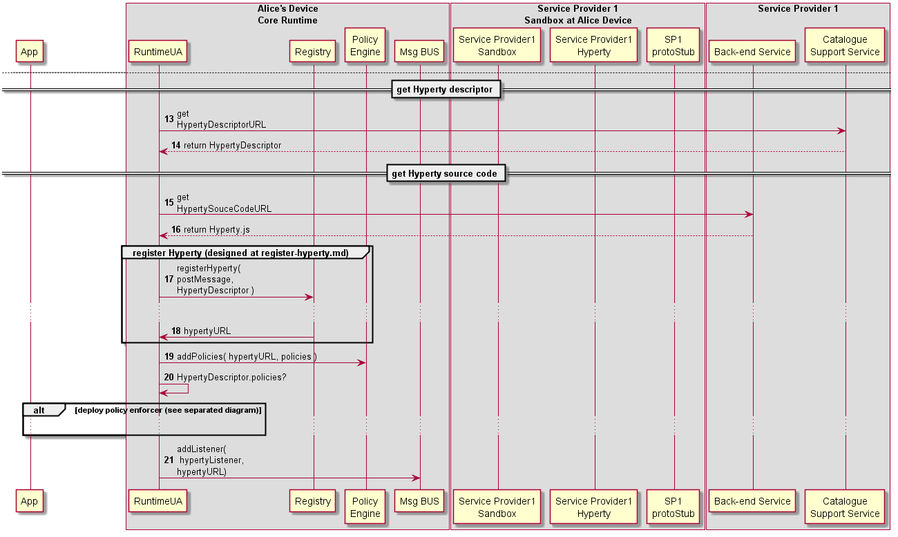

#### Deploy Hyperty {#header-identifiers-in-html-latex-and-context}

The Runtime procedures to deploy a new Hyperty are described in this section.

Note: The trigger of Hyperty deployment may take advantage of some existing libraries like require.js.

Step 1: As discussed in the Runtime Architecture, and according to security policies, Hyperties and the Application can be deployed in the same sandbox or in separated domains.

---

**Hyperty and App deployed in the same sandbox**

Steps 2 - 5: In this situation, the App and the Hyperty are running in the same isolated sandbox which is different from the Hyperty Core Runtime Sandbox. This means the download and instantiation of the Hyperty has first to be performed by the Application. Then the App asks the Runtime UA to register and activate the new Hyperty in the runtime.

**Hyperty and App deployed in different sandboxes**

Steps 6 - 10: In this situation, the App and the Hyperty must run in different isolated sandboxes. In this case the Hyperty sandbox is managed by the runtime UA which means the runtime UA can download and instantiated the Hyperty. The runtime UA should avoid the creation of new sandboxes in case there is already a sandbox for the same domain

---

Steps 11 - 12: the new [Hyperty instance is registered](register-hyperty.md) by the Runtime Registry. See section 4.3.1.4 for more details.

Steps 13: policies contained in the Hyperty Descriptor, are deployed in the BUS Authorisation component

Steps 14: the runtime UA checks in the Hyperty Descriptor if a Policy Enforcer is required

---

**Hyperty PEP deployment is required**

Steps 15 - 16: the runtime UA downloads and instantiates the Hyperty PEP in an isolated sandbox.

Steps 17 - 18: the Runtime UA register in the runtime Registry the new PEP for the new deployed Hyperty and the Registry returns PEP Runtime component URL

Steps 19: the runtime UA adds PEP intercepting listener to the runtime BUS to receive messages targeting the Hyperty URL.

Step 20: The Runtime UA activates the Hyperty PEP with its RuntimeURL, the postMessage function to be called to send messages to BUS and the Hyperty instance URL the PEP is intercepting. Depending on the sandbox implementation, the initialisation may have to be remotely executed by an Execution message type routed by the Message BUS.

---

Steps 21: the runtime UA adds Hyperty listener to the runtime BUS to receive messages targeting the Hyperty URL. It should be noted in case there is an intercepting PEP, the Hyperty listener will only be called for Messages forwarded by PEP.

Steps 22: the runtime UA activates the Hyperty instance with its Hyperty URL instance, the postMessage function to be called to send messages to BUS and configuration data contained in its descriptor. Depending on the sandbox implementation, the initialisation may have to be remotely executed by a Execution message type routed by the Message BUS.
