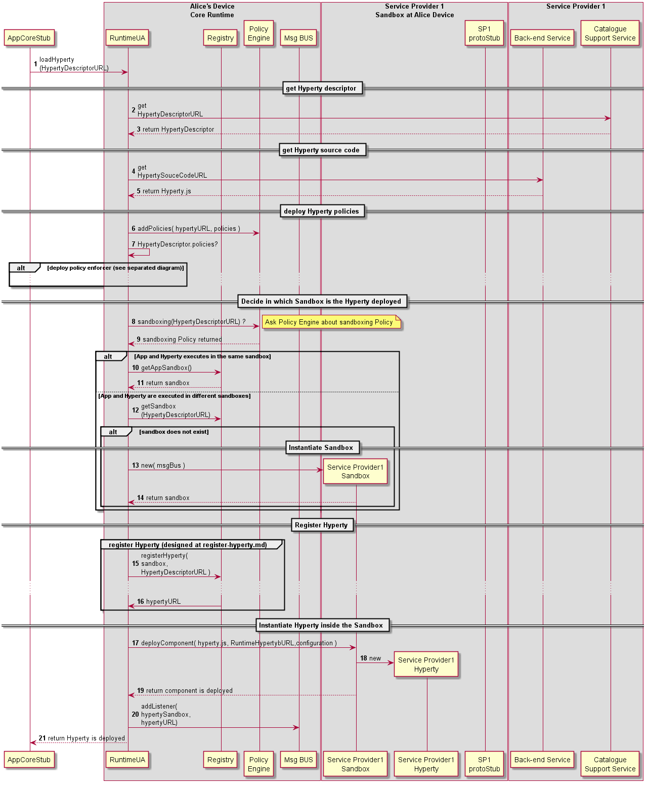

#### Deploy Hyperty

<!--
@startuml "deploy-hyperty.png"

autonumber

!define SHOW_RuntimeA

!define SHOW_AppAtRuntimeA

!define SHOW_CoreRuntimeA
!define SHOW_MsgBUSAtRuntimeA
!define SHOW_RegistryAtRuntimeA
!define SHOW_IdentitiesAtRuntimeA
!define SHOW_AuthAtRuntimeA
!define SHOW_CoreAgentAtRuntimeA

!define SHOW_SP1SandboxAtRuntimeA
!define SHOW_Protostub1AtRuntimeA
!define SHOW_ServiceProvider1HypertyAtRuntimeA
!define SHOW_ServiceProvider1RouterAtRuntimeA

!define SHOW_SP1

!include ../runtime_objects.plantuml

group discover Hyperty URL: to be designed in a separated diagram by the Id Management Group

	... ...

end group

App@A -> App@A : App and Hyperty executes in the same sandbox?

note right
	to be compliant with W3C CORS (http://www.w3.org/TR/cors/)
end note

alt Yes, App and Hyperty executes in the same sandbox

	App@A -> SP1 : get\nHypertyDescriptorURL

	App@A -> SP1 : get\nHypertySouceCodeURL

	create SP1H@A
	App@A -> SP1H@A : new

	note right
		 In this case, it is the App
		  that instantiates the Hyperty,
		   since the RuntimeUA is not able to do it
	end note

	RunUA@A <- App@A : registerHyperty\n(HypertyDescriptorURL\n hypertyInstance )

else No, App and Hyperty are executed in different sandboxes

	RunUA@A <- App@A : loadHyperty\n( HypertyDescriptorURL )

	RunUA@A -> SP1 : get\HypertyDescriptorURL

	note right
		according to the runtime type
		(eg web worker in browsers) 
		the Hyperty download may have 
		to be downloaded inside the sandbox
	end note

	RunUA@A -> SP1 : get\nHypertySourceCodeURL

	RunUA@A -> RunReg@A : getHypertySandbox\n(HypertyDomain)

	note right
		If there is already a sandbox for the Hyperty domain
		the Hyperty is instantiated there.
		Otherwise a new sandbox has to be created.
		Sandbox management procedures are not shown here
		since it will depend on the runtime type.
	end note

	RunUA@A -> RunReg@A : getHypertySandbox\n(HypertyDomain)

	create SP1H@A
	RunUA@A -> SP1H@A : new

end group

group register Hyperty (designed at register-hyperty.md)          

RunUA@A -> RunReg@A : registerHyperty(\npostMessage,\nHypertyDescriptor )

...

RunUA@A <- RunReg@A : hypertyURL

end group

RunUA@A -> RunUA@A : HypertyDescriptor.policies?

alt There is a Hyperty policy enforcer to be deployed

	RunUA@A -> SP1 : get\nPolicyEnforcerSourceCodeURL

	create Router1@A
	RunUA@A -> Router1@A : new

	RunUA@A -> RunReg@A : registerPEP( \npepSandbox.postMessage \n, hyperty)

	RunUA@A <- RunReg@A : pep runtime URL

	BUS@A <- RunUA@A : addPEP(\n pepListener, \npepURL, \ninterceptedHypertyURL)

	BUS@A <- RunUA@A : postMessage( init message \n(pepRuntimeURL,\n bus.postMessage\n, hypertyURL) )

	BUS@A -> Router1@A : postMessage( init message \n(pepRuntimeURL,\n bus.postMessage\n, hypertyURL) )

else There is no Hyperty Policy Enforcer

	BUS@A <- RunUA@A : addListener(\n hypertyListener, \nhypertyURL)

	RunUA@A -> BUS@A : postMessage(\n init message(\n hypertyURL,\n bus.postMessage\n, configuration

	SP1H@A <- BUS@A : postMessage(\n init message(\n hypertyURL,\n bus.postMessage\n, configuration )

end group

@enduml
-->

 According to the sandboxing runtime architecture, Hyperties and App domains will have an impact on the procedures to be used to deploy the Hyperty. Nevertheless, the trigger of Hyperty deployment may take advantage of some existing libraries like require.js.

---

** Hyperty and App from the same domain **

Steps 1 - 4: In this situation, the App and the Hyperty are running in the same isolated sandbox which is different from the Hyperty Core Runtime Sandbox. This means the download and instantiation of the Hyperty has first to be performed by the Application. Then the App asks the Runtime UA to register and activate the new Hyperty in the runtime.

** Hyperty and App from different domains **

Steps 7 - 8: In this situation, the App and the Hyperty are running in different and isolated sandboxes. In this case the Hyperty sandbox is managed by the runtime UA which means the runtime UA can download and instante the Hyperty. The runtime UA should avoid the creation of new sandboxes in case there is already a sandbox for the same domain

---

Steps 9 - 10 : the [Hyperty is registered](register-hyperty.md).

Steps 11: the runtime UA checks in the Hyperty Descriptor if a Policy Enforcer is required

---

** Alt1 : Hyperty PEP deployment is required **

Steps 12 - 13 : the runtime UA downloads and instantiates the Hyperty PEP in a isolated sandbox.

Steps 14 - 15 : the Runtime UA register in the runtime Registry the new PEP for the new deployed Hyperty and the Registry returns PEP Runtime component URL

Steps 16 - 17 : the runtime UA activates the Hyperty PEP which adds its intercepting listener to the runtime BUS to receive messages targeting the Hyperty URL.

** Alt2 : Hyperty PEP deployment is not required **

Steps 18 - 19 : the runtime UA activates the Hyperty instance which adds its listener to the runtime BUS to receive messages targeting the Hyperty URL.

---

