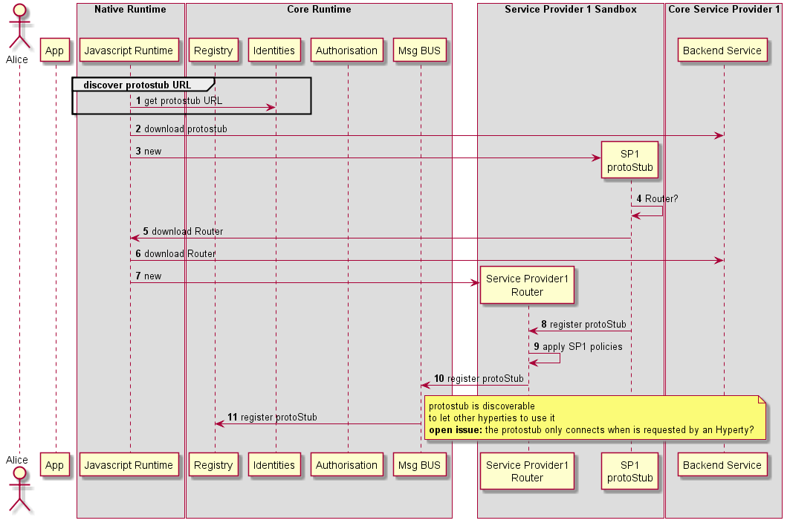

### Deploy runtime

<!--
@startuml "deploy-protostub.png"

autonumber

!define SHOW_RuntimeA

!define SHOW_AppAtRuntimeA

!define SHOW_NativeAtRuntimeA
!define SHOW_JavascriptEngineAtRuntimeA

!define SHOW_CoreRuntimeA
!define SHOW_MsgBUSAtRuntimeA
!define SHOW_RegistryAtRuntimeA
!define SHOW_IdentitiesAtRuntimeA
!define SHOW_AuthAtRuntimeA

!define SHOW_SP1SandboxAtRuntimeA
!define SHOW_Protostub1AtRuntimeA
!define SHOW_ServiceProvider1RouterAtRuntimeA

!define SHOW_SP1

!include ../runtime_objects.plantuml

group discover protostub URL

	JS -> RunID@A : get protostub URL

end group

JS -> SP1 : download protostub

create Proto1@A
JS -> Proto1@A : new

Proto1@A -> Proto1@A : Router?

Proto1@A -> JS : download Router

JS -> SP1 : download Router

create Router1@A
JS -> Router1@A : new

Proto1@A -> Router1@A : register protoStub

Router1@A -> Router1@A : apply SP1 policies

Router1@A -> BUS@A : register protoStub

BUS@A -> RunReg@A : register protoStub

note right
	protostub is discoverable 
	to let other hyperties to use it
	**open issue:** the protostub only connects when is requested by an Hyperty?
end note

@enduml
-->

