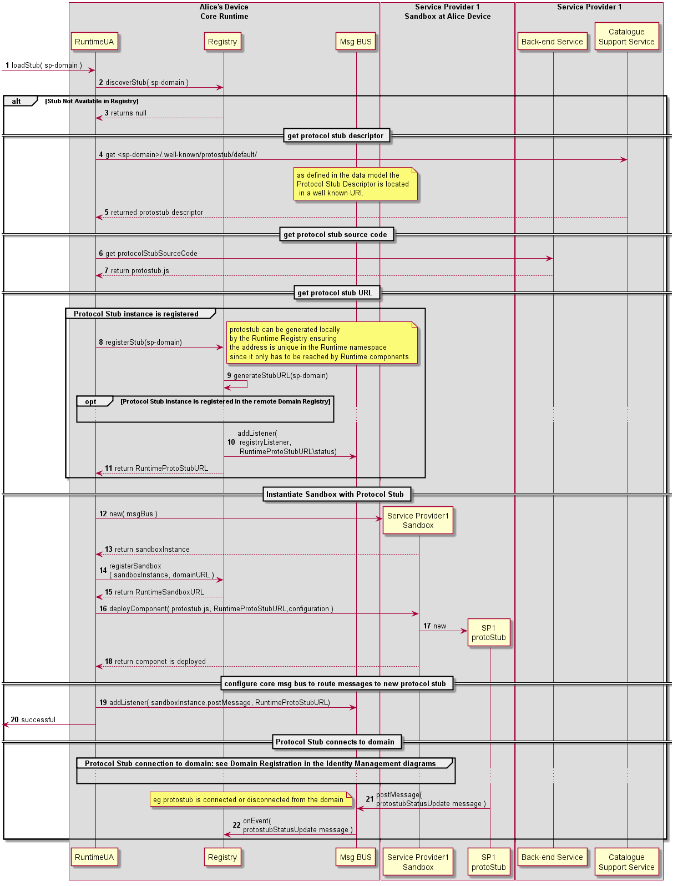

#### Deploy Protocol Stub

<!--
@startuml "deploy-protostub.png"

autonumber

!define SHOW_RuntimeA

!define SHOW_AppAtRuntimeA

!define SHOW_CoreRuntimeA
!define SHOW_MsgBUSAtRuntimeA
!define SHOW_RegistryAtRuntimeA
!define SHOW_IdentitiesAtRuntimeA
!define SHOW_AuthAtRuntimeA
!define SHOW_CoreAgentAtRuntimeA

!define SHOW_SP1SandboxAtRuntimeA
!define SHOW_Protostub1AtRuntimeA
!define SHOW_ServiceProvider1RouterAtRuntimeA

!define SHOW_SP1

!include ../runtime_objects.plantuml

-> RunUA@A : loadStub( domain )

RunUA@A -> RunReg@A : discoverStub( domain )

alt Stub Not Available in Registry

	RunUA@A -> SP1 : get <sp-domain>/.well-known/protostub/

		note over BUS@A
			as defined in the data model the protocol stub is a well know URI.
			**open issue:** should it be the protostub URL a well known URI?
		end note

	RunUA@A -> SP1 : get protocolStubSourceCode

	create Proto1@A
	RunUA@A -> Proto1@A : new

	RunUA@A -> RunReg@A : registerStub(domainURL)

	RunUA@A <- RunReg@A : return RuntimeProtoStubURL

	note right
		**open issue:** the protostub only connects
		to the domain when is requested by 
		an Hyperty?
	end note

	RunReg@A -> BUS@A : addListener( registryListener, RuntimeProtoStubURL\status)

	RunUA@A -> Proto1@A : init(RuntimeProtoStubURL, BUS.postMessage, protoStubConfigurationData)

	BUS@A <- RunUA@A : addListener( protostubListener, RuntimeProtoStubURL)

	group protocol stub connection to domain: to be designed by the ID Management group

	...

	end group

	Proto1@A -> BUS@A : postMessage( protostubStatusUpdate message )


	note left
		eg protostub is connected or disconnected from the domain
	end note

	BUS@A -> RunReg@A : onEvent( protostubStatusUpdate message )

end

@enduml
-->



Steps 1-2 : The protocol stub deployment may be triggered by the deployment of an Hyperty or by some attempt from a local Hyperty to communicate with a remote Hyperty running in the domain served by the protocol Stub. In this case the Runtime Registry would take the initiative to start the protocol stub deploy (FFS). Such trigger may take advantage of some existing libraries like require.js (to be validated with experimentations). The Runtime UA only downloads and deploys requested protocol stub after checking in the Registry that there is no protocol stub available in the runtime.

Steps 3 - 4 : the Runtime UA is able to derive the URL to download the protocol stub from the domain url, since it is a well known URI defined in the reTHINK Architecture Interfaces. The Runtime UA uses the protocol stub well known URI to download and instantiate it in the runtime.

Steps 5 - 7 : the new protocol stub is registered in the Runtime Registry, which allocates and return the runtime address (RuntimeURL) for the new runtime component. In addition, the runtime Registry requests the runtime BUS to add its listener to receive events about the protocol stub status.

Steps 8 - 11 : the Runtime UA retrieves required configuration data for the new protocol stub and initialises it. The protostub adds a listener to the runtime BUS to receive messages from the runtime.

Protocol stubs are connected by using credentials handled by the Core Runtime Identities Container which are detailed in the [domain login use case](../identity-management/domain-login.md).

Steps 12 - 13 : protocol stub publishes its status (including events about when it is connected or disconnected) in its resource status. Components registered on the protocol stub status resources, like the Registry, are notified about the new protocol status. 

Message to publish Protocol Stub Status

```
"id" : "1"
"type" : "UPDATE",
"from" : "hyperty-runtime://sp1/protostub/123",
"resource" : "hyperty-runtime://sp1/protostub/123/status",

"body" : { "value" : "LIVE" }
```

