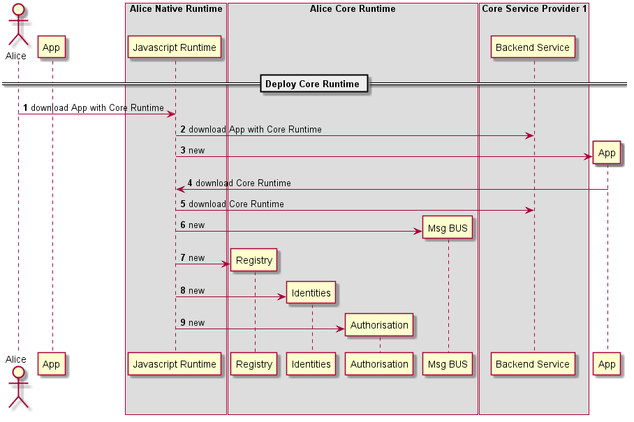

#### Deploy Hyperty Runtime

In case the device does not support the Hyperty Core Runtime components e.g. an existing browser like Chrome or a Network Node.js Server, they have to be deployed in the Device or in the Server.

The main data flows to support the deployment of the Hyperty Core Runtime is depicted in the diagram below.

Steps 1 - 2 : the deployment of the Runtime can be triggered by the explicit deployment provided by a specific Application to handle the process or an implicit deployment triggered by the deployment of an Hyperty or Protocol Stub. The usage of existing libraries like require.js will be evaluated. 

Steps 3 - 7 : the Runtime User Agent handles the download, instantiation and initialisation of required Runtime Core components including the Runtime Registry, Identity Module, Runtime PDP/PEP and the Message BUS.

Steps 8 - 10 : the Runtime User Agent registers the Runtime Instance into the remote Registry Service of the Hyperty Runtime Service Provider which returns the RuntimeURL allocated to the new Runtime. Then, the Registry is initialised with the previously returned RuntimeURL that will be used to derive the internal runtime addresses to be allocated to runtime components.

