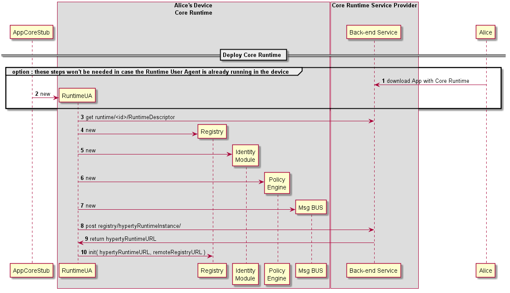

### Deploy runtime

<!--
@startuml "deploy-runtime.png"

autonumber

!define SHOW_RuntimeA

!define SHOW_AppAtRuntimeA

!define SHOW_NativeAtRuntimeA
!define SHOW_JavascriptEngineAtRuntimeA

!define SHOW_CoreRuntimeA
!define SHOW_MsgBUSAtRuntimeA
!define SHOW_RegistryAtRuntimeA
!define SHOW_IdentitiesAtRuntimeA
!define SHOW_AuthAtRuntimeA

!define SHOW_SP1

!include ../runtime_objects.plantuml

== Deploy Core Runtime ==

Alice -> JS : download App with Core Runtime

JS -> SP1 : download App with Core Runtime

create App
JS -> App : new

App -> JS : download Core Runtime

JS -> SP1 : download Core Runtime

create BUS@A
JS -> BUS@A : new

create RunReg@A
JS -> RunReg@A : new

create RunID@A
JS -> RunID@A : new

create RunAuth@A
JS -> RunAuth@A : new

@enduml
-->

