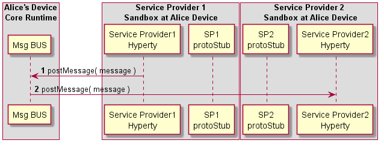

### Inter-domain Local Communication

<!--
@startuml "interdomain-local-communication.png"

autonumber

!define SHOW_RuntimeA

!define SHOW_SP1SandboxAtRuntimeA
!define SHOW_Protostub1AtRuntimeA
!define SHOW_ServiceProvider1HypertyAtRuntimeA
!define SHOW_ServiceProvider1RouterAtRuntimeA

!define SHOW_CoreRuntimeA
!define SHOW_MsgBUSAtRuntimeA
!define SHOW_RegistryAtRuntimeA
!define SHOW_IdentitiesAtRuntimeA
!define SHOW_AuthAtRuntimeA

!define SHOW_SP2SandboxAtRuntimeA
!define SHOW_Protostub2AtRuntimeA
!define SHOW_ServiceProvider2RouterAtRuntimeA
!define SHOW_ServiceProvider2HypertyAtRuntimeA

!include ../runtime_objects.plantuml

group discover Remote Hyperty URL

end group

SP1H@A -> Router1@A : send msg

Router1@A -> Router1@A : Apply Local Alice policies

Router1@A -> BUS@A : send msg

RunAuth@A <- BUS@A : Authz request

Router2@A <- BUS@A : send msg

Router2@A -> Router2@A : Apply SP2 policies

Router2@A -> SP2H@A : send msg

@enduml
-->

