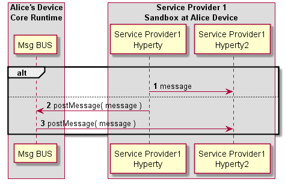

### Intra-domain Local Communication

<!--
@startuml "intradomain-local-communication.png"

autonumber

!define SHOW_RuntimeA

!define SHOW_SP1SandboxAtRuntimeA
!define SHOW_Protostub1AtRuntimeA
!define SHOW_ServiceProvider1HypertyAtRuntimeA
!define SHOW_ServiceProvider1RouterAtRuntimeA
!define SHOW_ServiceProvider1Hyperty2AtRuntimeA

!define SHOW_CoreRuntimeA
!define SHOW_MsgBUSAtRuntimeA
!define SHOW_RegistryAtRuntimeA
!define SHOW_IdentitiesAtRuntimeA
!define SHOW_AuthAtRuntimeA

!define SHOW_SP2SandboxAtRuntimeA
!define SHOW_Protostub2AtRuntimeA
!define SHOW_ServiceProvider2RouterAtRuntimeA
!define SHOW_ServiceProvider2HypertyAtRuntimeA

!include ../runtime_objects.plantuml

group discover Local Hyperty URL

end group

SP1H@A -> Router1@A : send msg

Router1@A -> Router1@A : Apply Local Alice policies

Router1@A -> SP1H2@A : send msg

note left
	should message goes through
	msg BUS?
end note

@enduml
-->

