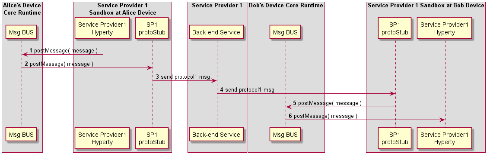

### Intra-domain Remote Communication

<!--
@startuml "intradomain-remote-communication.png"

autonumber

!define SHOW_RuntimeA

!define SHOW_SP1SandboxAtRuntimeA
!define SHOW_Protostub1AtRuntimeA
!define SHOW_ServiceProvider1HypertyAtRuntimeA
!define SHOW_ServiceProvider1RouterAtRuntimeA

!define SHOW_Runtime1B
!define SHOW_SP1SandboxAtRuntime1B
!define SHOW_Protostub1AtRuntime1B
!define SHOW_ServiceProvider1HypertyAtRuntime1B
!define SHOW_ServiceProvider1RouterAtRuntime1B

!define SHOW_SP1

!include ../runtime_objects.plantuml

group discover Remote Hyperty URL

end group

SP1H@A -> Router1@A : send msg

Router1@A -> Router1@A : Apply Local Alice policies

Router1@A -> BUS@A : send msg

BUS@A -> Proto1@A : send msg

Proto1@A -> SP1 : send msg

Proto1@1B <- SP1 : send msg

Router1@1B <- Proto1@1B : send msg

Router1@1B -> Router1@1B : Apply Local Bob policies

SP1H@1B <- Router1@1B : send msg

@enduml
-->

