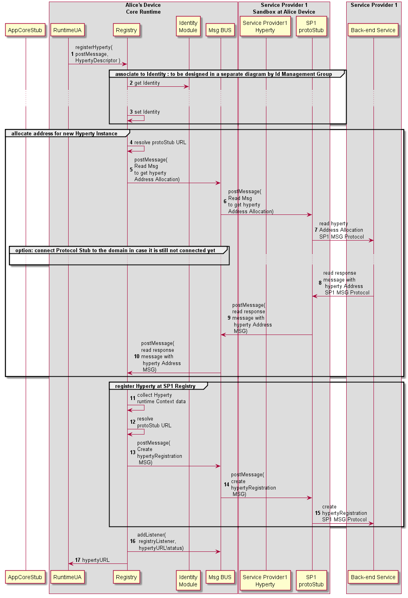

<!--
@startuml "register-hyperty.png"

autonumber

!define SHOW_RuntimeA

!define SHOW_AppAtRuntimeA

!define SHOW_CoreRuntimeA
!define SHOW_MsgBUSAtRuntimeA
!define SHOW_RegistryAtRuntimeA
!define SHOW_IdentitiesAtRuntimeA
!define SHOW_AuthAtRuntimeA
!define SHOW_CoreAgentAtRuntimeA

!define SHOW_SP1SandboxAtRuntimeA
!define SHOW_Protostub1AtRuntimeA
!define SHOW_ServiceProvider1HypertyAtRuntimeA
!define SHOW_ServiceProvider1RouterAtRuntimeA

!define SHOW_SP1

!include ../runtime_objects.plantuml

RunUA@A -> RunReg@A : registerHyperty(\npostMessage,\nHypertyDescriptor )

	group associate to Identity : to be designed in a separate diagram by Id Management Group

		RunID@A <- RunReg@A : get Identity

		... ...

		RunReg@A <- RunReg@A : set Identity

	end group

	group allocate address for new Hyperty Instance
		RunReg@A <- RunReg@A : resolve protoStub URL
		RunReg@A -> BUS@A : postMessage(\nRead Msg\nto get hyperty \nAddress Allocation)

		BUS@A -> Proto1@A : postMessage(\nRead Msg\nto get hyperty \nAddress Allocation)

		Proto1@A -> SP1 : read hyperty\nAddress Allocation\nSP1 MSG Protocol

		group option: connect protocol stub to the domain in case it is still not connected yet

		...

		end group

		Proto1@A <- SP1 : read response \nmessage with\n hyperty Address\n SP1 MSG Protocol

		Proto1@A -> BUS@A : postMessage(\nread response \nmessage with\n hyperty Address\n MSG)

		RunReg@A <- BUS@A : postMessage(\nread response \nmessage with\n hyperty Address\n MSG)

	end group
		
	group register Hyperty at SP1 Registry
		RunReg@A <- RunReg@A : collect Hyperty\nruntime Context data
		RunReg@A <- RunReg@A : resolve \nprotoStub URL
		RunReg@A -> BUS@A : postMessage(\nCreate \nhypertyRegistration\n MSG)

		BUS@A -> Proto1@A : postMessage(\ncreate \nhypertyRegistration\n MSG)

		Proto1@A -> SP1 : create\nhypertyRegistration\nSP1 MSG Protocol


	end group

RunReg@A -> BUS@A : addListener( registryListener, hypertyURL\status)

RunUA@A <- RunReg@A : hypertyURL

@enduml
-->




Step 1 : the Hyperty registration is requested by the Runtime UA triggered by the [Hyperty Deployment process](deploy-hyperty.md)

Steps 2 and 3 : The Hyperty is associated to a certain [identity](../identity-management/user-to-hyperty-binding.md)

Steps 4 - 10 : an Hyperty URL address is allocated in cooperation with the Msg Node Address Allocation functionality.

**Message to request address allocated for new Hyperty Instance**


```
"id" : "1"
"type" : "CREATE",
"from" : "hyperty-runtime://sp1/runalice/registry",
"to" : "sp1/msg-node/address-allocation",
"body" : { "hypertyUrl" : "hyperty://sp1/hy123" }
```

**Response Message returning the requested Hyperty Instance address**

```
"id" : "1"
"type" : "RESPONSE",
"from" : "sp1/msg-node/address-allocation",
"to" : "hyperty-runtime://sp1/runalice/registry",
"body" : { "hypertyInstanceURL" : "hyperty-instance://sp1/alice/hy123" }
```

Steps 11 - 15 : the Hyperty instance is registered in the back-end Registry

**Message to Register new Hyperty Instance**

```
"id" : "1"
"type" : "CREATE",
"from" : "hyperty-runtime://sp1/runalice",
"to" : "sp1/registry",
"body" : { "hypertyURL" : "hyperty://sp1/hy123", "hypertyInstanceURL" : "hyperty-instance://sp1/hy123,
"hypertyRuntimeURL" : "hyperty-runtime://sp1/runalice,
...}
```

Steps 16 - 17 : The runtime Registry adds its listener to be notified about Hyperty instance status and returns the Hyperty URL to the runtime UA