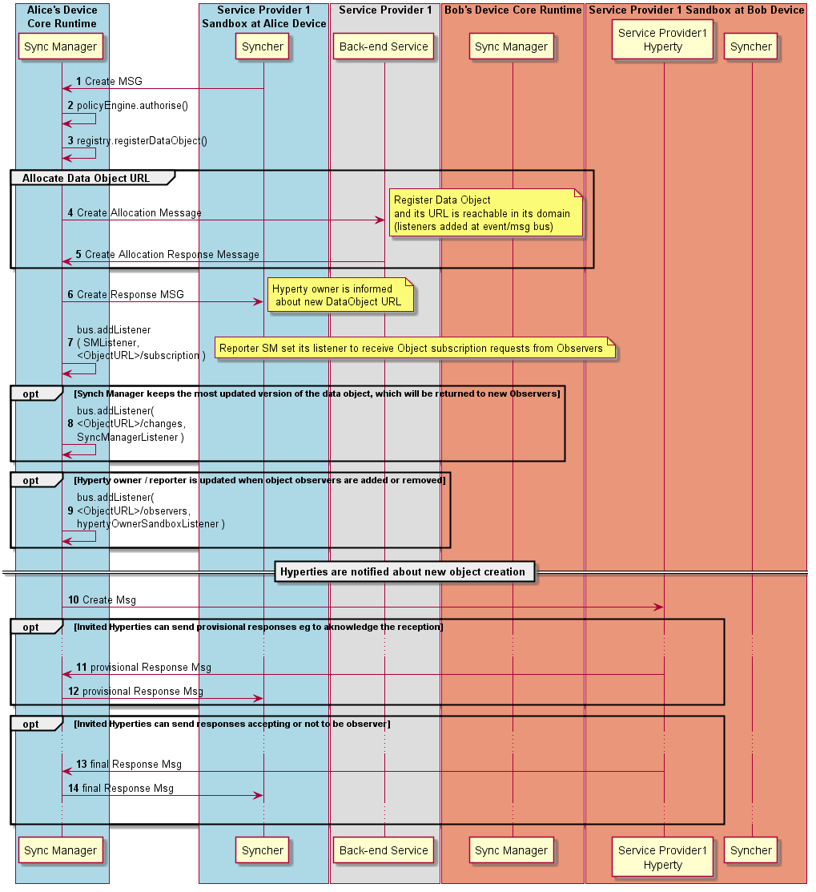

#### Data Object Creation by Reporter

This MSC diagrams shows the most relevant steps to support the setup of data object synchronisation.



Steps 1-2: The Data Object reporter post a Create Message to initiate the setup of the Data Object synchronisation.

**[Create Message sent by Reporter](https://github.com/reTHINK-project/architecture/tree/master/docs/datamodel/message#createmessagebody)**

```
"id" : "1"
"type" : "CREATE",
"from" : "hyperty://<sp1>/alicehy123",
"to" : "hyperty-runtime://<sp1>/<alice-device>/sm",
"body" : { "resource" : "comm://sp1/alice/123456", "authorise" : "hyperty://sp2/bobhy123", "value" : "<json object > , "schema" : "hyperty-catalogue://sp1/dataObjectSchema/schema123" }
```

Steps : The Core Police Engine applies policies to check whether Alice has permissions to create the data object.

Step : optionally, and according to applicable policies, the new data object is registered in the Registry. In Step 11, the Registry adds a listener in the MessageBUS to be notified about status change events of the new Data Object.

Steps : optionally, and again, according to applicable policies, a new address might have to be allocated to the Data Object by the Messaging Node address allocation functionalities, to ensure the new data object is globally reachable.

Steps : optionally, and again, according to applicable policies, the new Data Object is also registered in the Back-end (Domain) Registry.

Steps : optionally, and again, according to applicable policies, the Reported Hyperty is added as a listener to be notified when new Observers to its Data Object are added or removed. The DataObjectObserversURL is handled by the Policy Engine.

Steps 4: The new address allocated to the Data Object is informed back to the Reporter with a response message.

**[Response Message by SM to inform Hyperty Owner that object creation was authorised including in the body the new allocated Data Object URL](https://github.com/reTHINK-project/architecture/tree/master/docs/datamodel/message#createmessagebody)**

```
"id" : "1"
"type" : "RESPONSE",
"from" : "hyperty-runtime://<sp1>/<alice-device>/sm",
"to" : "hyperty://sp1/alicehy123",
"body" : { "code" : "200", "value" : "{ "resource" : "comm://sp1-msg-node/alice/123456" } }
```

Steps : In case the data object creation is authorised, the Message BUS forwards the data object creation message to invited Observers and the Core Policy Engine takes the Hyperty Instance URLs set in the `to` header field, to set as the list of addresses that are previously authorised to be Observer for the new data object.

Steps : optionally, invited Observers may respond with provisional responses e.g. to aknowledge the reception of the invitation and to accept or not the invitation to be an Observer.

**[Provisional Response Message sent by inviter Observer](https://github.com/reTHINK-project/architecture/tree/master/docs/datamodel/message#responsemessagebody)**

```
"id" : "1"
"type" : "RESPONSE",
"from" : "hyperty://sp2/bobhy123",
"to" : "hyperty://sp1/alicehy123",
"body" : { "code" : "1XX"  }
```
