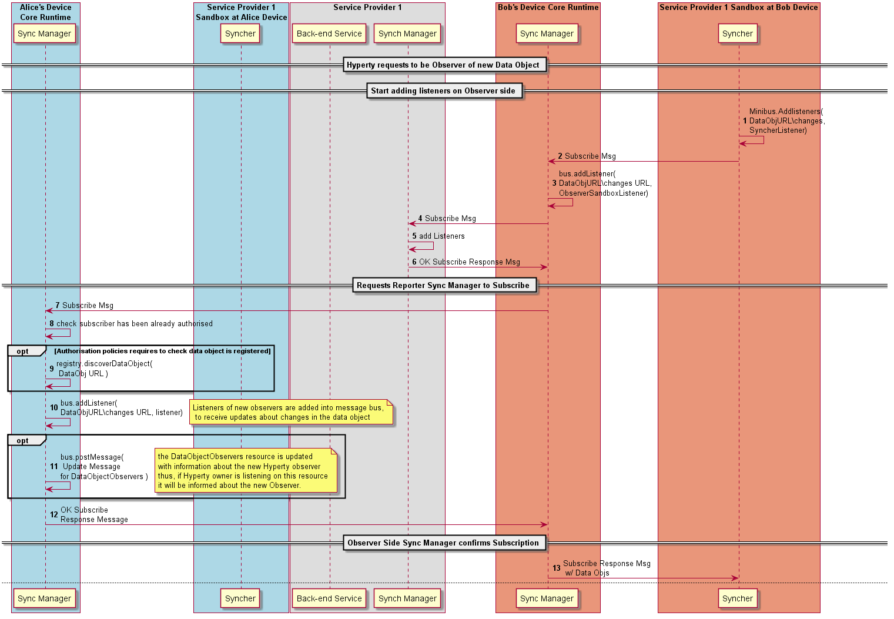

#### Data Object Unsubscription by Observer



to be an Observer of a Data Object, a Subscription message is sent to the resource managing subscription for the data object (DataObjectURL/subscription) which is implemented by the Synch Manager of the Reporter.

**[Unsubscription Message sent by Observer to Reporter domain SM](https://github.com/reTHINK-project/architecture/tree/master/docs/datamodel/message#subscriptionmessagebody)**

```
"id" : "1"
"type" : "UNSUBSCRIPTION",
"from" : "hyperty://sp2/bobhy123",
"to" : "comm://<sp1>/<alice>/<123456>/subscription"
```

The Sync Manager checks if Observer is valid.

Step : in case the unsubscription request is authorised, the Observer listener is removed from the Message BUS to receive messages on the Data Object resource URL.

Step : the Observer listener is also removed from the Message BUS to be notified about new Observers in case it was added.

Steps : optionally, it is posted an UPDATE message into the DataObjectObserversURL with information about the Observer removal.

Steps : the Observer is informed about the unsubscription authorisation with a RESPONSE message.

**[Unsubscription Response Message ](https://github.com/reTHINK-project/architecture/tree/master/docs/datamodel/message#responsemessagebody)**

```
"id" : "1"
"type" : "RESPONSE",
"from" : "comm://<sp1>/<alice>/<123456>/subscription",
"to" : "hyperty://sp2/bobhy123",
"body" : { "code" : "2XX" }
```

**[Unsubscription Message sent to observer sync-manager to remove listeners from observer runtime and domain ](https://github.com/reTHINK-project/architecture/tree/master/docs/datamodel/message#subscriptionmessagebody)**

```
"id" : "1"
"type" : "UNSUBSCRIPTION",
"from" : "hyperty://sp2/bobhy123",
"to" : "hyperty-runtime://<sp1>/<bob-device>/sm",
"body" : { "resource" : "comm://<sp1>/<alice>/<123456>/subscription" }
```

**[Unsubscription Message sent to observer domain sync-manager to remove listeners from observer runtime and domain ](https://github.com/reTHINK-project/architecture/tree/master/docs/datamodel/message#subscriptionmessagebody)**

```
"id" : "1"
"type" : "UNSUBSCRIPTION",
"from" : "hyperty-runtime://<sp1>/<bob-device>/sm",
"to" : "domain://msg-node.<sp1>/sm",
"body" : { "resource" : "comm://<sp1>/<alice>/<123456>/subscription" }
```

