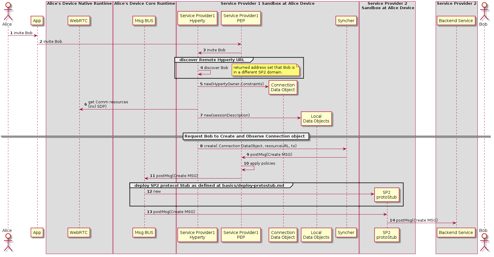

##### H2H Interdomain Communication - create communication

This MSC diagrams shows the most relevant steps to support the initial invitation of Alice to Bob, where Alice and Bob are in different domains.

<!--
@startuml "h2h-inter-comm-1-alice-invites-bob.png"

autonumber

!define SHOW_RuntimeA

!define SHOW_AppAtRuntimeA

!define SHOW_NativeAtRuntimeA
!define SHOW_WebRTCAtRuntimeA

!define SHOW_SP1SandboxAtRuntimeA
' !define SHOW_Protostub1AtRuntimeA
!define SHOW_ServiceProvider1HypertyAtRuntimeA
!define SHOW_ServiceProvider1RouterAtRuntimeA
!define SHOW_CommObjectAtRuntimeA
!define SHOW_LocalObjectAtRuntimeA
!define SHOW_Syncher1AtRuntimeA

!define SHOW_SP2SandboxAtRuntimeA
!define SHOW_Protostub2AtRuntimeA

!define SHOW_CoreRuntimeA
!define SHOW_MsgBUSAtRuntimeA

!define SHOW_SP2

!define SHOW_Bob

!include ../runtime_objects.plantuml

Alice -> App@A : invite Bob

App@A -> Router1@A : invite Bob

SP1H@A <- Router1@A : invite Bob

group discover Remote Hyperty URL

SP1H@A -> SP1H@A : discover Bob

note right
	returned address set that Bob is
	in a different SP2 domain.
end note

end group

create CommObj@A

SP1H@A ->  CommObj@A : new(HypertyOwner,Constraints)

SP1H@A -> WRTC@A : get Comm resources\n(incl SDP)

create LocObj@A

SP1H@A ->  LocObj@A : new(sessionDescription)

== Request Bob to Create and Observe Connection object ==

SP1H@A -> Sync1@A : create( Connection DataObject, resourceURL, to)

Sync1@A -> Router1@A : postMsg(Create MSG)

Router1@A -> Router1@A : apply policies

Router1@A -> BUS@A : postMsg(Create MSG)

group deploy SP2 protocol Stub as defined at basics/deploy-protostub.md

create Proto2@A
BUS@A -> Proto2@A : new

end group

Proto2@A <- BUS@A : postMsg(Create MSG)

Proto2@A -> SP2 : postMsg(Create MSG)

@enduml
-->





(Steps 1 - 4) : Alice decides to invite Bob for a communication. The discovery of Bob's Hyperty Instance URL is described here(../identity-management/discovery.md).

(Steps 5 - 7) : the Hyperty Instance creates the Connection, the LocalConnectionDescription and the LocalIceCandidates data objects as defined in [15].

(Steps 8 - 9) : the Hyperty Instance requests the Syncher to ask Bob to create and observe these objects. Syncher generates CREATE messages for each object and puts it in the Body in JSON format. For simplification purposes we assume the CREATE msg contains the Connection object plus local SDP and local IceCandidates:

**[Create Message](https://github.com/reTHINK-project/architecture/tree/master/docs/datamodel/message#createmessagebody)**

```
"id" : "1"
"type" : "CREATE",
"from" : "hyperty-instance://sp1/alicehy123",
"to" : "hyperty-instance://sp2/bobhy123",
"contextId" : "qwertyuiopasdfghjkl",
"body" : { "resource" : "comm://sp1/alice/123456", "value" : "<json object with connection, sdp and ice candidates>"}
```

(Steps 10) : Alice's PEP applies local policies if required including outgoing communication request access control

(Step 11) : The message is routed towards Alice Message BUS.

(Step 12) : SP2 protostub is deployed in the runtime if not deployed yet as defined in chapter "Deploy Protocol Stub"

(Steps 13 - 14) : The Message BUS routes the message to the SP2 protocol stub which processes it to send it to Service Provider 2 Back-end Messaging Service.
