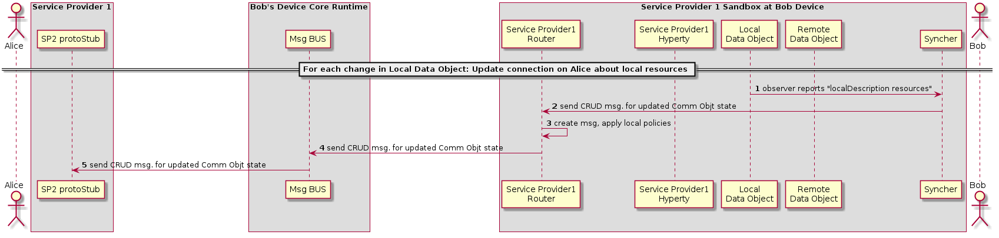

##### Synchronization of Alice's Data Object

<!--
@startuml "h2h-inter-comm-6-alice-DO-synch.png"

    autonumber
!define SHOW_Runtime1B
!define SHOW_SP1SandboxAtRuntime1B
!define SHOW_ServiceProvider1HypertyAtRuntime1B
!define SHOW_ServiceProvider1RouterAtRuntime1B
!define SHOW_RemoteObjectAtRuntime1B
!define SHOW_LocalObjectAtRuntime1B

!define SHOW_CoreRuntime1B
!define SHOW_MsgBUSAtRuntime1B

!define SHOW_NativeAtRuntime1B

!define SHOW_SP1_WITH_SP2Stub

!define SHOW_Syncher1AtRuntime1B

!include ../runtime_objects.plantuml

actor "Bob" as Bob

== For each change in Local Data Object: Update connection on Alice about local resources ==

LocObj@1B -> Sync1@1B : observer reports "localDescription resources"

' Update comm in Alice
Sync1@1B -> Router1@1B : send CRUD msg. for updated Comm Objt state
Router1@1B -> Router1@1B : create msg, apply local policies

Router1@1B -> BUS@1B : send CRUD msg. for updated Comm Objt state

BUS@1B -> SP2Stub : send CRUD msg. for updated Comm Objt state

@enduml
-->

(Steps 1 - 2): The local Data object reports that there have been changes in the connection parameters and the Syncher sends a CRUD message through the Policy Enforcer to Update the Remote Data Object at Alice's Hyperty (Step 2).

(Steps 3 - 4): The Policy Enforcer checks if the message is compliant with the local policies and forwards the message the Msg Bus (Step 4)

(Step 5): The message Bus sends the message to Alice via the SP2 stub, deployed in Alice's runtime
