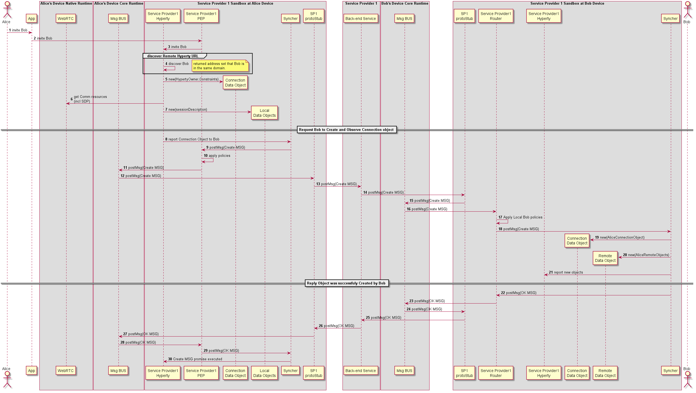

### H2H Intradomain Communication Chat Room

This MSC diagrams shows the most relevant steps to support chat room communication based on messaging pub-sub.

It is based on a model where each participant contains a Hyperty Resource object agregating chat messages sent by the participant.

Reporter of Chat Messages is the Participant that sends the messages.

All the other participants are observer of remote Chat Message received from remote Participants.

<!--
@startuml "h2h-intra-chat-room_model.png"

class Communication {
		host 
		owner 
	}

class Participant{
		
	}

class HypertyResource{
		ChatMessages
	}

Communication "1"*.."1..*" Participant
Participant "1"*..>"1" HypertyResource


@enduml
-->


<!--
@startuml "h2h-intra-chat-room.png"

autonumber

!define SHOW_RuntimeA

!define SHOW_AppAtRuntimeA

!define SHOW_NativeAtRuntimeA
!define SHOW_WebRTCAtRuntimeA

!define SHOW_SP1SandboxAtRuntimeA
!define SHOW_Protostub1AtRuntimeA
!define SHOW_ServiceProvider1HypertyAtRuntimeA
!define SHOW_ServiceProvider1RouterAtRuntimeA
!define SHOW_CommObjectAtRuntimeA
!define SHOW_LocalObjectAtRuntimeA
!define SHOW_Syncher1AtRuntimeA


!define SHOW_CoreRuntimeA
!define SHOW_MsgBUSAtRuntimeA

!define SHOW_Runtime1B
!define SHOW_SP1SandboxAtRuntime1B
!define SHOW_Protostub1AtRuntime1B
!define SHOW_ServiceProvider1HypertyAtRuntime1B
!define SHOW_ServiceProvider1RouterAtRuntime1B
!define SHOW_CommObjectAtRuntime1B
!define SHOW_RemoteObjectAtRuntime1B
!define SHOW_Syncher1AtRuntime1B

!define SHOW_CoreRuntime1B
!define SHOW_MsgBUSAtRuntime1B

!define SHOW_SP1

!define SHOW_Bob

!include ../runtime_objects.plantuml

Alice -> App@A : invite Bob

App@A -> Router1@A : invite Bob

SP1H@A <- Router1@A : invite Bob

group discover Remote Hyperty URL

SP1H@A -> SP1H@A : discover Bob

note right
	returned address set that Bob is
	in the same domain.
end note

end group

create CommObj@A

SP1H@A ->  CommObj@A : new(HypertyOwner,Constraints)

SP1H@A -> WRTC@A : get Comm resources\n(incl SDP)

create LocObj@A

SP1H@A ->  LocObj@A : new(sessionDescription)

== Request Bob to Create and Observe Connection object ==

SP1H@A -> Sync1@A : report Connection Object to Bob

Sync1@A -> Router1@A : postMsg(Create MSG) 

Router1@A -> Router1@A : apply policies

Router1@A -> BUS@A : postMsg(Create MSG) 

Proto1@A <- BUS@A : postMsg(Create MSG) 

Proto1@A -> SP1 : postMsg(Create MSG) 

Proto1@1B <- SP1 : postMsg(Create MSG) 

BUS@1B <- Proto1@1B : postMsg(Create MSG) 

Router1@1B <- BUS@1B : postMsg(Create MSG) 

Router1@1B -> Router1@1B : Apply Local Bob policies

Sync1@1B <- Router1@1B : postMsg(Create MSG) 

create CommObj@1B

Sync1@1B ->  CommObj@1B : new(AliceConnectionObject)

create RemObj@1B

Sync1@1B ->  RemObj@1B : new(AliceRemoteObjects)

SP1H@1B <- Sync1@1B : report new objects

== Reply Object was successfuly Created by Bob ==

Sync1@1B -> Router1@1B : postMsg(OK MSG) 

Router1@1B -> BUS@1B : postMsg(OK MSG) 

BUS@1B -> Proto1@1B : postMsg(OK MSG) 

Proto1@1B -> SP1 : postMsg(OK MSG) 

Proto1@A <- SP1 : postMsg(OK MSG) 

Proto1@A -> BUS@A : postMsg(OK MSG) 

Router1@A <- BUS@A : postMsg(OK MSG) 

Sync1@A <- Router1@A : postMsg(OK MSG) 

SP1H@A <- Sync1@A : Create MSG promise executed

@enduml
-->




**Create Message**

For simplification purposes we assume the CREATE msg contains the Connection object plus local SDP and local IceCandidates

```
type = CREATE
from = hyperty://sp1/alicehy123
to = hyperty://sp1/bobhy123
contextId = qwertyuiopasdfghjkl
cseq = 1
resource = comm://sp1/alice/123456
body = <json object with connection, sdp and ice candidates>
```

**OK Message**

```
type = OK
from = hyperty://sp1/bobhy123
to = hyperty://sp1/alicehy123
contextId = qwertyuiopasdfghjkl
cseq = 1
```
