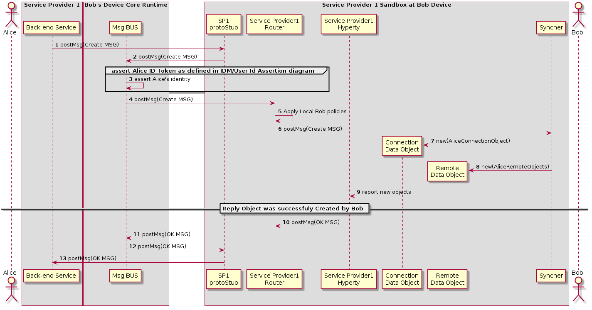

### H2H Intradomain Communication - create communication

This MSC diagrams shows how Bob receives invitation from Bob. 

<!--
@startuml "h2h-intra-comm-2-bob-receives-invitation.png"

autonumber


!define SHOW_Runtime1B
!define SHOW_SP1SandboxAtRuntime1B
!define SHOW_Protostub1AtRuntime1B
!define SHOW_ServiceProvider1HypertyAtRuntime1B
!define SHOW_ServiceProvider1RouterAtRuntime1B
!define SHOW_CommObjectAtRuntime1B
!define SHOW_RemoteObjectAtRuntime1B
!define SHOW_Syncher1AtRuntime1B

!define SHOW_CoreRuntime1B
!define SHOW_MsgBUSAtRuntime1B

!define SHOW_SP1

!define SHOW_Bob

!include ../runtime_objects.plantuml


Proto1@1B <- SP1 : postMsg(Create MSG) 

BUS@1B <- Proto1@1B : postMsg(Create MSG) 

Router1@1B <- BUS@1B : postMsg(Create MSG) 

Router1@1B -> Router1@1B : Apply Local Bob policies

Sync1@1B <- Router1@1B : postMsg(Create MSG) 

create CommObj@1B

Sync1@1B ->  CommObj@1B : new(AliceConnectionObject)

create RemObj@1B

Sync1@1B ->  RemObj@1B : new(AliceRemoteObjects)

SP1H@1B <- Sync1@1B : report new objects

== Reply Object was successfuly Created by Bob ==

Sync1@1B -> Router1@1B : postMsg(OK MSG) 

Router1@1B -> BUS@1B : postMsg(OK MSG) 

BUS@1B -> Proto1@1B : postMsg(OK MSG) 

Proto1@1B -> SP1 : postMsg(OK MSG) 


@enduml
-->





Steps 1 - 3 : Service Provider Back-end Messaginge Service routes the message to Bob's Message BUS, reaching Bob's PEP component

Step 4 : Bob's PEP applies local policies if required including incoming communication request access control

Steps 5 - 8 : the message is forwarded to Bob's Syncher which creates the requested new objects and reports to Bob's Hyperty Instance the new created objects.

Steps 9 - 12 : As soon as the new Objects were created by Bob's syncher, it responds back to Alice to confirm the objects were created with a [Response Message](https://github.com/reTHINK-project/architecture/tree/master/docs/datamodel/message#responsemessagebody):

```
"id" : "1"
"type" : "RESPONSE",
"from" : "hyperty-instance://sp1/bobhy123",
"to" : "hyperty-instance://sp1/alicehy123",
"contextId" : "qwertyuiopasdfghjkl",
"body" : { "code" : "200" , "description" : "ok"}
```
