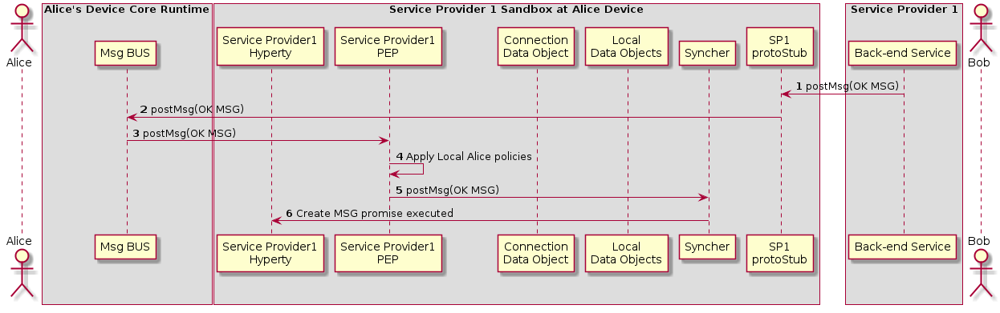

#### H2H Intradomain Communication - Invitation Acknowledgement

This MSC diagrams shows how Alice is aknowledged that Bob received the invitation

<!--
@startuml "h2h-intra-comm-3-alice-is-aknowledged.png"

autonumber

!define SHOW_RuntimeA

!define SHOW_SP1SandboxAtRuntimeA
!define SHOW_Protostub1AtRuntimeA
!define SHOW_ServiceProvider1HypertyAtRuntimeA
!define SHOW_ServiceProvider1RouterAtRuntimeA
!define SHOW_CommObjectAtRuntimeA
!define SHOW_LocalObjectAtRuntimeA
!define SHOW_Syncher1AtRuntimeA

!define SHOW_CoreRuntimeA
!define SHOW_MsgBUSAtRuntimeA

!define SHOW_SP1
!define SHOW_Bob

!include ../runtime_objects.plantuml

Proto1@A <- SP1 : postMsg(OK MSG)

Proto1@A -> BUS@A : postMsg(OK MSG)

Router1@A <- BUS@A : postMsg(OK MSG)

Router1@A -> Router1@A : Apply Local Alice policies

Sync1@A <- Router1@A : postMsg(OK MSG)

SP1H@A <- Sync1@A : Create MSG promise executed

@enduml
-->

(Step 1 - 3) : Service Provider Back-end Messaginge Service routes the OK Message to Bob's Message BUS which forwards it to its PEP

(Step 4) : Bob's PEP applies local policies if required

(Steps 5 - 6) : the message is forwarded to Alice's Syncher which updates the Data Object and reports the change to Alice's Hyperty Instance
