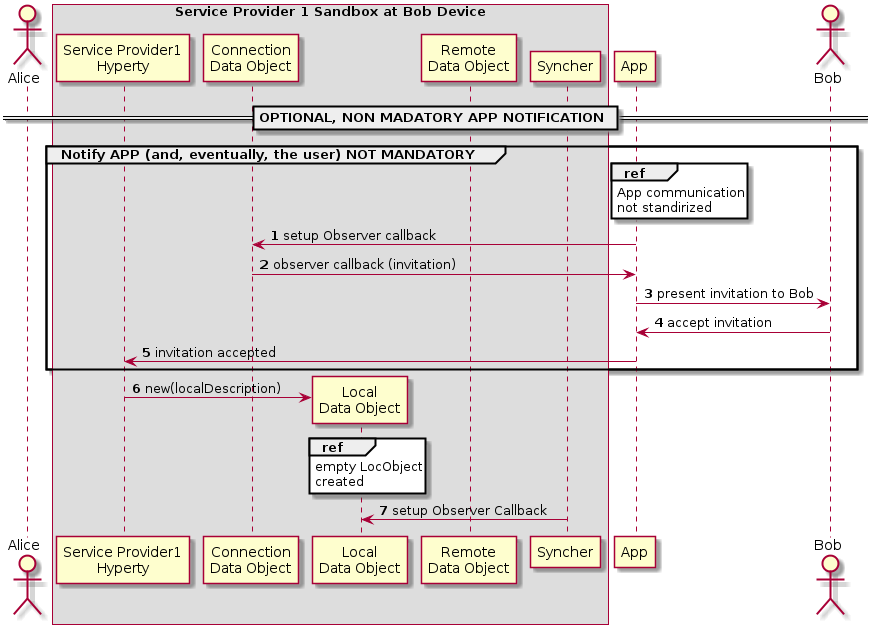

#### Incoming call is notified to Bob's application and Alice is updated

<!--
@startuml "h2h-intra-comm-4-notification-update.png"

	autonumber
!define SHOW_Runtime1B
!define SHOW_SP1SandboxAtRuntime1B
!define SHOW_ServiceProvider1HypertyAtRuntime1B
' '!define SHOW_ServiceProvider1RouterAtRuntime1B
!define SHOW_CommObjectAtRuntime1B
!define SHOW_RemoteObjectAtRuntime1B
!define SHOW_LocalObjectAtRuntime1B

!define SHOW_CoreRuntime1B

!define SHOW_Syncher1AtRuntime1B

!include ../runtime_objects.plantuml

participant "App" as App@1B
actor "Bob" as Bob

== OPTIONAL, NON MADATORY APP NOTIFICATION ==

group Notify APP (and, eventually, the user) NOT MANDATORY
	ref over "App@1B"
		App communication
		not standirized
	end ref
	App@1B -> CommObj@1B : setup Observer callback

	CommObj@1B -> App@1B : observer callback (invitation)
	App@1B -> Bob : present invitation to Bob

	' Bob accepts invitation
	Bob -> App@1B : accept invitation
	App@1B -> SP1H@1B : invitation accepted
end

create LocObj@1B

SP1H@1B -> LocObj@1B : new(localDescription)
ref over "LocObj@1B"
	empty LocObject
	created
end ref

Sync1@1B -> LocObj@1B : setup Observer Callback

@enduml
-->

(step 1) The Application which interacts with the human user setups a callback in to be notified when the Connection data Object is modified.

(step 2) When a Data Connection Object receives any modification request from another Hyperty, the callback setup in the step before is called. The App is aware of the incoming invitation to establish a media session.

(step 3) The App can  show this invitation to the human user in some way through a human interface. (step 4) In such a case the human typically will accept the communication. (step 5) The App accepts the invitation through the API exposed by the the Service Provider Hyperty.
In order to start the media session a Local Data Object is created (step 10) where the data related to the  local parameters of the media session is going to be established.

(step 6) The Syncher element from the Hyperty setups an Observer callback in the Local Data Object which will be called when the Local Data Object changes. (step 7) The observer reports that there is a communication in progress to the Syncher.
