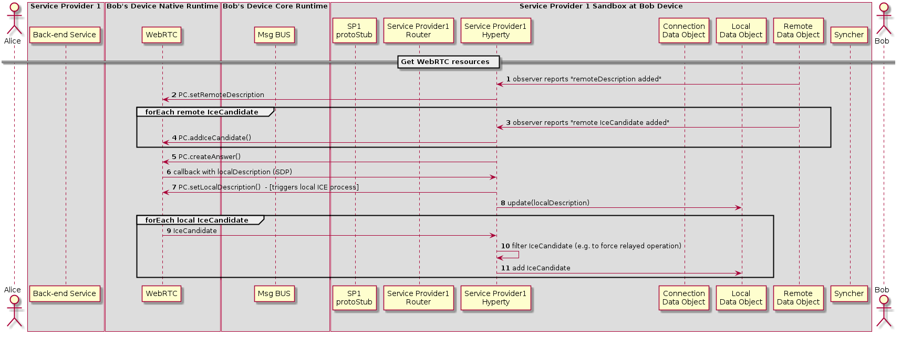

#### Bob starts WebRTC API (TBC)

<!--
@startuml "h2h-intra-comm-5-bob-webrtc.png"

	autonumber
!define SHOW_Runtime1B
!define SHOW_SP1SandboxAtRuntime1B
!define SHOW_Protostub1AtRuntime1B
!define SHOW_ServiceProvider1HypertyAtRuntime1B
!define SHOW_ServiceProvider1RouterAtRuntime1B
!define SHOW_CommObjectAtRuntime1B
!define SHOW_RemoteObjectAtRuntime1B
!define SHOW_LocalObjectAtRuntime1B

!define SHOW_CoreRuntime1B
!define SHOW_MsgBUSAtRuntime1B
' !define SHOW_RegistryAtRuntime1B
' !define SHOW_IdentitiesAtRuntime1B
' !define SHOW_AuthAtRuntime1B

!define SHOW_NativeAtRuntime1B
!define SHOW_WebRTCAtRuntime1B

!define SHOW_SP1
' !define SHOW_Msg1

!define SHOW_Syncher1AtRuntime1B

!include ../runtime_objects.plantuml

' participant "App" as App@1B
actor "Bob" as Bob

== Get WebRTC resources  ==

RemObj@1B -> SP1H@1B : observer reports "remoteDescription added"
SP1H@1B -> WRTC : PC.setRemoteDescription

group forEach remote IceCandidate
	RemObj@1B -> SP1H@1B : observer reports "remote IceCandidate added"
	SP1H@1B -> WRTC : PC.addIceCandidate()
end

SP1H@1B -> WRTC : PC.createAnswer()
WRTC -> SP1H@1B : callback with localDescription (SDP)
SP1H@1B -> WRTC : PC.setLocalDescription()  - [triggers local ICE process]

SP1H@1B -> LocObj@1B : update(localDescription)

group forEach local IceCandidate
	WRTC -> SP1H@1B : IceCandidate
	SP1H@1B -> SP1H@1B : filter IceCandidate (e.g. to force relayed operation)
	SP1H@1B -> LocObj@1B : add IceCandidate
end

@enduml
-->

(Step 1) The Hyperty is notified about the added remoteDescription object.

(Step 2) The Hyperty calls the WebRTC API from the browser including the remote parameters from the Remote Data Object. The same happens when a new Ice Candidate is updated in the Remote Data Object (step 3 and Step 4).

While remote Ice Candidate are added (step 3 and Step 4 may take place several times as Trickle Ice is supported) the Hyperty calls the Peer Connection method to create an SDP answer (step 5) to be sent to it with all the parameters used to establish the media session between Alice and Bob but the Ice Candidates which will be received asynchronously later. When the SDP with the local description is ready a callback is called and the SDP is sent to the Hyperty (step 6).

(Step 7) The Hyperty calls the Peer setLocalDesciption API method from the WebRTC API exposed by the browser so that the browser is aware of the media parameters which are going to be used to establish the media session with Alice. At this point the gathering process of local Ice Candidates starts.

(Step 8) The Hyperty updates the Local Data Object with the parameters from the localDescription.

(Step 9) As a result of the started ICE process local connectivity candidate will be reported from the WebRTC engine to the Hyperty. For each reported localCandidate the Hyperty can optionally perform a filter operation (Step 10), e.g. to filter out non-relay candidates to force TURN based operation, and reports the remaining candidates to the Local Data Object (Step 11)
