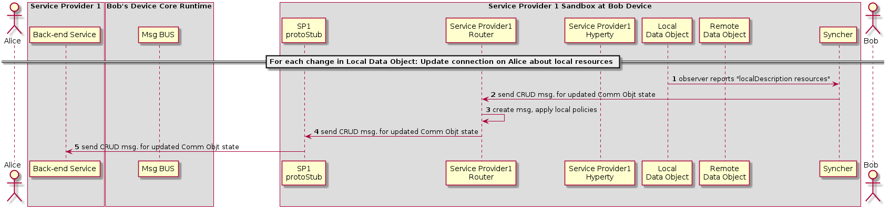

#### Synchronization of Alice's Data Object

<!--
@startuml "h2h-intra-comm-6-alice-DO-synch.png"

	autonumber
!define SHOW_Runtime1B
!define SHOW_SP1SandboxAtRuntime1B
!define SHOW_Protostub1AtRuntime1B
!define SHOW_ServiceProvider1HypertyAtRuntime1B
!define SHOW_ServiceProvider1RouterAtRuntime1B
' '!define SHOW_CommObjectAtRuntime1B
!define SHOW_RemoteObjectAtRuntime1B
!define SHOW_LocalObjectAtRuntime1B

!define SHOW_CoreRuntime1B
!define SHOW_MsgBUSAtRuntime1B
' !define SHOW_RegistryAtRuntime1B
' !define SHOW_IdentitiesAtRuntime1B
' !define SHOW_AuthAtRuntime1B

!define SHOW_NativeAtRuntime1B
' '!define SHOW_WebRTCAtRuntime1B

!define SHOW_SP1
' !define SHOW_Msg1

!define SHOW_Syncher1AtRuntime1B

!include ../runtime_objects.plantuml

participant "App" as App@1B
actor "Bob" as Bob

== For each change in Local Data Object: Update connection on Alice about local resources ==

LocObj@1B -> Sync1@1B : observer reports "localDescription resources"

' Update comm in Alice
Sync1@1B -> Router1@1B : send CRUD msg. for updated Comm Objt state
Router1@1B -> Router1@1B : create msg, apply local policies

Router1@1B -> Proto1@1B : send CRUD msg. for updated Comm Objt state
note left
via already established ProtOFly channel (assuming that it is bi-directional)
end note
Proto1@1B -> SP1 : send CRUD msg. for updated Comm Objt state

@enduml
-->

(Step 1) The local Data object reports that there have been changes in the connection parameters and the Syncher sends a CRUD message through the Policy Enforcer to Update the Remote Data Object at Alice's Hyperty (Step 2). (Step 3) the Policy Enforcer checks if the message is compliant with the local policies and the message is sent to the ProtoStub (Step 4) to be in turn sent to the Service Provider 1 Back-End (Step 5)
