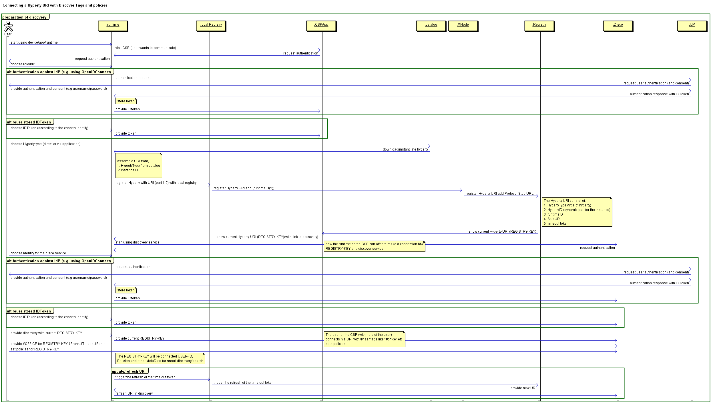
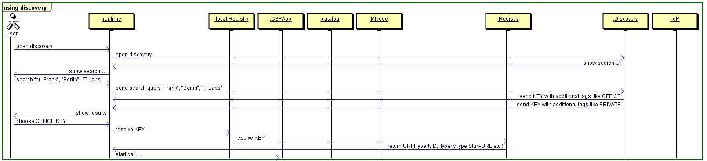

**This is OUTDATED!! Most updated version is [here](https://github.com/reTHINK-project/dev-service-framework/blob/d3.2-working-docs/docs/specs/dynamic-view/identity-management)**
==================================================================================================================================================================================

#### Discovery

The picture shows Discovery of a Hyperty. The first picture is about the preparation or "How comes the HYperty URL into the Discovery service?". The second pictury is about "How to find this information?" and "How to use it?".

##### Prepare Discovery

##### Use Discovery

