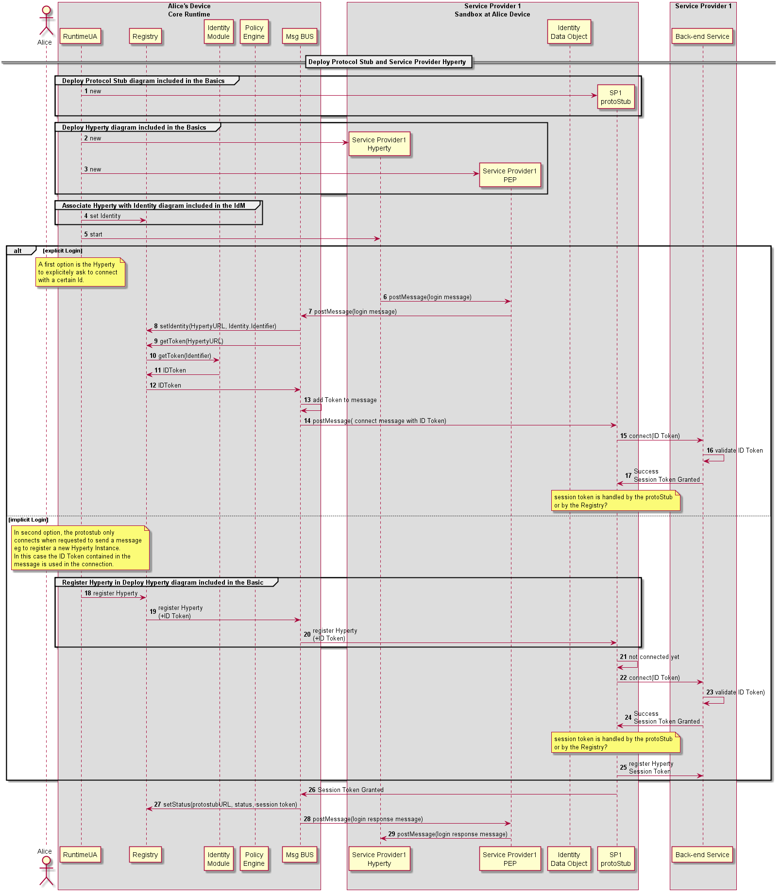

#### Domain Login

<!--
@startuml "domain-login.png"

autonumber

!define SHOW_RuntimeA

!define SHOW_CoreRuntimeA
!define SHOW_MsgBUSAtRuntimeA
!define SHOW_RegistryAtRuntimeA
!define SHOW_IdentitiesAtRuntimeA
!define SHOW_AuthAtRuntimeA
!define SHOW_CoreAgentAtRuntimeA

!define SHOW_SP1SandboxAtRuntimeA
!define SHOW_Protostub1AtRuntimeA
!define SHOW_ServiceProvider1HypertyAtRuntimeA
!define SHOW_ServiceProvider1RouterAtRuntimeA
!define SHOW_IdentityObjectAtRuntimeA

!define SHOW_SP1

!include ../runtime_objects.plantuml

== Deploy Protocol Stub and Service Provider Hyperty ==

group Deploy Protocol Stub diagram included in the Basics

    create Proto1@A
    RunUA@A -> Proto1@A : new
end

group Deploy Hyperty diagram included in the Basics

    create SP1H@A
    RunUA@A -> SP1H@A : new

    create Router1@A
    RunUA@A -> Router1@A : new
end

group Associate Hyperty with Identity diagram included in the IdM
    RunUA@A -> RunReg@A : set Identity
end

    RunUA@A -> SP1H@A : start

alt explicit Login
    note over RunUA@A
        A first option is the Hyperty
        to explicitely ask to connect
        with a certain Id.
    end note

    SP1H@A -> Router1@A : postMessage(login message)

    BUS@A <- Router1@A : postMessage(login message)

    BUS@A -> RunReg@A : setIdentity(HypertyURL, Identity.Identifier)

    BUS@A -> RunReg@A : getToken(HypertyURL)

    RunReg@A -> RunID@A : getToken(Identifier)

    RunReg@A <- RunID@A : IDToken

    BUS@A <- RunReg@A : IDToken

    BUS@A -> BUS@A : add Token to message

    BUS@A  -> Proto1@A : postMessage( connect message with ID Token)

    Proto1@A -> SP1 : connect(ID Token)

    SP1 -> SP1 : validate ID Token

    Proto1@A <- SP1 : Success\nSession Token Granted

    note over Proto1@A
        session token is handled by the protoStub
        or by the Registry?
    end note

else implicit Login

    note over RunUA@A
        In second option, the protostub only
        connects when requested to send a message
        eg to register a new Hyperty Instance.
        In this case the ID Token contained in the
        message is used in the connection.
    end note

    group Register Hyperty in Deploy Hyperty diagram included in the Basic
        RunUA@A -> RunReg@A : register Hyperty

        BUS@A <- RunReg@A : register Hyperty\n(+ID Token)

        Proto1@A <- BUS@A : register Hyperty\n(+ID Token)

    end

    Proto1@A -> Proto1@A : not connected yet

    Proto1@A -> SP1 : connect(ID Token)

    SP1 -> SP1 : validate ID Token)

    Proto1@A <- SP1 : Success\nSession Token Granted

    note over Proto1@A
        session token is handled by the protoStub
        or by the Registry?
    end note

    Proto1@A -> SP1 : register Hyperty\nSession Token

end

Proto1@A -> BUS@A : Session Token Granted

BUS@A -> RunReg@A : setStatus(protostubURL, status, session token)

BUS@A -> Router1@A : postMessage(login response message)

SP1H@A <- Router1@A : postMessage(login response message)

@enduml
-->

In this use case, it is considered there is a single Protocol Stub to interact with all back-end services including Identity Management. Another option is to have different protocol stubs to interact with different back-end services, for example, one Protocol Stub for Identity Management services and another Protocol Stub for messaging services. In this use case, the Service Provider also plays the role of a Identity Provider. The Use Case where Service Provider and Identity Provider are played by different stakeholders are described in D4.1 [109].
