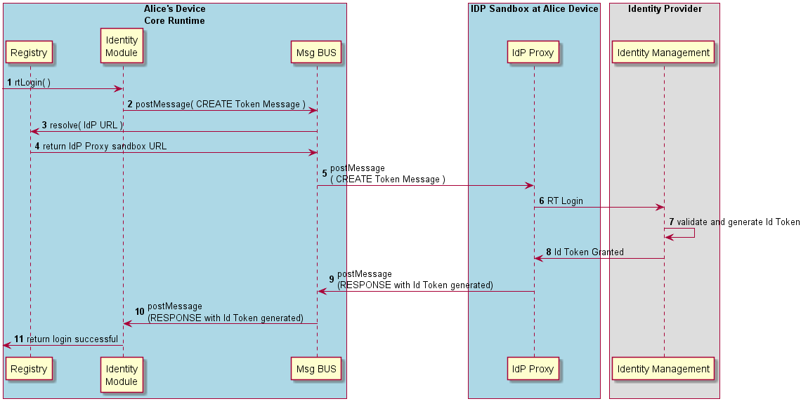

**This is OUTDATED!! Most updated version is [here](https://github.com/reTHINK-project/dev-service-framework/blob/d3.2-working-docs/docs/specs/dynamic-view/identity-management)**
==================================================================================================================================================================================

#### Relying Party Login (Id Token generation)

This section describes the main procedures to generate an Id Token by performing a Relying Party Login.



**Message to Create Id Token**

```
"id" : "1",
"type" : "CREATE",
"from" : "hyperty-runtime://<sp1>/<runalice>/id-module",
"to" : "domain://<idp>",
"body" : { "path" : "/identity/identifier/<bob>/idtoken" , "scope": ["username","cn",..] , "authentication" : "123qwe"}
```

**Response Message returning the generated Id Token**

```
"id" : "1"
"type" : "RESPONSE",
"from" : "domain://<idp>,
"to" : "hyperty-runtime://<sp1>/<runalice>/id-module",
"body" : { "code": 200, "idToken": "JWT Token content" }
```
