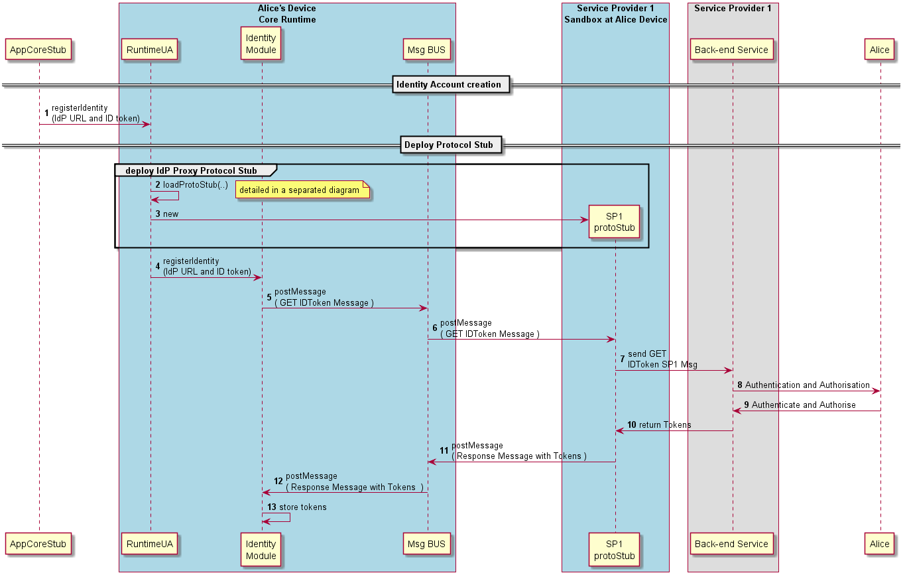

### User Registration

<!--
@startuml "user-registration.png"

autonumber

!define SHOW_RuntimeA

!define SHOW_AppAtRuntimeA

!define SHOW_NativeAtRuntimeA
!define SHOW_JavascriptEngineAtRuntimeA
!define SHOW_HTTPClientAtRuntimeA

!define SHOW_CoreRuntimeA
!define SHOW_MsgBUSAtRuntimeA
!define SHOW_RegistryAtRuntimeA
!define SHOW_IdentitiesAtRuntimeA
!define SHOW_AuthAtRuntimeA

!define SHOW_SP1SandboxAtRuntimeA
!define SHOW_Protostub1AtRuntimeA
!define SHOW_ServiceProvider1HypertyAtRuntimeA
!define SHOW_ServiceProvider1RouterAtRuntimeA
!define SHOW_IdentityObjectAtRuntimeA

!define SHOW_SP1

!include ../runtime_objects.plantuml

== Deploy protocol stub and Registration Hyperty ==

Alice -> HTTP_UAC@A : download\nRegistration App

HTTP_UAC@A -> SP1 : download Registration App

create App@A
JS@A -> App@A : new

group deploy protocol stub
	App@A -> HTTP_UAC@A : download protocol stub
	create Proto1@A
	JS@A -> Proto1@A : new
end

group deploy Hyperty
	App@A -> HTTP_UAC@A : download hyperty
	create SP1H@A
	JS@A -> SP1H@A : new

	create Router1@A
	JS@A -> Router1@A : new
end

== Create Identity Account ==

App@A -> Alice : request\nRegistration\nData

App@A <- Alice : Registration\nData\nprovided

App@A -> SP1H@A : Registration Data provided

create IDObj@A
SP1H@A -> IDObj@A : new

SP1H@A -> SP1H@A: create CreateObj Msg

SP1H@A -> Router1@A : send CreateObj Msg

Router1@A -> Router1@A : enforce SP1\nIdentity Creation \nPolicies

BUS@A <- Router1@A : send CreateObj Msg

Proto1@A <- BUS@A : send CreateObj Msg

Proto1@A -> SP1 : send CreateObj Msg

Proto1@A <- SP1 : Success\nID Token

Proto1@A -> BUS@A : Success\nID Token

RunReg@A <- BUS@A : Register Hyperty

RunReg@A -> RunID@A : Set ID Token

BUS@A -> Router1@A : Success

Router1@A -> SP1H@A : Success

IDObj@A x<- SP1H@A : Delete Obj

group Hyperty Instance Registration 
	Proto1@A <- RunReg@A : register Hyperty\n+ID Token

	Proto1@A -> SP1 : register Hyperty\n+ID Token
end group

@enduml
-->

In this use case, it is considered there is a single protocol stub to interact with all back-end services including Identity Management. Another option is to have different protocol stubs to interact with different back-end services including authentication, authorisation and messaging services.
