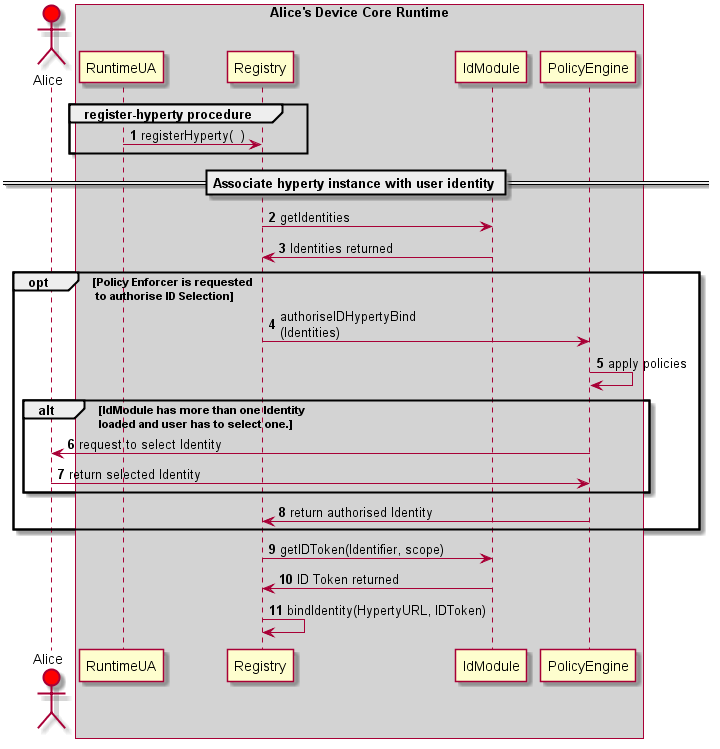

### Associate User Identity to Hyperty Instance

####Description of the protocol steps:

This sequence details the steps needed to associate the user identity to a given Hyperty instance.
  
*1*- Create ProtoSutb1 sandbox.

*2*- Create Hyperty 1 instance for Service Provider 1.

*3*- Create SP1 router and the respective PEP connector.

*4*- The application using Hyperty 1, triggers a request to set the Identity to be associated to this Hyperty instance. This request is sent to the SP1 router to be touted to the RunTime UA

*5*- Optimally the SP1 router checks the policies of the application itself in regard to the internal identity rule/policies. note that, this verification is internal and not related with the verification performed by the Core Runtime.

*6*- SP1Router send the request (if authorized by the Application internal rules) to associate a identity to the Hyperty 1 instance. This request is sent to the Core Runtime Message Bus. This request includes the Identification Token of Hyperty 1.

*7*- The MsgBus sends the Hyperty-user association to the RunTime UserAgent.

*8*- The RunTime UserAgent 'selects' the user identity to be used (eventually by asking Alice which used ID to use) and sends it to the Registry.

*9*- The registry sends a request to the Identities Engine. 

*10*- The Identities Engine replies with the identity token (ID Token) for the selected user. This step assumes that a identity Token has already exists for the requested user. If it does not, a [Domain Login](domain-login.md) must be performed.

*11*- The Registry sends a request to the Authorization/Policy engine to verify if the User Identity association request by the Hyperty Instance is authorized by the existing Policies.

*12*- If the association is allowed a success message is replied to the registry. If not a reject message is replied (not depicted in the figure).

*13*- The Register Engine generates an Association Token. This Association Token will allow the Hyperty instance to use the requested ID Token.

*14*- The created ID Association Token is sent to the SP1 router.

*15*- The router forwards the ID Association Token to the Hyperty instance (how requested it).

*16*- Hyperty 1 created a new ID Association Token object.

