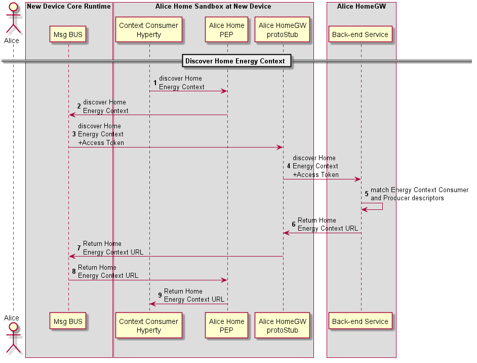

#### M2M Intra Communication : Context Discovery

<!--
@startuml "m2m-intra-comm-3-discovery.png"

autonumber

!define SHOW_RuntimeA

!define SHOW_NativeAtRuntimeA

!define SHOW_SP1SandboxAtRuntimeA
!define SHOW_Protostub1AtRuntimeA
!define SHOW_ServiceProvider1HypertyAtRuntimeA
!define SHOW_ServiceProvider1RouterAtRuntimeA

!define SHOW_CoreRuntimeA
!define SHOW_MsgBUSAtRuntimeA

!define SHOW_SP1

!include runtime_objects.plantuml

== Discover Home Energy Context ==

SP1H@A -> Router1@A : discover Home\nEnergy Context

Router1@A -> BUS@A : discover Home\nEnergy Context

Proto1@A <- BUS@A : discover Home\nEnergy Context\n+Access Token

SP1 <- Proto1@A : discover Home\nEnergy Context\n+Access Token

SP1 -> SP1 : match Energy Context Consumer\nand Producer descriptors

SP1 -> Proto1@A : Return Home \nEnergy Context URL

Proto1@A -> BUS@A : Return Home \nEnergy Context URL

Router1@A <- BUS@A : Return Home \nEnergy Context URL

SP1H@A <- Router1@A : Return Home \nEnergy Context URL

@enduml
-->




**[Previous: Device Bootstrap, Authentication Registration](m2m-bootstrap-auth-registration.md)**

Steps 1 - 4: The Energy Context Consumer Hyperty requests to Discover the Home Energy Context through the Gateway Protocol Stub.

**READ Message**

```
"id" : "1"
"type" : "READ",
"from" : "hyperty-instance://alice.home/washmachinehy123",
"to" : "alice.home",
"body" : { "resource" : "alice.home/registry/context", 
			"criteria" : {"tag" : "energy"},
			"projection" : {"url" : 1} }
```


Steps 5: The Residential Gateway finds the Energy Context Provider (HEMS) instance in its registry. It performs a match between its descriptor and the Energy Context Consumer (Wash Machine) descriptor to verify that both are compliant. 

Steps 6 - 9: The Home Energy Context URL is returned to the Energy Context Consumer Hyperty.

**RESPONSE to READ Message**

```
"id" : "1"
"type" : "RESPONSE",
"from" : "alice.home",
"to" : "hyperty-instance://alice.home/washmachinehy123",
"body" : { "code" : "200" , "description" : "ok",
		"value" : {"url" : "ctxt://alice.home/energy"}}
```
