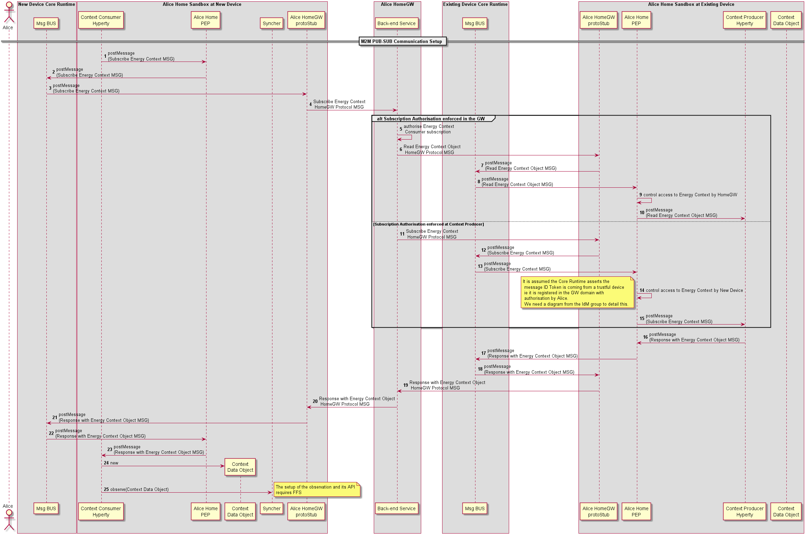

### M2M Intra Communication : PUB-SUB Communication

<!--
@startuml "m2m-intra-comm-4-pub-sub.png"

autonumber

!define SHOW_RuntimeA

!define SHOW_NativeAtRuntimeA

!define SHOW_SP1SandboxAtRuntimeA
!define SHOW_Protostub1AtRuntimeA
!define SHOW_ServiceProvider1HypertyAtRuntimeA
!define SHOW_ServiceProvider1RouterAtRuntimeA
!define SHOW_ContextObjectAtRuntimeA
!define SHOW_Syncher1AtRuntimeA

!define SHOW_CoreRuntimeA
!define SHOW_MsgBUSAtRuntimeA

!define SHOW_SP1

!define SHOW_Runtime1B

!define SHOW_SP1SandboxAtRuntime1B
!define SHOW_Protostub1AtRuntime1B
!define SHOW_ServiceProvider1HypertyAtRuntime1B
!define SHOW_ServiceProvider1RouterAtRuntime1B
!define SHOW_ContextObjectAtRuntime1B

!define SHOW_CoreRuntime1B
!define SHOW_MsgBUSAtRuntime1B

!include runtime_objects.plantuml

== M2M PUB-SUB Communication Setup ==

SP1H@A -> Router1@A : postMessage\n(Subscribe Energy Context MSG)

Router1@A -> BUS@A : postMessage\n(Subscribe Energy Context MSG)

Proto1@A <- BUS@A : postMessage\n(Subscribe Energy Context MSG)

SP1 <- Proto1@A : Subscribe Energy Context\n HomeGW Protocol MSG

group alt Subscription Authorisation enforced in the GW

	SP1 -> SP1 : authorise Energy Context\n Consumer subscription

	SP1 -> Proto1@1B : Read Energy Context Object\n HomeGW Protocol MSG 

	Proto1@1B -> BUS@1B : postMessage\n(Read Energy Context Object MSG)

	Router1@1B <- BUS@1B : postMessage\n(Read Energy Context Object MSG)

	Router1@1B <- Router1@1B : control access to Energy Context by HomeGW

	SP1H@1B <- Router1@1B : postMessage\n(Read Energy Context Object MSG)

else Subscription Authorisation enforced at Context Producer

	SP1 -> Proto1@1B : Subscribe Energy Context\n HomeGW Protocol MSG

	Proto1@1B -> BUS@1B : postMessage\n(Subscribe Energy Context MSG)

	Router1@1B <- BUS@1B : postMessage\n(Subscribe Energy Context MSG)

	Router1@1B <- Router1@1B : control access to Energy Context by New Device

	note left
		It is assumed the Core Runtime asserts the
		 message ID Token is coming from a trustful device
		 ie it is registered in the GW domain with
		 authorisation by Alice. 
		 We need a diagram from the IdM group to detail this.
	end note

	Router1@1B -> SP1H@1B : postMessage\n(Subscribe Energy Context MSG)

end

SP1H@1B -> Router1@1B : postMessage\n(Response with Energy Context Object MSG)

Router1@1B -> BUS@1B : postMessage\n(Response with Energy Context Object MSG)

Proto1@1B <- BUS@1B : postMessage\n(Response with Energy Context Object MSG)

SP1 <- Proto1@1B : Response with Energy Context Object\n HomeGW Protocol MSG

SP1 -> Proto1@A : Response with Energy Context Object\n HomeGW Protocol MSG

Proto1@A -> BUS@A : postMessage\n(Response with Energy Context Object MSG)

Router1@A <- BUS@A : postMessage\n(Response with Energy Context Object MSG)

SP1H@A <- Router1@A : postMessage\n(Response with Energy Context Object MSG)

create CtxtObj@A
SP1H@A -> CtxtObj@A : new

SP1H@A -> Sync1@A : observe(Context Data Object)

note right
	The setup of the observation and its API
	requires FFS
end note

@enduml
-->




**[Previous: Context Discovery](m2m-intra-comm-3-discovery.md)**

*the following steps description are incorrect (copy paste from previous diagram)*

Steps 1 - 4: The Energy Context Consumer Hyperty requests to Discover the Home Energy Context through the Gateway Protocol Stub.

**READ Message**

```
"id" : "1"
"type" : "READ",
"from" : "hyperty-instance://alice.home/washmachinehy123",
"to" : "alice.home",
"body" : { "resource" : "alice.home/registry/context", 
			"criteria" : {"tag" : "energy"},
			"projection" : {"url" : 1} }
```


Steps 5: The Residential Gateway finds the Energy Context Provider (HEMS) instance in its registry. It performs a match between its descriptor and the Energy Context Consumer (Wash Machine) descriptor to verify that both are compliant. 

Steps 6 - 9: The Home Energy Context URL is returned to the Energy Context Consumer Hyperty.

**RESPONSE to READ Message**

```
"id" : "1"
"type" : "RESPONSE",
"from" : "alice.home",
"to" : "hyperty-instance://alice.home/washmachinehy123",
"body" : { "code" : "200" , "description" : "ok",
		"value" : {"url" : "ctxt://alice.home/energy"}}
```
