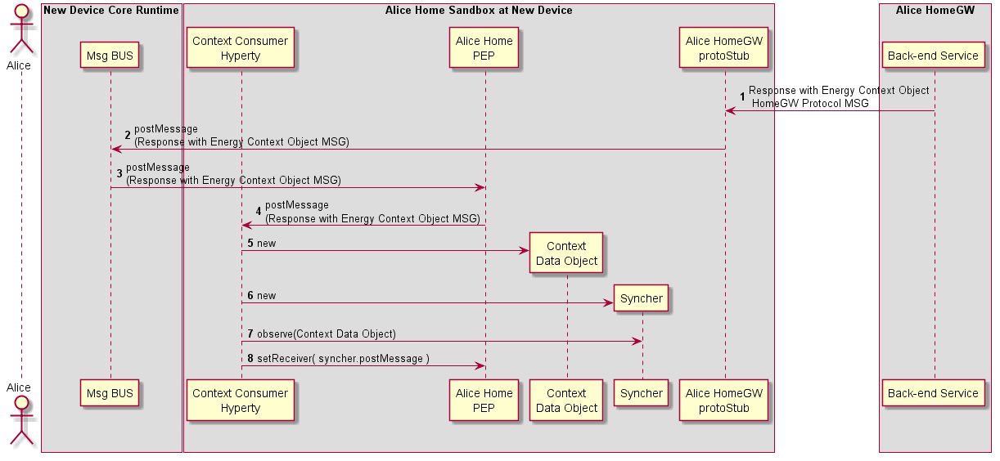

#### M2M Intra Communication : PUB-SUB Communication

**[Previous: Context Discovery](m2m-intra-comm-3-discovery.md)**

<!--
@startuml "m2m-intra-comm-4-pub-sub-1.png"

autonumber

!define SHOW_RuntimeA

!define SHOW_NativeAtRuntimeA

!define SHOW_SP1SandboxAtRuntimeA
!define SHOW_Protostub1AtRuntimeA
!define SHOW_ServiceProvider1HypertyAtRuntimeA
!define SHOW_ServiceProvider1RouterAtRuntimeA
!define SHOW_ContextObjectAtRuntimeA
!define SHOW_Syncher1AtRuntimeA

!define SHOW_CoreRuntimeA
!define SHOW_MsgBUSAtRuntimeA

!define SHOW_SP1

!include runtime_objects.plantuml

== M2M PUB-SUB Communication Setup ==

SP1H@A -> Router1@A : postMessage\n(Subscribe Energy Context MSG)

Router1@A -> BUS@A : postMessage\n(Subscribe Energy Context MSG)

Proto1@A <- BUS@A : postMessage\n(Subscribe Energy Context MSG)

SP1 <- Proto1@A : Subscribe Energy Context\n HomeGW Protocol MSG

@enduml-->


Steps 1 - 4: The Energy Context Consumer Hyperty requests to Subscribe the Home Energy Context through the Gateway Protocol Stub.

**SUBSCRIBE Message**

```
"id" : "1"
"type" : "SUBSCRIBE",
"from" : "hyperty-instance://alice.home/washmachinehy123",
"to" : "alice.home",
"body" : { "resource" : "ctxt://alice.home/energy" }
```


<!--
@startuml "m2m-intra-comm-4-pub-sub-2.png"

autonumber

!define SHOW_SP1

!define SHOW_Runtime1B

!define SHOW_SP1SandboxAtRuntime1B
!define SHOW_Protostub1AtRuntime1B
!define SHOW_ServiceProvider1HypertyAtRuntime1B
!define SHOW_ServiceProvider1RouterAtRuntime1B
!define SHOW_ContextObjectAtRuntime1B

!define SHOW_CoreRuntime1B
!define SHOW_MsgBUSAtRuntime1B

!include runtime_objects.plantuml
group alt Subscription Authorisation enforced in the GW

	SP1 -> SP1 : authorise Energy Context\n Consumer subscription

	SP1 -> Proto1@1B : Read Energy Context Object\n HomeGW Protocol MSG 

	Proto1@1B -> BUS@1B : postMessage\n(Read Energy Context Object MSG)

	Router1@1B <- BUS@1B : postMessage\n(Read Energy Context Object MSG)

	Router1@1B <- Router1@1B : control access to Energy Context by HomeGW

	SP1H@1B <- Router1@1B : postMessage\n(Read Energy Context Object MSG)

else Subscription Authorisation enforced at Context Producer

	SP1 -> Proto1@1B : Subscribe Energy Context\n HomeGW Protocol MSG

	Proto1@1B -> BUS@1B : postMessage\n(Subscribe Energy Context MSG)

	Router1@1B <- BUS@1B : postMessage\n(Subscribe Energy Context MSG)

	Router1@1B <- Router1@1B : control access to Energy Context by New Device

	note left
		It is assumed the Core Runtime asserts the
		 message ID Token is coming from a trustful device
		 ie it is registered in the GW domain with
		 authorisation by Alice. 
		 We need a diagram from the IdM group to detail this.
	end note

	Router1@1B -> SP1H@1B : postMessage\n(Subscribe Energy Context MSG)

end

SP1H@1B -> Router1@1B : postMessage\n(Response with Energy Context Object MSG)

Router1@1B -> BUS@1B : postMessage\n(Response with Energy Context Object MSG)

Proto1@1B <- BUS@1B : postMessage\n(Response with Energy Context Object MSG)

SP1 <- Proto1@1B : Response with Energy Context Object\n HomeGW Protocol MSG

@enduml-->


Two options to handle with Subscription Auhtorisation:

**Option 1: Authorisation enforced in the GW**

Steps 1 : The Residential Gateway uses local policies to authorise the subscription request. 

Steps 2 - 6: The Residential GW requests the Device holding the Context to retrieve the most updated Energy Context Data object. Through a READ message.

**READ Message**

```
"id" : "1"
"type" : "READ",
"from" : "alice.home",
"to" : "hyperty-instance://alice.home/hemshy123",
"body" : { "resource" : "ctxt://alice.home/energy" }
```

**Option 2: Authorisation enforced in the Device**

Steps 7 - 11 : The subscription request is forwarded to existing device Policy Enforcer which applies local policies to give permission to forward the message to the Producer Hyperty. It is assumed the Core Runtime asserts the  message ID Token is coming from a trustful device ie it is registered in the GW domain with authorisation by Alice. (to be detailed in a separated IdM related diagram). *question:* should the Policy Enforcer respond with the Context Data Object without interacting with the Hyperty instance but only with the object?


Steps 12 - 15: The Hyperty responds with the most updated Context Data object.

**RESPONSE to READ or SUBSCRIBE Message**

```
"id" : "1"
"type" : "RESPONSE",
"from" : "hyperty-instance://alice.home/hemshy123",
"to" : "hyperty-instance://alice.home/washmachinehy123", // for subscribe message response
"to" : "alice.home", // for read message response
"body" : { "code" : "200" , "description" : "ok",
		"value" : { <Energy Context Data Object>}}
```


<!--
@startuml "m2m-intra-comm-4-pub-sub-3.png"

autonumber

!define SHOW_RuntimeA

!define SHOW_NativeAtRuntimeA

!define SHOW_SP1SandboxAtRuntimeA
!define SHOW_Protostub1AtRuntimeA
!define SHOW_ServiceProvider1HypertyAtRuntimeA
!define SHOW_ServiceProvider1RouterAtRuntimeA
!define SHOW_ContextObjectAtRuntimeA
!define SHOW_Syncher1AtRuntimeA

!define SHOW_CoreRuntimeA
!define SHOW_MsgBUSAtRuntimeA

!define SHOW_SP1

!include runtime_objects.plantuml


SP1 -> Proto1@A : Response with Energy Context Object\n HomeGW Protocol MSG

Proto1@A -> BUS@A : postMessage\n(Response with Energy Context Object MSG)

Router1@A <- BUS@A : postMessage\n(Response with Energy Context Object MSG)

SP1H@A <- Router1@A : postMessage\n(Response with Energy Context Object MSG)

create CtxtObj@A
SP1H@A -> CtxtObj@A : new

create Sync1@A
SP1H@A -> Sync1@A : new

SP1H@A -> Sync1@A : observe(Context Data Object)

SP1H@A -> Router1@A : setReceiver( syncher.postMessage )


@enduml
-->





Steps 1 - 4: The Subscription Response with Energy Context Data Object reachs the Consumer Hyperty.

Steps 5 - 8: Context Consumer Hyperty instantiates the received  Energy Context Data Object and sets as an observer of it. Then, instantiates an Observer Syncher to observe it.
