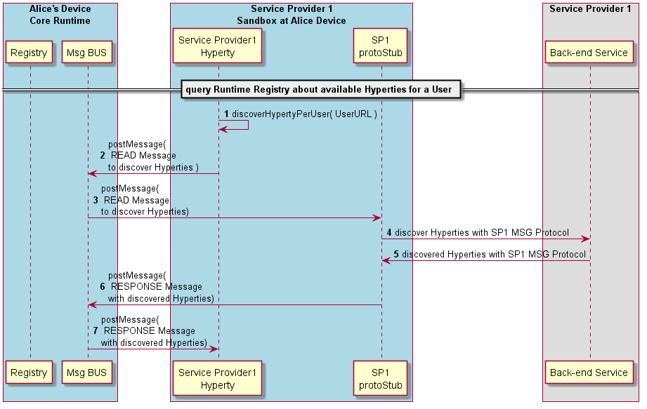

#### Discover Hyperty per User URL

The Runtime procedures to Discover available Hyperties for a user.



**Message to Query Registry Domain for Hyperty Instances**

```
"id" : "1",
"type" : "READ",
"from" : "hyperty://<sp1>/<alice123>",
"to" : "domain://registry.<sp1>/hyperty-instance/user/user://<sp1>/<bob>"
```

**Response Message returning the discovered Hyperty Instances**

```
"id" : "1"
"type" : "RESPONSE",
"from" : "domain://registry.<sp1>"",
"to" : "hyperty://<sp1>/<alice123>",
"body" : { "code": 200, "hyperty-instances": ["hypertyInstance" : { "url" : "hyperty://<sp1>/<bob123>" , "user" : "user://<sp1>/<bob>" , ... }, ...] }
```
