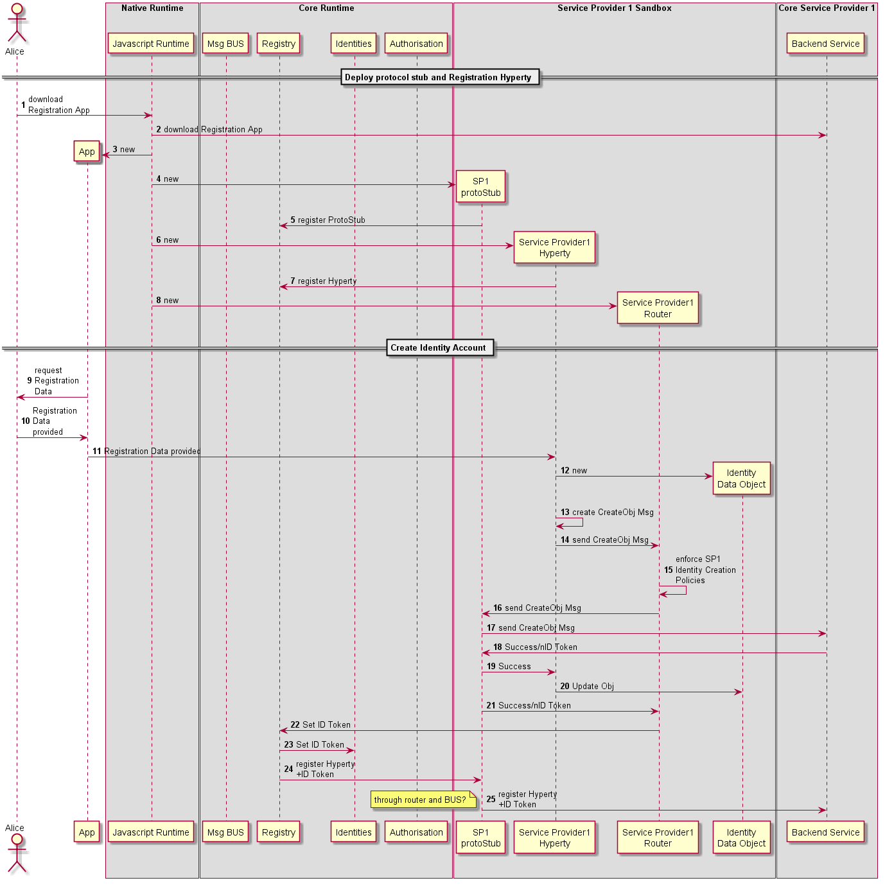

### User Registration

<!--
@startuml "user-registration.png"

autonumber

!define SHOW_RuntimeA

!define SHOW_AppAtRuntimeA

!define SHOW_NativeAtRuntimeA
!define SHOW_JavascriptEngineAtRuntimeA

!define SHOW_CoreRuntimeA
!define SHOW_MsgBUSAtRuntimeA
!define SHOW_RegistryAtRuntimeA
!define SHOW_IdentitiesAtRuntimeA
!define SHOW_AuthAtRuntimeA

!define SHOW_SP1SandboxAtRuntimeA
!define SHOW_Protostub1AtRuntimeA
!define SHOW_ServiceProvider1HypertyAtRuntimeA
!define SHOW_ServiceProvider1RouterAtRuntimeA
!define SHOW_IdentityObjectAtRuntimeA

!define SHOW_SP1

!include runtime_objects.plantuml

== Deploy protocol stub and Registration Hyperty ==

Alice -> JS : download\nRegistration App

JS -> SP1 : download Registration App

create App
JS -> App : new

create Proto1@A
JS -> Proto1@A : new

Proto1@A -> RunReg@A : register ProtoStub

create SP1H@A
JS -> SP1H@A : new

SP1H@A -> RunReg@A : register Hyperty

create Router1@A
JS -> Router1@A : new

== Create Identity Account ==

App -> Alice : request\nRegistration\nData

App <- Alice : Registration\nData\nprovided

App -> SP1H@A : Registration Data provided

create IDObj@A
SP1H@A -> IDObj@A : new

SP1H@A -> SP1H@A: create CreateObj Msg

SP1H@A -> Router1@A : send CreateObj Msg

Router1@A -> Router1@A : enforce SP1\nIdentity Creation \nPolicies

Proto1@A <- Router1@A : send CreateObj Msg

Proto1@A -> SP1 : send CreateObj Msg

Proto1@A <- SP1 : Success/nID Token

Proto1@A -> SP1H@A : Success

IDObj@A <- SP1H@A : Update Obj

Proto1@A -> Router1@A : Success/nID Token

RunReg@A <- Router1@A : Set ID Token

RunReg@A -> RunID@A : Set ID Token

Proto1@A <- RunReg@A : register Hyperty\n+ID Token

Proto1@A -> SP1 : register Hyperty\n+ID Token

note left
	through router and BUS?
end note

@enduml
-->

