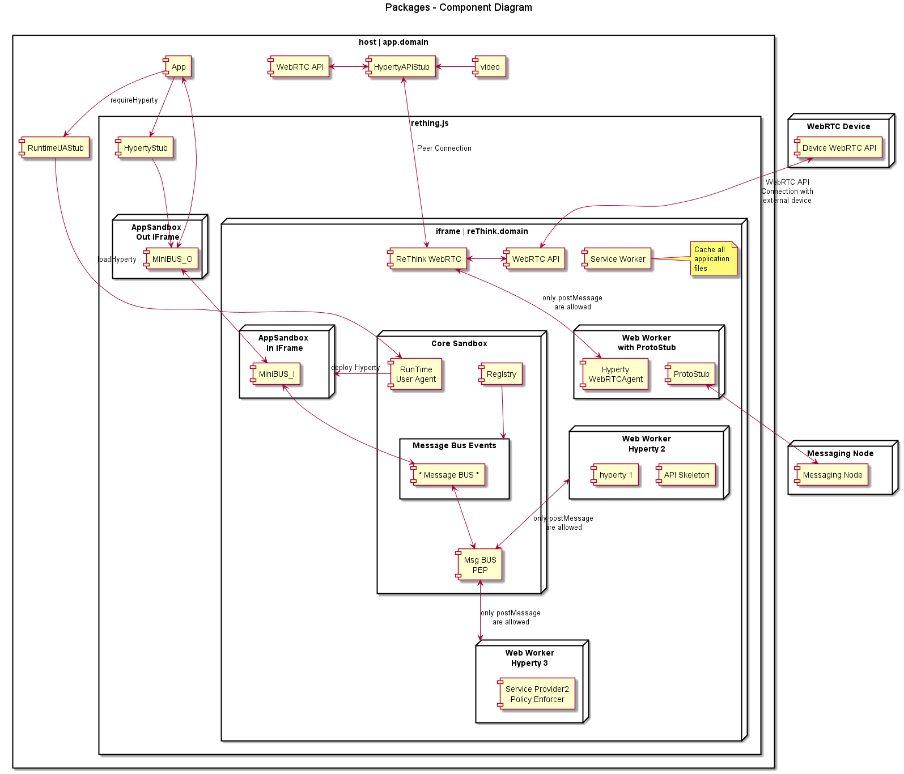

### Browser Runtime Implementation

<!--
@startuml "Runtime_Browser_Implementation.png"

title Packages - Component Diagram

node "WebRTC Device" {
  [Device WebRTC API] as WebRTCDevice
}

node "Auth" {
  [Auth Server] as Auth
}

node "Message Node" {
  [Message Node] as MNode
}

rectangle "host | app.domain" {

    component [video] as GUIVideo
    component [app.js] as App
    
    component [HypertyAPIStub] as PeerLocal
    component [WebRTC API] as WebRTCApiLocal

    rectangle rething.js {
  
        component [API Stub] as APIStub

        rectangle "iframe | reThink.domain" {
        
            component [ReThink WebRTC] as PeerRemote
            component [WebRTC API] as WebRTCApiRemote
            
            component [Service Worker] as ServiceWorker
            note bottom
                Cache all
                application
                files
            endnote
            
            component [RunTime\nUser Agent] as Agent
            note bottom
                Install all
                components
                needed, after
                auth
            endnote

            node "Web Worker\nwith ProtoStub" as WPS {
              [ProtoStub] as PS
              [Hyperty\nWebRTCAgent] as HWRTCA
            }
        
            node "Web Worker\nHyperty 2" as W2 {
              component [API Skeleton] as APIS2
              [hyperty 1] as H1
            }
        
            node "Web Worker\nHyperty 3" as W3 {
              component [Service Provider2\nPolicy Enforcer]
            }

            node "Core Sandbox" as Core {
            
                component [Registry] as Registry
                component [Identities\nContainer] as IContainer
                component [Msg BUS\nPEP] as Policy
                component [Policy Decision (PDP)\n(incl Authorisation)\n+Policies Repository )] as PDP
                
            
                rectangle "Message Bus Events" as MsgBusEvent {
                    component [* Message BUS *] as MsgBus
                }
            }

        }
    }
}

Auth <-[hidden]up-> WebRTCDevice
WebRTCApiRemote <-[hidden]down-> Core

App -down-> APIStub
APIStub -down-> MsgBus

GUIVideo -left-> PeerLocal
PeerLocal <-left-> WebRTCApiLocal
PeerLocal <-down-> PeerRemote : Peer Connection
PeerRemote <-right-> WebRTCApiRemote
PeerRemote <-down-> HWRTCA  : only postMessage\nare allowed
WebRTCApiRemote <-up-> WebRTCDevice : WebRTC API\nConnection with\nexternal device

Registry -right-> MsgBusEvent
IContainer -left- Registry

MsgBus <-down-> Policy
PDP -right-> Policy

PS <-right-> MNode

Policy <-right-> W3 : only postMessage\nare allowed
Policy <-left-> W2 : only postMessage\nare allowed

Agent <-right-> Auth : Verify\ncredentials

@enduml
-->

## General design considerations
The Runtime implementation at browsers plays a central role in reTHINK project. Browsers are almost always present in devices aimed to be used by human beings so using its runtime to execute any application will ensure that it will be correctly interpreted and executed. However, browser's runtime has many security constraints the developer must deal with in order to get a functional web application. 

The design of the browser runtime implementation for reTHINK project has been directed by security and functional requirements along as well as the security limitations forced by the browser. Some of the design decissions are expected to be modified during the implementation phase, however all the proposed design has been tested with real code which implemented prototypes of the different parts.  

## Description of the proposed implementation design.

The diagram below shows all the elements presents in the runtime environment in a browser executing we web application which uses hyperties. 

The web application labeled as *app.domain* represents the html file which is downloaded from the server (hosted by domain which can be an entity different from teh CSP which provides de hyperties). 
 
 app.js represents a Javascript file used by app.domain which allows to interact from app.domain with the *rethink.js* library.
 
 The *rethink.js* library contains the Javascript code necessary to setup all the runtime used by reTHINK in the browser. In the next setion all the elements instantiated by rethink.js will be covered. iFrames and Service workers will be used to implement the necessary runtimes.     

### Service workers. 
A service worker is a script that is run by your browser in the background, separate from a web page, allowing to execute features which do not need a web page or user interaction. They are used to manage the cache of Runtime Core Components. Web Workers are only able to interact to each other by sending messages with self.postMessage(..) which can be caught by en event listener implemented by the Runtime MsgBUS Core Component. 

#### Hyperties and Protocol Stubs 
As described in the diagram both Hyperties and Protocol Stubs will be implemented inside Web Workers so they can be executed as separated threads which run independent from the Core runtime.
The same Service Worker may also be used to manage the cache of Hyperties and protostubs.

 Since it is not possible to use webrtc APIs inside a web worker, there will be a "reTHINK WebRTC" component inside the iFrame but outside the web worker, that is in charge of interacting with the WebRTC API on behalf of Hyperties running inside Web Workers, through messages exchanged between Hyperties and the "reTHINK WebRTC". There will be a "HypertyWebRTCAgent" that will expose standard WebRTC APIs to be used by the Hyperty. In this way the Hyperty is not aware that it is not interacting directly with the native WebRTC API. It should be analysed whether communication between "reTHINK WebRTC" and "HypertyWebRTCAgent" will be supported by the Message BUS or by something else.

The Hyperty API to be consumed by the Application can not be directly used by the App (because it is inside a Web Worker) there will a kind of RPC communication through messages exchanged between the HypertyAPIStub component running on the App side and an API Skeleton running on Hyperty side. It should be analysed whether communication between these components will be supported by the Message BUS or by something else.

### Runtime Message Bus Core Component.
The Message Bus Core component which will be in charge of listening to messagies comming from the different elements and sending them to the right destionation based on the information included in the message headers. For example, it will capture the events coming from the service workers which implement the hyperties and the protocol stubs by instantiating and event listener: *window.addEventListener('message', handleSizingResponse, false)*. 

Attached to the Message Bus there will be a Policy Enforcer which will implement a set of policies to apply to the messages being transported by the bus. It will also determine whether a message is allowed to be sent or not.  

### iFrames

As depicted in the diagram all Runtime Core components, Hyperties and Protocol Stub are executed inside an iFrame loaded from reTHINK runtime provider domain. This the mechanism allows to have a different runtimes for each of them which has been identified as a good security practice as the runtime are isolated. These iFrames are not inteneded to show any content in the Webapp so they will be hidden iFrames.  

#### How to send media stream from the reTHINK iFrame to the Web App. 

Due to the runtime constraints it is not possible to pass WebRTC Media and Data Streams handled inside the iFrame towards the Application that is outside the iFrame, a local loop peerconnection is established between the "reTHINK WebRTC" and the "HypertyAPIStub" running on Application side. 

After some investigation it was found away to send stream from app client to iframe with our domain.An internal loop between peer connection objetcs is used to send to send the media stream between the iFrame where is received from the remote peer and the App which consumes the media coming from the hyperty (it is displayed in *<video>* and *<audio>* elements).

The performance impact of this technique has not been considered very relevant in the preliminary tests however other alternatives will be considered in case a performance penalty is observed in more complex applications.

##### Practical implementation
The peer getUserMedia from app client and make a call to peer inside the rethink iframe, and this answer with null stream (we send stream one way), after this, peer can send the stream through peer connection to another client.

