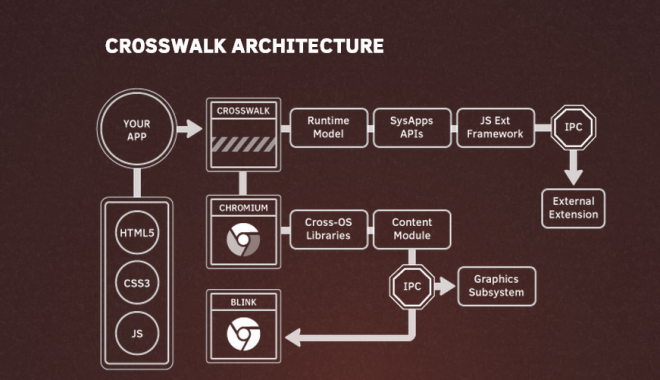
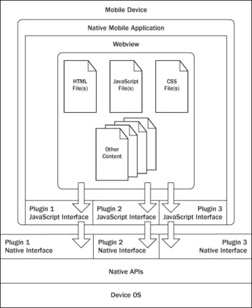

### Considerations about the implementation of Runtime for standalone applications

A couple of tools have emerged to build native apps using standard web technologies. Among them:
- crosswalk
- cordova / phonegap / ionic

#### Crosswalk
Crosswalk is a runtime for  mobile and desktop web applications. It enables to deploy standard web application for various devices (Android/IOS/Linux). It is based on Chrome and Blink for rendering.

By using the Crosswalk Project, an application developer can:

- Use all the features available in modern web browsers: HTML5, CSS3, JavaScript.
- Access the latest recommended and emerging web standards.
- Use experimental APIs not available in mainstream web browsers.
- Control the upgrade cycle of an application by distributing it with its own runtime.
- Add custom extensions to an application, to leverage platform features not exposed by Crosswalk or the standardized web platform.
- Crosswalk supports WebRTC applications so it makes possible to send and receive real-time flows from Android and iOS devices. 

####Crosswalk Architecture

Crosswalk supports an efficient way of creating your own Web APIs as extensions by writing native Java code. This way the user can expose new platform and device APIs as they need them.
New Api could be available in crosswalk before they get standardized at the W3C level.

####cordova /Ionic / phonegap
Apache Cordova is a library used to create native mobile applications using Web technologies. The application is created using HTML, CSS and JavaScript and compiled for each specific platform using the platform native tools. Cordova provides a standard set of JavaScript APIs to access device features on all supported platforms. Additional features can be provided through the development of plugins

####Cordova functionnal schema

The application itself is implemented as a web page, by default a local file named index.html, that references whatever CSS, JavaScript, images, media files, or other resources are necessary for it to run. The app executes as a WebView within the native application wrapper, which you distribute to app stores.

At its core, Cordova offers a simple but powerful API to call Javascript functions that map to native code or plugins. This means you can transfer any kind of data from native land into web land.
Cordova can do almost a native app can do, it just needs the right plugins that send the right data to your web code

####Cordova plugins
A Cordova plugin bridges a bit of functionality between the WebView powering a Cordova application and the native platform the Cordova application is running on. Plugins are composed of a single JavaScript interface used across all platforms, and native implementations following platform-specific Plugin interfaces that the JavaScript will call into. It should be noted that all of the core Cordova APIs are implemented using this exact architecture.
Cordova has a high quality plugin API, we just need more great plugins that expose data from the native layer, not just hard coded features or UIs. While the default plugins are very simple and easy to use, they don’t scale well when you want to build something really custom

####Some plugin examples

##### iosRTC
iosrtc is a wrapper around Google’s WebRTC library and simply provides  PeerConnection, getMediaDevices and getUserMedia APIs , without any limitations or artificial constraints.

##### phoneRTC
phoneRTC : https://github.com/alongubkin/phonertc

##### Crosswalk-based Cordova Android
Crosswalk-based Cordova Android is derived from Cordova Android and uses Crosswalk as the HTML5 runtime. It is an Android application library that allows for Cordova-based projects to be built for the Android Platform. It is aimed at replacing default Android Webview with Crosswalk Webview, bringing all new functionalities of Chrome.

This solution has been succesfully used by companies part of the reTHINK project to develop WebRTC hybrid applications so it is a suitable candidate to be used to implement standalone reTHINK applications for Android.   

####Cordova vs PhoneGap
Cordova is the community powered version of PhoneGap, which is Adobe’s productized version and ecosystem on top of Cordova. 

####Cordova vs Ionic
Ionic uses and extends Cordova  

####Webview
The WebView class is an extension of Android's View class that allows you to display web pages as a part of your activity layout. It does not include any features of a fully developed web browser, such as navigation controls or an address bar. All that WebView does, by default, is show a web page. This allows to leverage features provided by the browser engine in any App without adding extra libraries.

Since Android 4.4 (KitKat), the WebView component is based on the Chromium open source project. WebViews now include an updated version of the V8 JavaScript engine and support for modern web standards previously missing in old WebViews. New Webviews also share the same rendering engine as Chrome for Android, so rendering should be much more consistent between the WebView and Chrome.

In Android 5.0 (Lollipop), the WebView has moved to an APK so it can be updated seperately to the Android platform.

#####Webview WebRTC support
From WebView v36 WebRTC is supported so it makes easier to add WebRTC capabilities to any native. Webview 36.0.0.0 is still a developer preview version so it can not be used in official Apps currently but it is expected to become soon the stable release..

#####Crosswalk vs Webview

The size of the apps is lower compared to Crosswalk applications which must include all the libraries to implement the browser functionality. 
The WebView can be updated separately from the rest of the application. This can be an advantage as it will allows to fix any kind of issue and support new features, but it may cause issues if the App using it is not updated to fix any possible incompability.

One of the obvious drawbacks is that Webview is not available in iOS. 

####OpenWebRTC

OpenWebRTC is an open sourced project from Ericsson Research : https://github.com/EricssonResearch/openwebrtc

A flexible, mobile-first, cross-platform WebRTC client framework based on GStreamer. OpenWebRTC currently supports iOS, Android, Mac OS X and Linux.

#### Selected solutions for the implementation:

##### Solutions that have already been tested :

###### Android :

Crosswalk : integrate chromium in the application with different possible integration :
- Crosswalk embedded in the application
- Crosswalk cordova plugin

Crosswalk usage should ensure us a compatibility with what is done for browser runtime as it embed Chromium

###### iOS : 
iOSRTC, cordova plugin : https://github.com/eface2face/cordova-plugin-iosrtc

Usage of Cordova will enables us to reuse the components that will be developped on the browser runtime.

###### Android & iOS :

Crosswalk and iosRTC can be embeded in the same application code to support both platform.

Hybrid solution will be selected for the project as it enable to use JavaScript for the runtime

##### Solution to be tested during the implementation :
- Usage of Webviews will be interesting as it should facilitate the integration of WebRTC API. 
- openWebRTC can also be insteresting as it should enable the possibility to build complete native and hybrid application.
