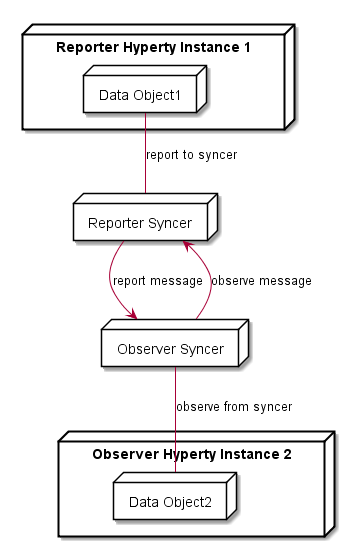

Runtime Architecture
--------------------

The main Hyperty Runtime architecture is presented in fig. @runtime_arch_high_level. It is comprised by different types of components that, for security reasons, are executed in isolated sandboxes. Thus, components downloaded from a specific Service Provider (e.g. Service Provider 1) are executed in sandboxes that are different from the sandboxes used to execute components downloaded from another service provider (e.g. Service Provider 2). In addition, for the same Service Provider, and also for security reasons, protocol stubs and Hyperties are isolated from each other and executed in different sandboxes. Communication between components running in different sandboxes is only possible through messages exchanged through a Message Bus functionality provided by the Core Sandbox. On the other hand, the protocol stub provides the bridge for the Hyperty Runtime to communicate with associated Service Provider. For example, in Figure @runtime_arch_high_level, protostub1 is the only way that Hyperty instances have to communicate with Service Provider 1. In general, in the Core Sandbox, all required functionalities to support the deployment, execution and maintenance of components downloaded from service providers, are executed. Core components are, ideally, natively part of the device runtime. However, to support existing platforms including Browsers and Mobile Operating Systems, to minimise the need to install new applications, the existing device native runtime functionalities (e.g. JavaScript engine) are distinguished from the Hyperty Core Runtime functionalities. In such situations, the Hyperty Core Runtime components are downloaded from the Hyperty Runtime Service Provider and are executed in an isolated core sandbox.

In Figure @runtime_arch_high_level, the Application and the Hyperty Instances it consumes, are downloaded from the same Service Provider. Thus, it is assumed they trust each other and that they can be executed in the same sandbox. In Figure @runtime_arch_high_level_unstrusted, it is depicted the Runtime Architecture where the Application and the Hyperty Instances it consumes, don't trust each other, for example, they are downloaded from different service providers. In such situation, Hyperties and the Application are isolated from each other and they are executed in different sandboxes.

As described below, to prevent cross origin attacks / spy, access to Core Runtime Message BUS is subject to authorisation, by using standardised policies downloaded from each involved Service Provider. In addition, the Hyperty Runtime Architecture also supports the enforcement of Service Provider policies, with its own Policy Enforcer component executed in a dedicated sandbox (see Figure @runtime_arch_high_level_pep) enabling the enforcement of proprietary policies.

The different types of policies to be applied on these different points, namely in the Message BUS, requires further research to avoid performance overhead and potential conflicts. In principle, if for a specific domain there is Policy Enforcer, it will not be needed to enforce policies from that domain in the Core Policy Engine.

In addition, Core Policy Engine should enforce general access control policies that are agnostic of sender and target domains, or specific to the domain managing the device runtime (Core Runtime Provider). The policies used to control the access to synchronised Data Objects used in Hyperty Communication (see below) , are a good example of such policies.

Some more details are provided in the following sections.

### Service Provider Sandboxes

#### Hyperty

As defined in D2.2 [15] Hyperties communicate through [data object synchronisation](https://github.com/reTHINK-project/architecture/blob/master/docs/datamodel/data-synch/readme.md) where different access control policies can be used. The Reporter-Observer pattern introduced in D2.2 will be evaluated in order to simplify the management of inconsistencies in such distributed data synchronisation communication model.

The main Reporter-Observer pattern principle is to only grant writing permissions to Object owner (creator). Such policy to control the access to synchronised object has to be enforced by the Core Policy Engine.

The following Terminology is used:

Observer Hyperty is not allowed to change objects

Reporter Hyperty, creator of the object, is allowed to change the object. Only one Hyperty instance reporter per synched object instance.

Such Model is depicted in Figure @runtime_arch_data_synch. The Reporter-Observer pattern is supported by the exchange of messages between Reporter Syncher and Observer Syncher as defined in the reTHINK Message Model [15].

Additional and more sophisticated and proprietary data synchronisation algorithms can be used, by deploying a Policy Enforcer in the Runtime.

Hyperty communication through data object synchronisation is provided by the Syncher component running in the Hyperty Sandbox. Data object synchronisation should take advantage of the emerging [JavaScript Object.observer API](http://www.html5rocks.com/en/tutorials/es7/observe/) [106].

#### Policy Enforcer

Policy Enforcer complements the Core Policy Engine functionality enabling the enforcement of proprietary or closed Policies in the Hyperty Runtime for a specific Hyperty instance including access control policies to synchronised object.

#### Protocol Stub

The protocol stub implements a protocol stack to be used to communicate with the Service Provider's backend servers (including Messaging Server or other functionalities like IdM) according to Protocol on the Fly and codec on the fly concept as introduced in D2.2.

Protocol stubs are only reachable through the Message BUS. In this way it is ensured that all messages received and sent goes through the message bus where policies can be enforced and additional data can be added or changed including message addresses and identity tokens.

### Core Runtime

The Core Runtime components are depicted in Figure @runtime_arch_core.

Runtime Core components should be as much as possible independent on the Runtime type. They should be deployed once and executed at the background. The next time the runtime is started there should be no need to download the core runtime again unless there is a new version. Runtime core components instances should be shared by different Apps and Hyperty instances.

The Core Runtime is provided by a specific Service Provider (the Core Runtime Service Provider) that handles a Catalogue service to with Runtime Descriptors and a Registry service to handle the registration of Runtime instances.

#### Message BUS

The Message Bus Supports local message communication in a loosely coupled manner between Service Provider sandboxes including Hyperty Instances, Protocol Stubs and Policy Enforcers. Messages are routed to listeners previously added by the Runtime User Agent, to valid Runtime URL addresses handled by the Runtime Registry functionality.

Access to Message Bus is subject to authorisation to prevent cross origin attacks / spy from malicious downloaded code including Hyperties, Protocol Stubs or Policy Enforcers.

#### Core Policy Engine

The Core Policy Engine provides Policy decision and Policy Enforcement functionalities for incoming and outgoing messages from / to Service Provider sandboxes, according to Policies downloaded and stored locally when associated Hyperties are deployed by the Runtime User Agent. The possibility to consult Policies stored remotely should also be investigated. It also provides authorisation / access control to the Message BUS.

The verification or generation of identity assertions, to get valid Access tokens, are two examples of actions ruled by policies.

#### Runtime Registry

The Runtime Registry handles the registration of all available runtime components including Core components, Service Provider Sandboxes and each component executing in each sandbox like Hyperty Instances, Protocol Stubs, Policy Enforcers and Applications.

The Runtime Registry handles the allocation of Runtime URL addresses for all these components and manages its status.

In addition, the Runtime Registry should ensure synchronisation with Back-end Service Provider Registry.

#### Identity Module

The Runtime Identity Module manages ID and Access Tokens required to trustfully manage Hyperty Instances communication including trustful association between Hyperty Instances with Users. In addition, it also supports the generation and validation of Identity assertions. Identity module is compliant with [WebRTC IdP Proxy](http://w3c.github.io/WebRTC-pc/#identity) [107] but not limited to WebRTC.

Messages routed by Message Bus should be signed with a token according to the Identity associated to it and managed by the Identity Module.

#### Runtime User Agent

The Runtime User Agent, manages Core Sandbox components including its download, deployment and update from Core Runtime Provider. It also handles Device bootstrap and the download, deployment and update of Service Provider sandboxes including Hyperties, Protocol Stubs and Policy Enforcers. It manages the descriptors of deployed components that are downloaded from the Service Provider Catalogue via the [Catalogue Service interface](https://github.com/reTHINK-project/architecture/blob/master/docs/interface-design/Interface-Design.md#73-catalogue-interface)[15].

#### QoS User Agent

The QoS User Agent Manages network QoS in the runtime. This component requires further investigations which will be reported in D3.3.

#### Graph Connector

The Graph Connector is a local address book maintaining a list of trustful communication users. This functionality is further detailed in deliverable D4.1 [109].

### Native Runtime

The Native Runtime provides Functionalities that are natively provided by the runtime, e.g. JavaScript engine or WebRTC Media Engine to support for Stream communication between Hyperties according to WebRTC Standards when available.
