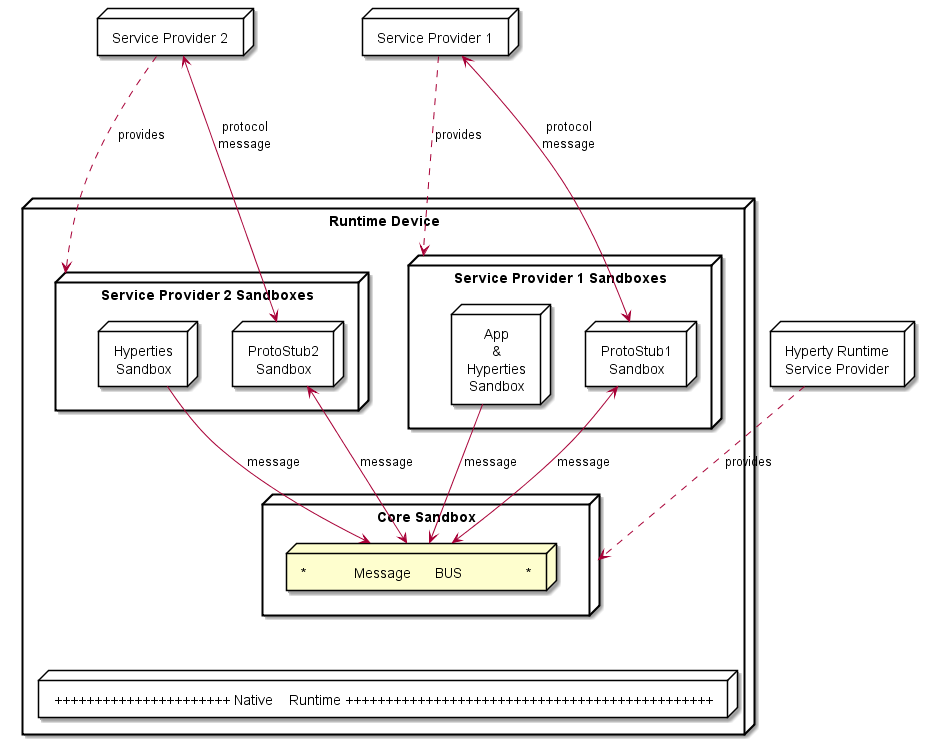
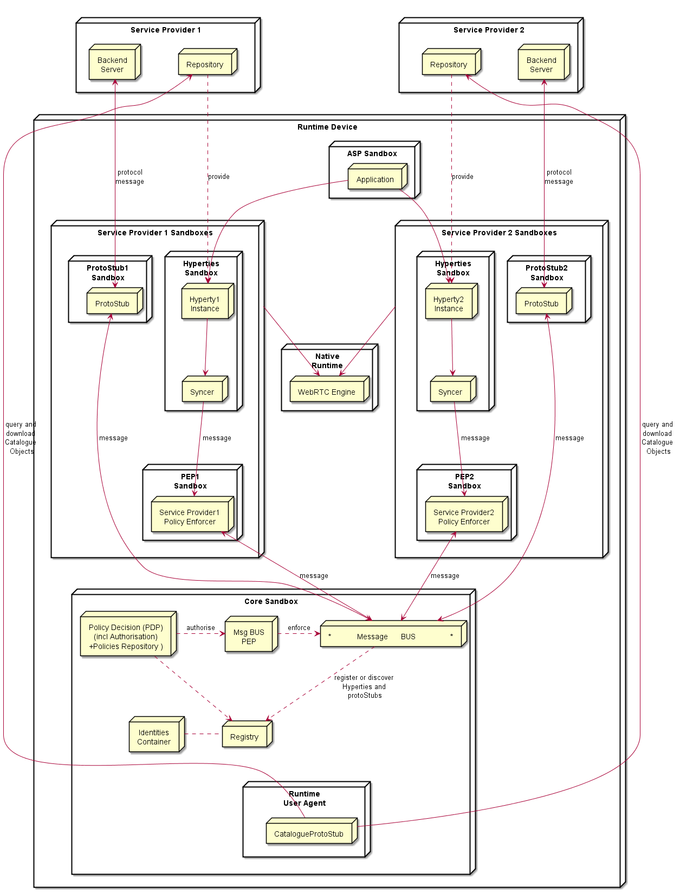

## Runtime Architecture

The main Hyperty runtime architecture is presented in fig. @runtime_arch_0. It is comprised by different types of components that, for security reasons, are executed in isolated sandboxes. Thus, components downloaded from a specific Service Provider (e.g. Service Provider 1 from fig. @runtime_arch_0) are executed in sandboxes that are different from the sandboxes used to execute components downloaded from another service provider (e.g. Service Provider 2 from fig. @runtime_arch_0). In addition, for the same Service Provider, and also for security reasons, protocol stubs and Hyperties are isolated from each other and executed in different sandboxes. Communication between components running in different sandboxes are only possible through messages exchanged through a message bus functionality provided by the Core Sandbox. In general, in the Core Sandbox, all required functionalities to support the deployment, execution and maintenance of components downloaded from service providers, are executed. Core components are, ideally, natively part of the device runtime. However, to support existing platforms including Browsers and Mobile Operating Systems, to minimise the need to install new applications, the existing device native runtime functionalities (e.g. Javascript engine) are distinguished from the hyperty core runtime functionalities. In such situations, the Hyperty Core Runtime components are downloaded from the Hyperty Runtime Service Provider and are executed in an isolated core sandbox.

In figure @runtime_arch_0, the Application and the Hyperty Instances it  consumes, are downloaded from the same Service Provider, and they trust each other, i.e. they are executed in the same sandbox. In figure @runtime_arch_1, it is depicted the Runtime Architectyre where the Application and the Hyperty Instances it consumes, don't trust each other, for example, they are downloaded from different service providers. In such situation, Hyperties and the Application are isolated from each other and are executed in different sandboxes.

According to [ongoing discussions](https://github.com/reTHINK-project/core-framework/issues/41):
* one sandbox for the ASP providing the Application
* one sandbox per Hyperty Service Provider Domain that includes the Router/Policy Engine and associated protoStub
* the ProtoStub is used to communicate with Service Provider backend services.
* Hyperty instances communicates with Msg bus through Router/Policy Engine which may also act as a kind of firewall
* according to recommendations provided in the [runtime security analysis](securityanalysis.md), protoStubs and Router/Policy Engines execute isolated in independent sandboxes.
* to prevent cross origin attacks / spy, access to Message BUS may be subject to authorisation
* Different Points of Policy Enforcement:
 * Policies enforced at Hyperty Sender Domain Router for outgoing messages
 * Policies enforced to control the access to message Bus
 * Policies enforced at Hyperty Receiver Domain Router for incoming messages

 The different types of policies to be applied on these different points, namely in the Message BUS, requires further research to avoid performance overhead and potential conflicts. Initial thoughts:
 Message BUS PEP would enforce general access control policies that are agnostic of sender and target domains, or specific to the domain managing the device runtime (Core Runtime Provider). The access control to CRUD operations on standardised data objects like the Communication Data Object (eg only the owner of an active communication may apply delete or update operations on it) is a good candidate.

Below, it is depicted a functional architecture of the Runtime:

*Provide first a higher level architecture without showing detailed components. Distinguish internal APIs from external Interfaces which should be identified according to names defined in D2.2.*

### Service Provider Sandboxes

According to Browser Sandbox model, each Service Provider Sandboxes executes components downloaded from the same Service Povider domain including Hyperties, protocol stubs used to connect and communicate with Service Provider Domain and PEP enabled Connector. 

Functionalities to support Hyperty Communication through data object synchronisation are provided by the Syncer component based on Object.observer API. Details are discussed [here](https://github.com/reTHINK-project/architecture/blob/master/docs/datamodel/data-synch/readme.md).

#### Application

#### Hyperty

#### Policy Enforcer

Handles communication between Hyperties and the local Message Bus, enforcing when needed valid Policies on this communicayion (e.g. authorisation policies) according to Service Provider domain policies. It also enforces access control policies to synchronised object (Object Monitor functionalities as proposed [here](https://github.com/reTHINK-project/architecture/issues/52)).

#### Protocol Stub

Protocol Stack to be used to communicate with Service Provider Backend Servers (including Messaging Server or other functionalities like IdM) according to Protocol on the Fly and codec on the fly concept.

Protocol stubs are reachable through the Message BUS. In this way it is ensured that all messages received and sent goes through the message bus where policies can be enforced and additional data can be added or changed including message addresses and identity tokens.

### Core Runtime

#### Policy Decision Point and Message BUS authorisation

It provides Policy decision functionalities for the Service Provider Router sandbox according to Policies downloaded and stored locally when associated Hyperties are deployed. The possibility to consult Policies stored remotely should also be investigated. It also provides authorisation / access control to the Message BUS.

#### Message BUS

Supports local message communication between Hyperty Instances in a loosely coupled manner. Access to message BUS is subject to authorisation to prevent cross origin attacks / spy from malicious Hyperties.

See [postaljs](https://github.com/postaljs/postal.js)

#### Registry

Local Runtime Hyperty registry where Hyperty local addresses are registered and discoverable by other local Hyperties. The Runtime Registry should ensure synchronisation with Remote Domain Registry (to be provided by WP4)

#### Identities Containers

Contains Tokens that associates Hyperties with Users, it also provides Identity assertions. Something similar to [WebRTC IdP Proxy](http://w3c.github.io/webrtc-pc/#identity) but not limited to WebRTC.

When registered, Hyperties are associated with an Identity by the Registry / Identities container. Then all, messages sent by the Hyperty will be signed with a token according to the Identity associated to the Hyperty. 

#### Runtime User Agent

Manages Core Sandbox components including its deployment and update from Core Runtime Provider. It also handles Device bootstrap and the deployment of Hyperties and Protocol Stubs in the Runtime. It includes a Catalogue Protocol Stub to interface with any reTHINK Service Provider Catalogue service to query and download required Catalogue Data Objects, according to [Catalogue Service interface design][interface-catalogue](https://github.com/reTHINK-project/architecture/blob/master/docs/interface-design/Interface-Design.md#73-catalogue-interface).

#### QoS User Agent

Manages network QoS in the runtime. Not limited to WebRTC. Relationship with LHCB?

*to be discussed in Aveiro*

### Native Runtime

Functionalities that are natively provided by the runtime.

#### WebRTC Media Engine

Provides the support for Stream communication between Hyperties according to WebRTC Standards.

