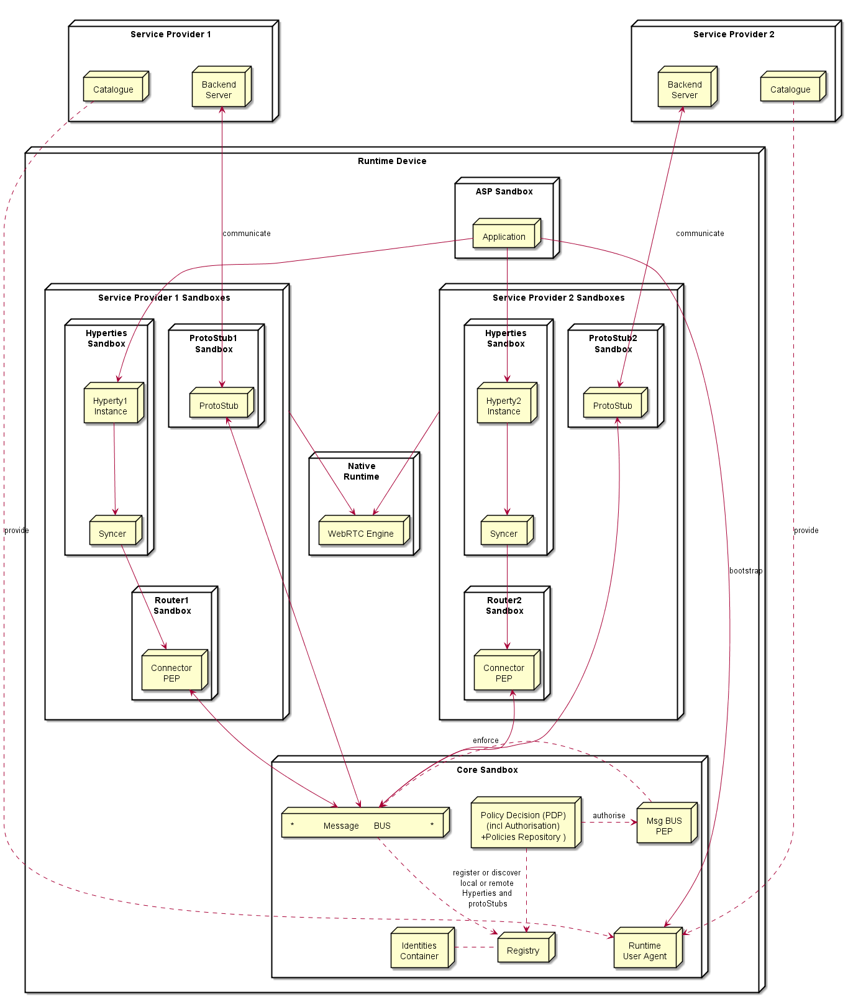

## Runtime Architecture

According to [ongoing discussions](https://github.com/reTHINK-project/core-framework/issues/41):
* one sandbox for the ASP providing the Application
* one sandbox per Hyperty Service Provider Domain that includes the Router/Policy Engine and associated protoStub
* the ProtoStub is used to communicate with Service Provider backend services.
* Hyperty instances communicates with event bus through Router/Policy Engine which may also act as a kind of firewall
* according to recommendations provided in the [runtime security analysis](securityanalysis.md), protoStubs and Router/Policy Engines execute isolated in independent sandboxes.
* to prevent cross origin attacks / spy, access to Message BUS is subject to authorisation

<!--
@startuml "Runtime_Architecture_new.png"

node "Service Provider 1" as SP1 {
	node Repository as Repo1
	node "Backend\nServer" as Msg1

	Repo1 -[hidden]left- Msg1
}

node "Service Provider 2" as SP2 {
	node Repository as Repo2
	node "Backend\nServer" as Msg2

	Repo2 -[hidden]right- Msg2
}

node "Runtime Device" as rt {

 node "ASP Sandbox" as ASPSand {
	 node "Application" as App 
	}

 SP1 -[hidden]down- App
 SP2 -[hidden]right- App

 node "Service Provider 1 Sandboxes" as SP1Sand {

 node "Hyperties\nSandbox" as H1Sand {
	 node "Hyperty1\nInstance" as H1
	 }

 node "ProtoStub1\nSandbox" as Proto1Sand {

	 node "ProtoStub" as Proto1
 }

 node "Router1\nSandbox" as PEP1Sand {
	 node "Router\nPEP" as PEP1
 }

  H1 -down-> PEP1

  PEP1 -up-> Proto1

 }

node "Service Provider 2 Sandboxes" as SP2Sand {

 node "Hyperties\nSandbox" as H2Sand {
	 node "Hyperty2\nInstance" as H2
	 }

 node "Router2\nSandbox" as PEP2Sand {
	 node "Router\nPEP" as PEP2
	 }

 node "ProtoStub2\nSandbox" as Proto2Sand {

  node "ProtoStub" as Proto2
  }

  PEP2 -up-> Proto2

  H2 -down-> PEP2

 }

 App -down-> H1

 App -down-> H2

Repo1 ..down-> H1: provide

Repo2 ..down-> H2: provide

Msg1 <-down-> Proto1 : communicate

Msg2 <-down-> Proto2 : communicate

node "Core Sandbox" as core {

 node "*            Message      BUS                *" as Bus

 node "Registry" as Reg

 node "Identities\nContainer" as ID

 node "Policy Decision (PDP)\n(incl Authorisation)\n+Policies Repository )" as PDP
 }

node "Native\nRuntime" as native {
node "WebRTC Engine" as WRTC
	
}

 PDP ..right-> Bus : authorise

 PEP1 <-down-> Bus

 PEP2 <-down-> Bus

 Reg .left. ID

 Reg <-up. Bus: register or discover\nHyperties and\n protoStubs

 WRTC <-up- SP1Sand

 WRTC <-up- SP2Sand
 	}

@enduml
-->

### Service Provider Sandboxes

According to Browser Sandbox model, each Service Provider Sandboxes executes components downloaded from the same Service Povider domain including Hyperties, protocol stubs used to connect and communicate with Service Provider Messaging Server and PEP enabled Router. 

Mechanisms to support Hyperty Communication through data object synchronisation are discussed [here](data-synch-model.md).

#### Router/Policy Engine

Routes Hyperty messages to be exchanged with local Message Bus or the Messaging Server via the protoStub, and enforces valid Policies on messaging routing (e.g. authorisation policies) according to Service Provider domain policies. 

#### Protocol Stub

Protocol Stack to be used to communicate with Service Provider Backend Servers (including Messaging Server or other functionalities like IdM) according to Protocol on the Fly and codec on the fly concept.

### Core Runtime

#### Policy Decision Point and Message BUS authorisation

It provides Policy decision functionalities for the Service Provider Router sandbox according to Policies downloaded and stored locally when associated Hyperties are deployed. The possibility to consult Policies stored remotely should also be investigated. It also provides authorisation / access control to the Message BUS.

#### Message BUS

Supports local message communication between Hyperty Instances in a loosely coupled manner. Access to message BUS is subject to authorisation to prevent cross origin attacks / spy from malicious Hyperties.

See [postaljs](https://github.com/postaljs/postal.js)

#### Registry

Local Runtime Hyperty registry where Hyperty local addresses are registered and discoverable by other local Hyperties. The Runtime Registry should ensure synchronisation with Remote Domain Registry (to be provided by WP4)

#### Identities Containers

Contains Tokens that associates Hyperties with Users, it also provides Identity assertions. Something similar to [WebRTC IdP Proxy](http://w3c.github.io/webrtc-pc/#identity) but not limited to WebRTC.

## Native Runtime

Functionalities that are natively provided by the runtime.

### WebRTC Media Engine

Provides the support for Stream communication betweeb Hyperties according to WebRTC Standards.

