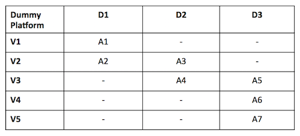
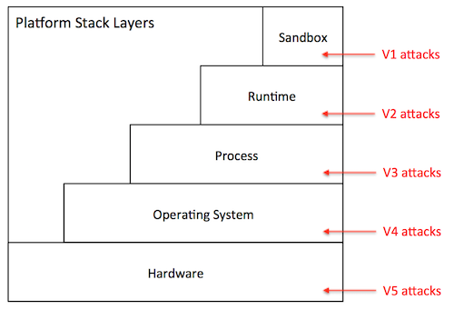
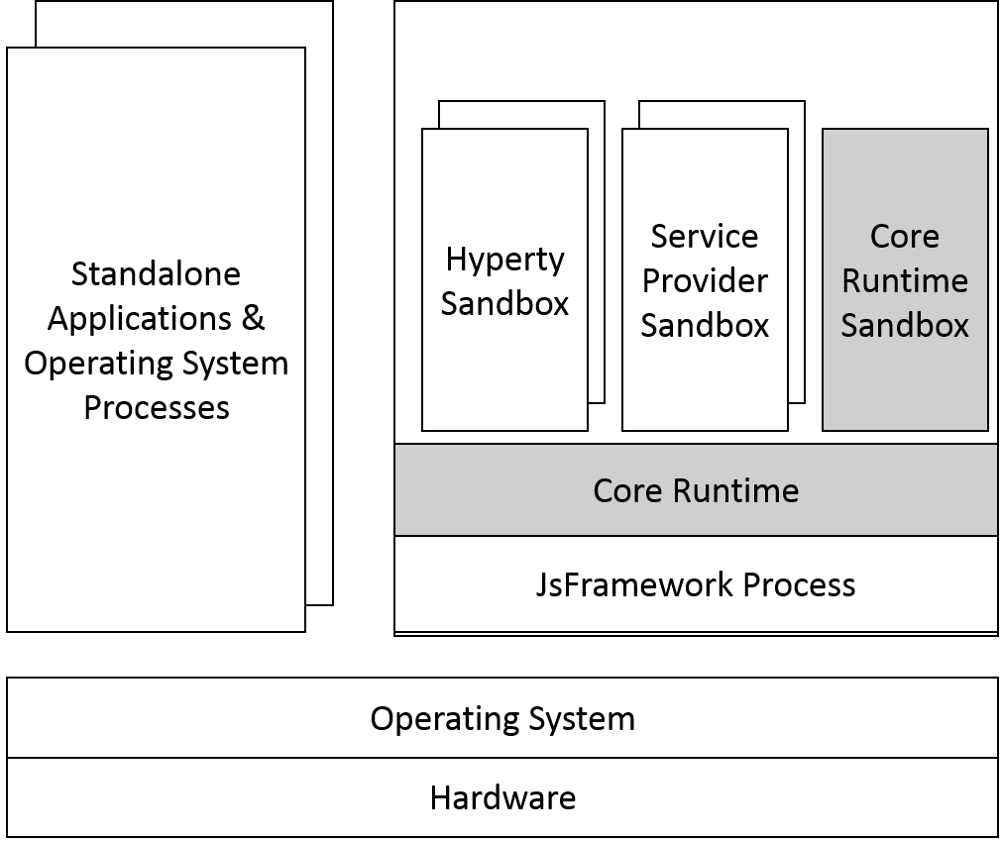
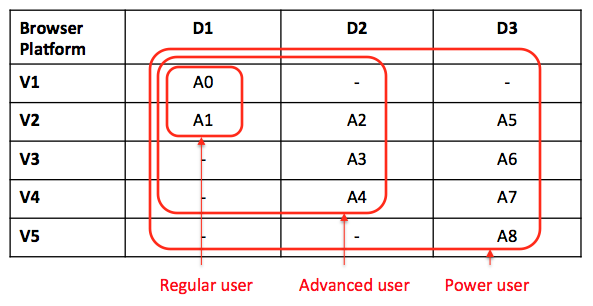
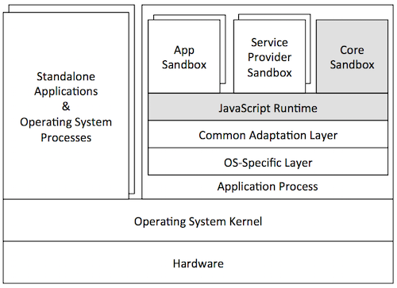

## Security analysis of the Hyperty Runtime

### Introduction

The security analysis contained in this document refers to the runtime architecture described in [[1]](https://github.com/reTHINK-project/core-framework/blob/master/docs/specs/runtime/runtime-architecture.md).

In reTHINK, the trusted computing base (TCB) of the Hyperty Runtime encompasses the following components: the Native Runtime, the Core Sandbox components, and the underlying JavaScript engine, Operating System, and hardware platform. If the native runtime is compromised, so it will be the support for WebRTC stream communication between hyperties. Subverting the core sandbox components can compromise: the correct decision and enforcement of policies by the PDP, the proper routing of messages through the Message Bus, the flawless registration and discovery of Hyperty and protoStubs by the Registry, and the correct maintenance of identities by the Identities Container. Subverting the JavaScript Engine can interfere with the correctness and security of JavaScript code, whose execution necessarily requires a JavaScript engine such as V8. The code that depends on the JavaScript engine includes the runtime components specific to the reTHINK architecture (Router PEP, PDP, Message Bus, Registry, Identities Container, and WebRTC engine), and all the user or developer code hosted by the Hyperty runtime, namely Hyperty Instances, ProtoStubs, and Applications. Given that the JavaScript Engine depends on both the Operating System and the hardware platform, compromising the latter can also affect the JavaScript engine and all the other components sitting on top of it.

Next, we analyze the security properties of our system assuming that all components of the trusted computing base are intact. Then, we assess the security of the Hyperty Runtime when deployed on target platforms that exhibit different characteristics with respect to the platforms’ software and hardware configuration. In particular, we explore five platform configurations: *browser*, *application*, *server*, *router*, and *embedded*. We analyze the security of each platform under different threat models.

### Mitigated threats assuming an intact TCB

When the TCB is intact, our architecture ensures correct isolation of client JavaScript code (i.e., Hyperties, ProtoStubs, and Applications). Isolation is enforced both among client code instances and between client code instances and the environment (e.g., external applications, or OS resources). In addition, our architecture provides for the correct enforcement of the policy rules attached to Hyperty code. Such policies can regulate different aspects of a hyperty’s behavior: access control to local resources (e.g., cookies, files, network, etc), routing, charging, and privacy restrictions. Finally, our architecture ensures the authenticity of client code and the identity of the involved entities.

In the basic threat model, we assume that an attacker can server arbitrary client code to the Hyperty Runtime. The attacker can impersonate a legitimate service provider and serve malicious ProtoStub or Hyperty code. When instantiated on the Hyperty Runtime, this code can attempt to execute JavaScript instructions in order to access private data held: by other client code (including applications’), by the Hyperty Runtime TCB, or by the surrounding environment (e.g., the JavaScript Engine, or the Operating System). Malicious ProtoStub or Hyperty code may also aim to tamper with any of the just mentioned software components of the system. In particular, malicious code may try to tamper with Hyperty policies or with the respective policy decision and enforcement engine in order to escalate privileges. Finally, malicious code may launch denial of service attacks (e.g., by executing CPU intensive code). Below in this document, we expand on this threat model to consider potential vulnerabilities of our system when deployed on different environments.

Next, we describe how our system defends against several classes of potential attacks. We add to this list some attacks that can be currently launched. We provide some recommendations for fixing such attacks.

#### T1: Unauthorized access by client code

The basic mechanism of our architecture to prevent unauthorized access by client code is sandboxing. Each Hyperty instance running in the system runs in its own sandbox. A sandbox defines a security perimeter for the Hyperty instance, preventing it from reading or writing the memory (or other resources) in use by other Hyperty instances or by other components in the surrounding environment. Along with a Hyperty instance, a sandbox also hosts the ProtoStub instance required by the local Hyperty instance to communicate with external services. Therefore, potentially malicious ProtoSub code will be prevented from accessing resources that are not authorized. To communicate outside the sandbox, the runtime provides well defined interfaces: the Router PEP, which is used by the Hyperty instance to communicate with the PDP and with the Message Bus, and an API to communicate with the Messaging Server. The PDP is responsible for enforcing the policy associated with the Hyperty instance.

Note that, in our architecture, sandboxing is also used to isolate other software components. In particular, there is the Core Sandbox, which hosts the Hyperty Runtime components implemented in JavaScript. Both the client code sandboxes and the core sandboxes are enforced by the JavaScript engine.

#### T2: Policy subversion

Every Hyperty instance running in the system is constrained by a policy. In general, a policy can enclose several policy fragments, each of them defining subpolicies of different types. There are four types of policies: access control policies, routing policies, charging usage policies, and privacy policies. These policies are responsible for regulating, supervising, or restricting the operations that a hyperty can perform, e.g., prevent access to a local file, enforce a predefined network route, or define the usage costs of a service. To prevent a malicious Hyperty instance (or ProtoSub) from subverting the security policy and escalate its privileges, the policy decision component (PDP) and the policy repository are located in the Core Sandbox, and therefore outside the Hyperty instance’s reach. As a result, policy integrity and enforcement are safe from malicious client code.

#### T3: Threats to client code authenticity

The authenticity of client code -- Hyperty or ProtoStub -- can be compromised if at least one of two things occurred without detection before the code is loaded and instantiated into a sandbox: an attacker modified the original code bytes (e.g., by embedding malware into a Hyperty code), or (ii) modified the identity of the code or of its manufacturer. To prevent these attacks, our architecture requires that every client code distribution, be it Hyperty or ProtoStub, is digitally signed by its manufacturer. By checking these signatures before instantiating the Hyperty or ProtoStub code on the sandboxes and assuming that the cryptographic primitives are correct, the Hyperty Runtime is able to guarantee the integrity and identity of the code.

#### T4: Denial of service attacks

A malicious Hyperty instance or ProtoStub implementation can launch denial of service attacks by holding to specific resources, e.g., hogging the CPU by sitting on an infinite loop, or flooding the network with bogus messages. The JavaScript engine featuring the Hyperty Runtime prevents such attacks by placing a limit to the maximum utilization of a given service by a client code instance, for example by bounding the CPU cycles that a Hyperty instance is allowed to execute uninterrupted.

#### Possible attacks in the current architecture

Given that ProtoStub, Hyperty instances, and the Router PEP share the same sandboxes, some attacks are possible: (i) a malicious Hyperty instance or ProtoStub can compromise the Router PEP, (ii) a malicious Hyperty can subvert a ProtoStub, or (iii) a malicious ProtoStub can compromise a Hyperty instance.

 * The first attack causes no particular damage outside the enclosing sandbox. Because the Router PEPs holds no secrets, there’s no risks of confidentiality breaches. On the other hand, the Router PEP provides services to the sandbox’s client code. As a result, compromising the integrity of the Router PEP could result at most in integrity and availability violations to the JavaScript client instances enclosed in the sandbox.

 * The second attack -- a malicious Hyperty subverts a ProtoStub -- could be problematic if the ProtoStub contains secrets bundled into the ProtoStub code itself. Secrets can refer not necessarily to sensitive data (which is unlikely given that ProtoStubs implement communication protocols), but proprietary  IT-protected code owned by the developer or by the service provider. The current architecture provides no protection against this attack.

 * Lastly, the third attack -- a malicious ProtoStub -- can be the most severe one. If a buggy ProtoStub is exploited, an attacker can gain access to execution state of the Hyperty instances sharing the same sandbox. If a Hyperty instance processes sensitive user data or handles key material, such an exploit can result in a data breach. The current version of the Hyperty Runtime architecture offers no protection against this attack.

In order to mitigate attacks (ii) and (iii), we recommend that Hyperty instances and ProtoSubs execute isolated in independent sandboxes.

### Vulnerability assessment of the Hyperty Runtime

The threats described in the previous section can be thwarted by the Hyperty Runtime so long as the TCB of the system remains intact. In this section, we study the potential vulnerabilities of the TCB when deployed on a specific target platform. We envision five potential target platforms: browser, standalone application, middlebox, server, and secure element. Next, before we present our analysis for each platform, we describe our methodology to ensure a uniform assessment of the system across platforms.

#### Methodology

Our basic methodology to assess the vulnerabilities of the Hyperty Runtime’s TCB is based on a *vulnerability matrix*. A vulnerability matrix indicates representative practical attacks that can be carried out against the TCB on a given platform as a mean to compromising the security of the system. The security is compromised by successfully achieving one of the goals described in the section above: permit unauthorized access by client code (T1), subvert hyperty policies (T2), compromise the authenticity of client code (T3), and launch denial of service attacks (T4). Such practical attacks to the TCB are classified in the vulnerability matrix along two dimensions: (i) the attack vector along the computer stack where vulnerabilities can be exploited (e.g.., targeting the operating system), and (ii) the difficulty level of launching attacks based on the required technical skills and resources.

The figure above shows an example of a vulnerability matrix for a dummy platform. The content of each cell contains attacks that the TCB is vulnerable to. Each attack is identified, e.g, as A1, or A7, and naturally must be accompanied by a description of the attack, e.g., “A1: inspection of JavaScript code through the browser”, “A7: probing the system bus”. The columns represent the difficulty level and the rows the attack vector (both will be explained below). The vulnerability matrix will then allow us to grasp how exposed the TCB is to attacks: the lower the difficulty degree of the attacks is the more vulnerable the Hyperty Runtime will be when deployed on that particular target platform. 

The attacks presented in the vulnerability matrix are launched by a given attack agent. The attack agents to be considered depend on the specific platform and may include, for example, the local user, malware, the system administrator, a thief, etc. The behavior of an attack agent is characterized by an *attack profile*, which specifies the subset of all possible attacks to the Hyperty Runtime’s TCB that a given agent can perform. For example, considering a browser platform, the attack profile of an adversarial average web user certainly includes attacks like “inspection of JavaScript code through the browser”, but not “probing the system bus”. Therefore, when drawing the vulnerability matrix of the TCB for a given platform, we determine which attacks the TCB may be subjected to based on the profiles of the attacker agents that we expect to find in that particular usage scenario.

Next, we describe the classification for attack vectors and difficulty levels:

**Attack vectors.** Attack vectors can be classified in five types, ordered top-down, from the highest to the lowest layer of the computer stack, as shown in the figure below:

 *  *Sandbox level (V1)*: The attacker has direct access to the sandbox environment, hence to the code and execution state of Hyperty instances. For example, on a browser platform, users typically have access to the JavaScript of a given page. This means that a malicious user could leverage that mechanism to tamper with the JavaScript code of locally running Hyperty instances.

 * *Runtime level (V2)*: The attacker has direct access to the code or execution state of the Hyperty Runtime. Depending on the specific exploit, he can mount attacks that disable the defenses against any of the attacks described in the previous section. For example, on a browser platform, a V2 attack can be achieved by installing a malicious browser extension that bypasses the policy enforcement mechanism of the Hyperty Runtime.

 * *Process level (V3)*: the attacker has access to the execution state of the process where the Hyperty Runtime is hosted. Just like V2 attacks, this type of attack can result in catastrophic consequences. Examples of attacks performed at the process level include attaching a debugger to the Hyperty Runtime process and inspect its internal data structures, or dumping the process’s memory to disk by reading from /dev/mem.

 * *Operating system level (V4)*: the adversary has access to the execution state of the operating system, and therefore to the execution state of the Hyperty Runtime. Similarly to V2 and V3, V4 attacks can be catastrophic. An attack performed at this layer consists, for example, of adding a rootkit to the operating system in order to keep track of the all ingress and outgress communication performed by the Hyperty instances running on the host.

 * *Hardware level (V5)*: the adversary has physical access to the hardware of the platform and can launch simple attacks that do not involve tampering with the circuitry. Attacks in this category include, removal or inspection of the hard disk, probing the system bus in order to extract secrets from volatile memory, etc. An attack at this level may also include tampering with the silicon chips, perform side-channel attacks, etc. Such attacks require a high-level of expertise and committed resources. In theory, attacks performed at this level can reveal the entirety of the system state, including operating system’s. In practice, however, such attacks are more directed to extract specific secrets when V3 attacks or above are not possible.

**Difficulty level.** The difficulty level of launching an attack depends on several factors, namely the privileges owned by the adversary (e.g., user or superuser), the skills required to perform the exploit (e.g., run a debugger or tamper with silicon), and the resources that are necessary to commit to successfully carry out the exploit (e.g., specific software exploits, memory probes, etc.). Based on these factors, we define three difficulty levels for a given attack:

 * *Easy (D1)*: The attack is easy to perform. Based on the privileges owned by the attacker, the tools that are necessary to launch the attack are accessible, well documented, and are simple to handle. Some examples of D0 attacks include: (i) on a browser platform, a malicious user leverages the browser interface controls in order to modify the JavaScript code of a given Hyperty, (ii) on a server platform, a disgruntled system administrator leverages superuser privileges to disable the policy enforcement mechanisms of the Hyperty Runtime where client Hyperty instances are being executed.

 * *Medium (D2)*: The attack requires considerable skills and / or resources. It can be launched by mastering the tools presently available in the system (e.g., tools provided by the operating system, debuggers) or installing new ones that can be found on the Internet (including malware or exploits). The attacker has not enough skills or resources to find new vulnerabilities in the system or to develop its own exploits known vulnerabilities. Examples of such attacks include, for example, attaching debuggers to extract in-memory secrets from the Hyperty Runtime, patch the Hyperty Runtime using exploit code  published on the Web, etc.

 * *Hard (D3)*: The attack is very sophisticated. To mount the attack, the attacker must be able to develop its own exploit code, find new vulnerabilities in the system, and / or launch software hardware attacks. For example, finding a new vulnerability in a device driver’s code, and write the code to exploit that vulnerability. The attacks performed at the deep hardware level are also considered hard to execute.

#### Browser platform

One of the primary platforms targeted by reTHINK is the browser. The browser platform will be highly heterogeneous; we may be talking about desktops, laptops, or mobile devices featuring many different configurations with respect to: hardware architecture, operating system in use, installed software, and specific browser distribution and extensions. Nevertheless, a general architecture of the browser platform is shown in the figure below. 

Essentially, the Hyperty Runtime runs inside a browser’s process. This process is in fact a “subprocess” of the browser that implements a sandboxing mechanism of its own (as in the Chrome browser). The Hyperty Runtime is responsible for the secure execution of JavaScript code inside individual sandboxes: the core sandbox encloses additional components of the reTHINK framework written in JavaScript, the client sandbox is used for securing JavaScript client code (i.e., Hyperty instances and ProtoStubs), and ASP sandboxes provide a home for Hyperty applications. As shown in the figure, the Hyperty Runtime’s hosting process depends on the operating system, which in turn depends on the underlying hardware configuration. Aside to the browser processes, we find all sorts of application processes and operating system services.

From the security point of view, the threats to the TCB are mainly caused by an adversarial user. To better characterize these threats, we define three attacker profiles and draw the vulnerability matrix as follows:

 * *Regular user*: This attacker profile captures the class of users with an average proficiency level in computing, but is willing to subvert the security properties enforced by the TCB. He has only user privileges that enable him to launch the browser, and run Hyperty-based applications. A regular user is expected to mount the following attacks:

   * *A0*: access and modify client Javascript code through the browser interface.

 * *Advanced user*: This profile captures users with superuser privileges and some degree of skills and knowledge of the system. He is informed about existing tools and techniques that can be used to hack into the system’s components, has access to exploits published online, and can handle auxiliary tools (e.g., debuggers, Unix advanced commands, etc.). If necessary he can root or jailbreak the operating system by following instructions (if we are talking about mobile devices). He can assemble and disassemble the basic hardware components of the system (e.g., plugging in / out the hard disk). In addition to attack A0, an advanced user can perform attacks in different layers such as these:

   * *A1*: compromise the runtime by installing a malicious browser extension,
   * *A2*: dump the memory contents of the process to disk,
   * *A3*: install a rootkit on the operating system that keeps track of Hyperty instances’ communication.

 * *Power user*: This user is highly skilled. He gathers deep knowledge of the system and can launch sophisticated attacks. He is able investigate for vulnerabilities in the software (including in the Hyperty Runtime or in the OS) and build its own exploits. He has the resources and tools to launch hardware attacks that involve tampering with silicon. Summing up to the attacks described previously, a power user can mount more sophisticated attacks on various layers of the stack:

   * *A4*: find and exploit a bug in the Hyperty Runtime
   * *A5*: attach a debugger to the browser’s subprocess and inspect / modify its memory,
   * *A6*: build a device driver to continuously monitor the execution of Hyperty Instances,
   * *A7*: probe the system bus in order to extract private key material in use by Hyperty Instances.

**Vulnerability assessment:** As illustrated by the vulnerability matrix, the browser platform is vulnerable to a range of attacks. Some of these attacks can be mounted by regular users with relative ease. In addition, there are several ways for advanced users to successfully compromise the TCB by exploiting the system at different layers in the stack. As a result, we recommend that the browser platform should be avoided for hosting client code (i.e., Hyperty Instances, ProtoStubs, or Applications) and policies which the local user has incentives to subvert. Examples of such code include: Hyperty instances restricted by specific usage charging policies, ProtoStubs that encode proprietary communication protocols, or Applications that access copyrighted digital data.

#### Application platform

A variant of the browser platform just presented is to run the Hyperty Runtime and client code as a standalone application. A practical usage scenario, for example, is to bundle the Hyperty Runtime in mobile apps and deploy them on mobile devices such as smartphones or tablets. Alternatively, we also envision that the Hyperty Runtime can be packaged as a classical standalone application for desktop platforms, for example Linux- or Windows-based. To allow for the development and maintenance of such applications, reTHINK will provide an SDK, which will include APIs and platform specific libraries for adapting the Hyperty Runtime to the underlying operating system platform.

The figure above illustrates a hypothetical application platform tailored for Android mobile devices. Just like in the browser platform, the Hyperty Runtime is hosted by an application process. The host application is responsible for mediating the system calls issued by the Hyperty Runtime to the operating system and for providing a user interface to the Hyperty Runtime and client JavaScript applications (and hyperties). This application comprises additional software components: a platform-independent adaptation layer, and platform-specific libraries, e.g., for IO, storage, and memory management. In the example, the platform-specific libraries are tailored for the Android API.

From the security point of view, application and browser platform are quite similar; for that reason we adopt the same attacker profiles (regular user, advanced user, and power user). The main difference between architectures is twofold. First, the host application will prevent direct introspection of the JavaScript code running inside Hyperty Runtime sandboxes. As a result, the application architecture is able to mitigate simple attacks to the browser (A0 in the browser’s vulnerability matrix), raising the bar for regular users. Second, the host application will not support software extensions. This will prevent some advanced attacks to the runtime based on installation of malicious extension code, and to the browser process (see attacks A1 and A2, respectively, in the browser’s vulnerability matrix). Apart from that, the vulnerability matrices are comparable. Next, we present the vulnerability matrix of the application platform and provide alternative examples for attacks on Android devices.

 * *Advanced user*: An advanced user can compromise the entire system by launching attacks at the OS level:

   * *A1*: root the device and instrument the operating system in order to introspect the Hyperty instances’ sandboxes.

 * *Power user*: A power user can mount more sophisticated attacks on various layers of the stack:

   * *A2*: find and exploit a bug in the Hyperty Runtime,
   * *A3*: find a bug in the host application code and exploit it,
   * *A4*: monitor the execution of Hyperty Instances by rooting the device,
   * *A5*: hack the device hardware to extract sensitive Hyperty data from memory.

**Vulnerability assessment:** As illustrated by the vulnerability matrix, the application platform (targeting Android devices) is more robust to attacks than the browser platform. This is mainly due to the fact the application architecture allows us to close some security holes in the browser architecture that cannot be thwarted without modifying the code of the browser. Nevertheless, it is still possible to for an advanced user to compromise the system by rooting the device, which will likely dissuade the average user. Nevertheless, we recommend prudence in deploying client code (i.e., Hyperty Instances, ProtoStubs, or Applications) and policies which the local user has high incentives to subvert.

#### Server platform

reTHINK also targets server platforms. The idea is to allow Hyperties and client applications to deliver their services from the cloud or from a local cluster. In such environments, there is a server infrastructure which is carefully configured to provide specific services to users (e.g., web hosting, VM hosting). Part of that configuration requires the installation and setup of specific server-side applications (SSAs), e.g., web server, DB server, etc. There are two typical server configurations for hosting server-side applications (SSAs): virtualized or non-virtualized. In virtualized environments, SSAs run inside virtual machines, which in turn are managed by virtual machine monitors (VMMs), such as Xen or VMware. In non-virtualized environments, SSAs execute natively on servers configured with a classical operating system like Linux. Regardless of whether the server platform is virtualized or not, the SSA will always depend on an operating system, even if the OS runs inside a VM. Therefore, to provide Hyperty support for server platforms, the Hyperty Runtime will be packaged as a standalone SSA.

### Router platform

### Embedded platform

