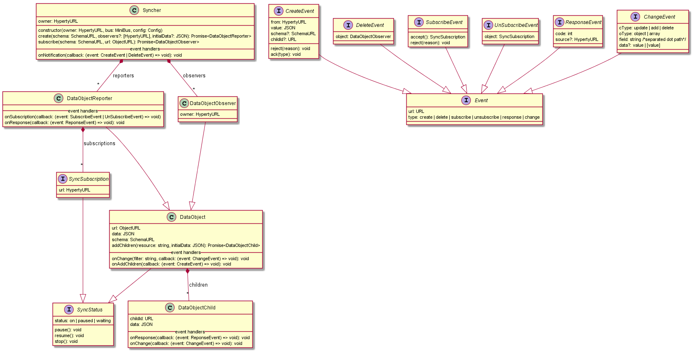

## SyncherManager (Micael proposal)

Although some properties, methods and event handlers are subject to change. The most important is the structure of the framework, because structure is much harder to change than changing method, properties, etc.

MiniBus is a core component that represents a view of the MessageBus, and it's inserted as a dependency. When an object (Reporter or Observed) is created, the SyncherManager will add a listener in the MiniBus to receive/send Messages of that object.

[Sequence Diagram Doc](https://github.com/reTHINK-project/core-framework/blob/master/docs/specs/runtime/dynamic-view/basics/create-sync-data-object.md)

### SyncherManager
The main class for the package. Should only be available one per Hyperty/URL. It's the owner of all kind of DataObjects.

##### Properties
* owner: HypertyURL
* observers: [DataObjectObserver]
* reporters: [DataObjectReporter]

##### Methods
* constructor(owner: HypertyURL, bus: MiniBus, config: Config)
* create(schema: Schema, initialData?: JSON): Promise\<DataObjectReporter\>
* subscribe(url: ObjectURL): Promise\<DataObjectObserver\>

With these methods it's able to create Reporters or subscribe to existing ones, giving Observers.

##### Event Handlers
* onInvite(callback: (event: InviteEvent | UnInviteEvent) => void): void

Receive invitations from Reporter objects. Hyperties should listen and respond accordingly, using the event methods.

### DataObjectReporter
Read/Write reporter object. Syncronization is shared with other observers.

##### Properties
* (inherited) url: ObjectURL
* (inherited) status: on | paused | waiting
* (inherited) schema: Schema
* (inherited) data: JSON
* subscriptions: [SyncSubscription]

In addition to the inherited properties, it has a registry of all remote observers subscriptions. Since all subscriptions are instances of SyncSubscription, it's possible to read the status of the subscription and act on it (pause, resume, stop). For example, in a chat room it will be possible to kick out someone executing the stop().

##### Methods
* (inherited) pause(): void
* (inherited) resume(): void
* (inherited) stop(): void
* invite(url: HypertyURL): Promise\<SyncSubscription\>

In addition to the inherited methods, a reporter can invite an Hyperty to observe this object. In case of success returns a Sync Subscription with a status, or error if rejected.
SyncStatus methods of the reporter are used to act on all subscriptions. It's just a shortcut to call the same method in all subscriptions.

##### Event Handlers
* (inherited) onChange(filter: string, callback: (event: ChangeEvent) => void): void
* onSubscription(callback: (event: SubscribeEvent | UnSubscribeEvent) => void)

In addition to the inherited handlers, the reporter can listen to subscriptions/unsubscriptions. An invitation accept can also be considered has a subscription.

### DataObjectObserver
Read only observer object, giving a data view of a remote reporter object.

##### Properties
* owner: HypertyURL
* (inherited) url: ObjectURL
* (inherited) status: on | paused | waiting
* (inherited) schema: Schema
* (inherited) data: JSON

##### Methods
* (inherited) pause(): void
* (inherited) resume(): void
* (inherited) stop(): void

##### Event Handlers
* (inherited) onChange(filter: string, callback: (event: ChangeEvent) => void): void

### Events and Handlers
Methods fire actions and Handlers react to actions and respond accordingly.
All events listed on the class diagram are intercepted in an event handler. From a functional perspective, methods like (accept, reject, wait, ...) are responses to an actions. Since actions are represented by events, it makes sense that responses are directly related to them. Some rules:
* All events are inherited from the Event interface
* All handlers have method signature of "on\<classifier\>(..., callback)"

### Interfaces (SyncData, SyncStatus, SyncSubscription)
* **SyncData** is used to access the synchronized data, and make changes on it. It's able to register listeners for data changes, based on some kind of filter.
* **SyncStatus** is used to get and control the status of a DataObject (local, remote, reporter or observer).
* **SyncSubscription** reference to a remote observer/subscription. 

**TODO** Maybe some kind of state machine diagram is needed to define better all the status, and the actions that activate the status transitions.
