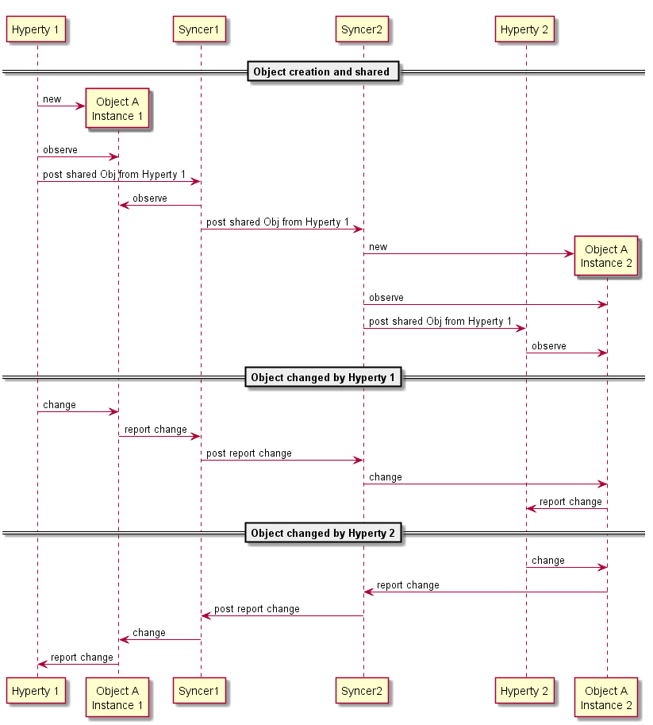

## Experimentations for Data Synchronisation model

<!--
@startuml "hyperty-data-synchronisation.png"

	node "Hyperty Instance 1" as H1 {

		node "Data Object1" as Obj1 {

		}
	}

	node "Syncer" as Syncer1 {

	}

	node "Hyperty Instance 2" as H2 {

		node "Data Object2" as Obj2 {

		}
	}

	node "Syncer" as Syncer2 {

	}

	Obj1 -down- Syncer1 : observe and report to syncer\n(based on object.observe API)

	Syncer1 -down- Syncer2 : sync-api \n(send/receive synchronisation messages)

	Obj2 -up- Syncer2 : observe and report to syncer\n(based on object.observe API)

@enduml
-->

<!--
@startuml "hyperty-data-synchronisation-msc.png"

participant "Hyperty 1" as H1

participant "Object A\nInstance 1" as Obj1

participant "Syncer1" as Sync1

participant "Syncer2" as Sync2

participant "Hyperty 2" as H2

participant "Object A\nInstance 2" as Obj2

== Object creation and shared ==

create Obj1
H1 -> Obj1 : new

H1 -> Obj1 : observe

H1 -> Sync1 : post shared Obj from Hyperty 1

Sync1 -> Obj1 : observe

Sync1 -> Sync2 : post shared Obj from Hyperty 1

create Obj2
Sync2 -> Obj2 : new

Sync2 -> Obj2 : observe

H2 <- Sync2 : post shared Obj from Hyperty 1

H2 -> Obj2 : observe

== Object changed by Hyperty 1==

H1 -> Obj1 : change

Sync1 <- Obj1 : report change

Sync1 -> Sync2 : post report change

Sync2 -> Obj2 : change

H2 <- Obj2 : report change

== Object changed by Hyperty 2==

H2 -> Obj2 : change

Sync2 <- Obj2 : report change

Sync2 -> Sync1 : post report change

Sync1 -> Obj1 : change

H1 <- Obj1 : report change

@enduml
-->

Usage of the emerging [object.observe](https://developer.mozilla.org/pt-PT/docs/Web/JavaScript/Reference/Global_Objects/Object/observe) javascript API to support Hyperty communication based on object synchronisation. If not supported by the native runtime we can use a few [existing libraries](https://github.com/MaxArt2501/object-observe).

Experimentation proposal:

**questions:**
* concurrency (ie both hyperties change the same attribute at "the same time" creating inconsistence between the two objects) will be addressed in other experimentations
* To simplify, concurrency may be handled by only granting writing permissions to Object owner (creator). Such control would be enforced by the Msg BUS Access control.
* In case more sophisticated concurrency control is needed we may look on existing solutions like [sync-it](https://www.npmjs.com/package/sync-it)
