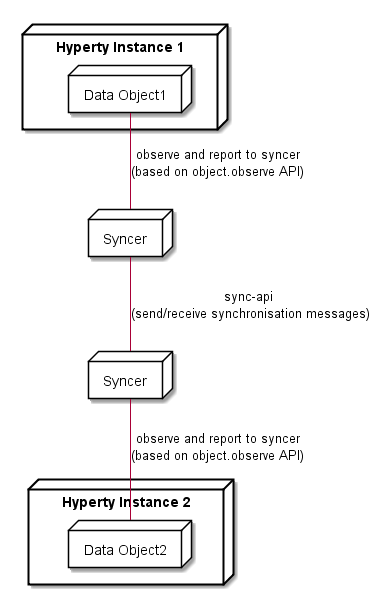

## Experimentations for Data Synchonisation model

<!--
@startuml "hyperty-data-synchronisation.png"

	node "Hyperty Instance 1" as H1 {

		node "Data Object1" as Obj1 {

		}
	}

	node "Syncer" as Syncer1 {

	}

	node "Hyperty Instance 2" as H2 {

		node "Data Object2" as Obj2 {

		}
	}

	node "Syncer" as Syncer2 {

	}

	Obj1 -down- Syncer1 : observe and report to syncer\n(based on object.observe API)

	Syncer1 -down- Syncer2 : sync-api \n(send/receive synchronisation messages)

	Obj2 -up- Syncer2 : observe and report to syncer\n(based on object.observe API)

@enduml
-->

Usage of the emerging [object.observe](https://developer.mozilla.org/pt-PT/docs/Web/JavaScript/Reference/Global_Objects/Object/observe) javascript API to support Hyperty communication based on object synchronisation. If not supported by the native runtime we can use a few [existing libraries](https://github.com/MaxArt2501/object-observe).

