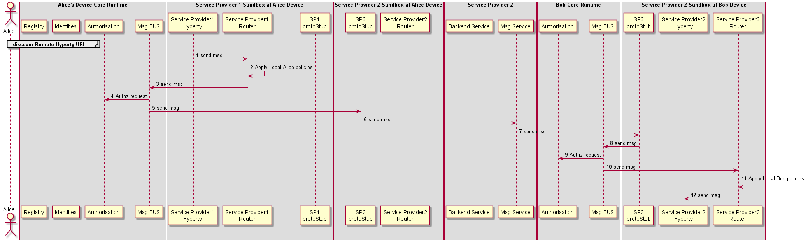

### Inter-domain Remote Communication

<!--
@startuml "interdomain-remote-communication.png"

autonumber

!define SHOW_RuntimeA

!define SHOW_SP1SandboxAtRuntimeA
!define SHOW_Protostub1AtRuntimeA
!define SHOW_ServiceProvider1HypertyAtRuntimeA
!define SHOW_ServiceProvider1RouterAtRuntimeA

!define SHOW_CoreRuntimeA
!define SHOW_MsgBUSAtRuntimeA
!define SHOW_RegistryAtRuntimeA
!define SHOW_IdentitiesAtRuntimeA
!define SHOW_AuthAtRuntimeA

!define SHOW_SP2SandboxAtRuntimeA
!define SHOW_Protostub2AtRuntimeA
!define SHOW_ServiceProvider2RouterAtRuntimeA

!define SHOW_RuntimeB
!define SHOW_SP2SandboxAtRuntimeB
!define SHOW_Protostub2AtRuntimeB
!define SHOW_ServiceProvider2HypertyAtRuntimeB
!define SHOW_ServiceProvider2RouterAtRuntimeB

!define SHOW_SP2
!define SHOW_Msg2

!define SHOW_CoreRuntimeB
!define SHOW_MsgBUSAtRuntimeB
!define SHOW_AuthAtRuntimeB

!include ../runtime_objects.plantuml
!include ../runtime_objects_domain2.plantuml

group discover Remote Hyperty URL

end group

SP1H@A -> Router1@A : send msg

Router1@A -> Router1@A : Apply Local Alice policies

Router1@A -> BUS@A : send msg

RunAuth@A <- BUS@A : Authz request

BUS@A -> Proto2@A : send msg

Proto2@A -> Msg2 : send msg

Proto2@B <- Msg2 : send msg

BUS@B <- Proto2@B : send msg

RunAuth@B <- BUS@B : Authz request

Router2@B <- BUS@B : send msg

Router2@B -> Router2@B : Apply Local Bob policies

SP2H@B <- Router2@B : send msg

@enduml
-->

