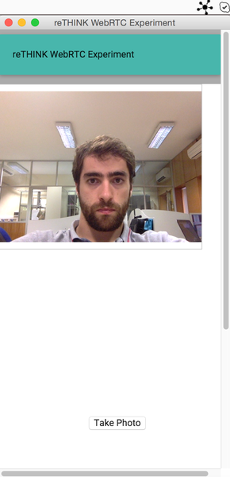

### Electron experiment

[Electron](electron.atom.io) application that runs with system tray and use chromium WebRTC to establish video.



### How it works

The app itself is written in JS, HTML and CSS.

##### Developing

```bash
npm install # installs experiments environment and all the deps
npm start # runs the experiments
```
