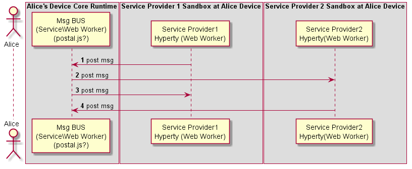

### Inter-domain Local Communication experimentations with Service, Web Workers and Postal JS

<!--
@startuml "interdomain-local-communication.png"

autonumber

!define SHOW_RuntimeA

!define SHOW_SP1SandboxAtRuntimeA
!define SHOW_ServiceProvider1HypertyAtRuntimeA

!define SHOW_CoreRuntimeA
!define SHOW_MsgBUSAtRuntimeA

!define SHOW_SP2SandboxAtRuntimeA
!define SHOW_ServiceProvider2HypertyAtRuntimeA

!include ../test_objects.plantuml

SP1H@A -> BUS@A : post msg

SP2H@A <- BUS@A : post msg

SP1H@A <- BUS@A : post msg

SP2H@A -> BUS@A : post msg

@enduml
-->

**questions:**
* how to exchange messages between web workers through a service worker each one running in a dedicated sandbox
* persistence of data including status eg identity tokens and registry data
* 
